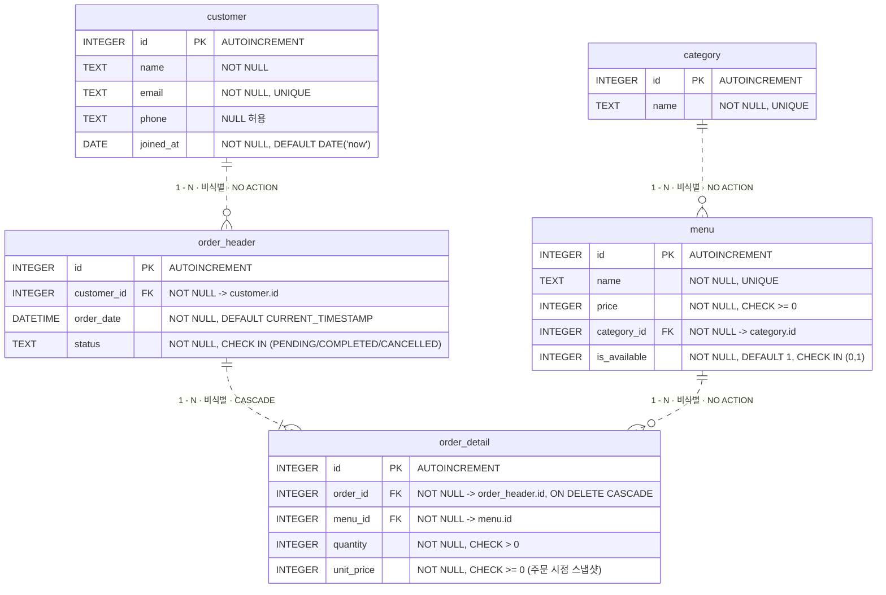

# SQL로 만드는 나만의 데이터베이스 — 카페 주문 시스템

코디세이 B5-1 미션 산출물. 백엔드 프레임워크 없이 **SQL만으로** 도메인을 모델링하고, 샘플 데이터를 넣고, 요구사항을 쿼리로 해결하는 흐름 전체를 담았다.

- **DBMS**: SQLite 3 (검증 환경: SQLite 3.39.4 / Python 3.10.10 / Windows)
  → 실제 검증 버전은 `results/*.txt` 첫 8줄의 메타데이터 블록에 자동 기록된다.
- **주제**: 카페 주문 관리
- **테이블 수**: 5개 (요구 4개 이상 충족)
- **1:N 관계**: 4개 (요구 2개 이상 충족)
- **쿼리**: 핵심 15개 + 대조/보강 7개

---

## 0. 과제 명세 (원본 미션 요구사항)

> 출처: `codyssey_assignments/B5-1.pdf` — 원문 요구사항을 그대로 옮기고, 해설은 💡 로 구분했다.

### 0.1 미션 한눈에 보기

| 항목 | 내용 |
| --- | --- |
| 분야 | AI/SW 기초 |
| 구분 | 데이터베이스와 백엔드 |
| 학습시간 | 40시간 |
| 미션 제목 | 정보를 깔끔하게 정리하는 디지털 서랍장 만들기 |
| 문제 유형 | 문제기술 / 기술적 설명 |

**원문 — 1. 미션 소개**

> 엑셀과 DB의 차이는 '데이터가 얼마나 많냐'가 아닙니다. 테이블 사이의 '관계'를 표현할 수 있냐의 차이입니다. 그 관계를 모르면 JOIN도 ORM도 계속 헷갈립니다. 여기서 제대로 잡아두면 뒤가 편합니다. 테이블 설계부터 시작해서, 요구사항을 SQL 쿼리 하나로 해결하는 흐름을 직접 완성합니다.
>
> 데이터베이스는 서비스의 데이터를 "파일이나 엑셀"이 아니라, 관계와 규칙을 가진 형태로 안전하게 저장하고 꺼내기 위한 표준 기술입니다. 특히 SQL은 데이터 조회, 검색, 정렬, 집계 같은 실무 요구를 가장 직접적으로 해결하는 언어입니다.
>
> 이 미션에서는 백엔드 프레임워크 없이, 도메인에 맞는 테이블 구조를 설계하고(PK/FK/제약조건) 직접 데이터를 넣고(INSERT) 필요한 정보를 뽑는(SELECT/JOIN/GROUP BY) 전체 흐름을 실습합니다. 단순 쿼리 연습이 아니라 "데이터 모델링 → 데이터 입력 → 요구사항을 SQL로 해결"하는 과정을 결과물로 남깁니다.
>
> 또한, 이후 JPA/ORM을 학습할 때 필요한 관계(1:N), 키(PK/FK), 무결성, 조인 기반 조회 사고방식을 먼저 체득하게 됩니다. 즉, ORM이 해주는 일을 "SQL 관점에서" 이해할 수 있는 기반을 만드는 미션입니다.

> 💡 **(해설) 이 과제가 진짜로 묻는 것**
>
> 1. **"이 데이터를 왜 한 테이블에 다 넣지 않고 쪼갰는가"** 를 스스로의 도메인 언어로 설명할 수 있는가. 채점자는 스키마 그림보다 그 설명을 본다.
> 2. **1:N 관계를 FK로 물리적으로 강제**할 수 있는가. 단순히 `member_id INTEGER` 컬럼을 두는 것과, 그 컬럼이 `REFERENCES member(id)` 로 묶여 잘못된 값이 실제로 거부되는 것은 완전히 다른 얘기다. 과제는 후자를 요구한다("없는 값 참조가 막혀야 한다").
> 3. **쿼리 15개를 "범주별 최소 개수"로 채웠는가.** 15개라는 총합보다, 기본 조회 4 / 조인 4(INNER 2 + LEFT 1 포함) / 집계 3 / 서브쿼리 1 / 수정·삭제 2 / 인덱스 1 이라는 **카테고리별 하한선**이 실질적 채점 기준이다.
> 4. **실행 결과를 남겼는가.** 쿼리 텍스트만 있고 결과 캡처가 없으면 "동작했다"는 증거가 없는 것으로 본다.
> 5. 이 과제는 ORM(JPA)을 배우기 전 **SQL 관점의 사고방식**을 만들어두는 것이 목적이다. 그래서 프레임워크가 금지되어 있다.

### 0.2 최종 산출물 (제출물)

**원문 — 2. 최종 결과물**

> 다음 네 가지를 만족하는 SQL 기반 데이터베이스 실습 결과물을 완성한다. (백엔드 프레임워크 사용 금지)
>
> 1. **도메인 데이터베이스 1개 설계**
>    - 자유 주제(예: 도서 대여, 영화 평점, 카페 주문, 여행 일정, 학급 관리 등)를 정하고 최소 4개 테이블을 만든다.
>    - 테이블 간 1:N 관계가 최소 2개 이상 포함되어야 한다.
> 2. **스키마 생성 스크립트 1개**
>    - `CREATE TABLE` 로 스키마를 정의하고, PK/FK/제약조건을 포함한다.
>    - 실행 순서대로 정리된 `.sql` 파일 1개로 제출 가능해야 한다.
> 3. **샘플 데이터 입력 스크립트 1개**
>    - 각 테이블에 의미 있는 샘플 데이터가 들어가도록 `INSERT` 를 작성한다.
>    - 각 테이블당 최소 10행 이상 데이터가 존재해야 한다.
> 4. **핵심 쿼리 15개 + 실행 결과 캡처**
>    - 조회/조인/집계/서브쿼리/수정 및 삭제까지 포함한 쿼리 15개를 작성한다.
>    - 각 쿼리의 실행 결과를 스크린샷(또는 결과 텍스트)로 남긴다.

**원문 — 7. 제약 사항 > 제출물** (및 4-7 제출물 구성과 동일)

- 스키마 생성 SQL 1개 파일
- 샘플 데이터 INSERT SQL 1개 파일
- 쿼리 15개 SQL 1개 파일
- 실행 결과 캡처(이미지 또는 텍스트) 폴더 1개
- (선택) ERD 다이어그램 이미지 1개 (draw.io, dbdiagram.io 등 활용)

**제출 증거 체크리스트 (위 원문을 체크 가능한 형태로 재배열)**

- [ ] 주제를 정한 도메인 DB 1개 (테이블 ≥ 4, 1:N 관계 ≥ 2)
- [ ] 스키마 생성 SQL 파일 1개 — 실행 순서대로 정리됨
- [ ] 샘플 데이터 INSERT SQL 파일 1개 — 테이블당 ≥ 10행
- [ ] 쿼리 15개 SQL 파일 1개
- [ ] 실행 결과 캡처 폴더 1개 (이미지 또는 텍스트)
- [ ] (선택) ERD 다이어그램 이미지 1개

### 0.3 과제 목표 — 수료 후 스스로 설명할 수 있어야 하는 것

**원문 — 3. 과제 목표**

> 이 과제를 마친 후, 학습자는 아래를 스스로 설명할 수 있어야 한다.
>
> - 데이터베이스가 "엑셀과 뭐가 다른지", 왜 테이블로 나눠 저장하는지 설명할 수 있다.
> - PK/FK가 무엇이고, 1:N 관계가 데이터를 어떻게 연결하는지 말로 설명할 수 있다.
> - `SELECT` / `INSERT` / `UPDATE` / `DELETE` 를 언제 쓰는지 구분할 수 있다.
> - `JOIN` 과 `GROUP BY` 로 "연결된 데이터를 한 번에 뽑는 방법"을 설명할 수 있다.
> - 실무에서 흔한 요구(검색/정렬/집계/랭킹)를 SQL로 어떻게 풀지 감을 잡을 수 있다.
> - 인덱스가 왜 필요한지, 어떤 컬럼에 적용하면 좋은지 기초적인 이해를 할 수 있다.

### 0.4 기능 요구 사항 (필수)

**원문 — 4. 기능 요구 사항: "다음 요구사항을 모두 만족해야 한다."**

#### R1. DB 환경 준비

- [ ] **R1-1** 로컬에서 실행 가능한 DB를 설치/준비한다. (예: SQLite, MySQL, PostgreSQL, H2 중 택1)
- [ ] **R1-2** DB에 접속해 SQL을 실행할 수 있는 도구를 준비한다. (예: DBeaver, TablePlus, DataGrip, CLI 등)
- [ ] **R1-3** DB별 문법 차이(날짜 함수, 자동 증가 키 등)가 존재하므로, 가급적 표준 SQL 범위 내에서 작성을 권장한다. **DB 고유 문법을 사용한 경우, 해당 쿼리에 어떤 DB 전용 문법인지 주석으로 명시한다.**

**원문 — DB 선택 시 참고 가이드**

| DB | 원문 설명 |
| --- | --- |
| SQLite | 설치가 가장 간단하고, 파일 기반으로 별도 서버가 필요 없다. (입문자 추천) |
| MySQL | 실무에서 가장 널리 사용되며, 설치 후 서버 실행이 필요하다. |
| PostgreSQL | 표준 SQL 준수율이 높고, 고급 기능이 풍부하다. |
| H2 | Java 환경에서 주로 사용하며, 인메모리 모드를 지원한다. |

#### R2. 데이터 모델(스키마) 설계

- [ ] **R2-1** 최소 4개 테이블을 설계한다.
- [ ] **R2-2** 각 테이블은 PK를 가진다.
- [ ] **R2-3** 최소 2개 이상의 FK를 사용해 1:N 관계를 만든다.
- [ ] **R2-4** 컬럼 타입을 의미에 맞게 선택한다. (`TEXT/VARCHAR`, `INTEGER`, `DATE/DATETIME` 등)
- [ ] **R2-5** 테이블/컬럼 이름은 역할이 드러나도록 작성한다. (`member`, `rental`, `created_at` 등)
- [ ] **R2-6** "서비스 주제(데이터 종류)"는 학습자가 직접 정하되, 최소 4개 테이블과 2개 이상의 1:N 관계를 포함할 수 있는 수준으로 선택한다.

**원문 — 참고할 수 있는 주제 예시**

| 주제 | 관리 대상 |
| --- | --- |
| 도서 대여 | 회원, 도서, 대여 기록, 카테고리 관리 |
| 영화 평점 | 사용자, 영화, 리뷰, 장르 관리 |
| 카페 주문 | 고객, 메뉴, 주문, 주문 상세 관리 |
| 온라인 쇼핑 | 회원, 상품, 주문, 주문 상세 관리 |
| 학급 관리 | 학생, 과목, 성적, 교사 관리 |

#### R3. 제약조건 적용

- [ ] **R3-1** 최소 1개 컬럼에 `NOT NULL` 을 적용한다.
- [ ] **R3-2** 최소 1개 컬럼에 `UNIQUE` 를 적용한다.
- [ ] **R3-3** FK가 실제로 동작하도록 설정한다. **(없는 값 참조가 막혀야 한다)**

> 💡 **(해설)** SQLite는 기본적으로 외래 키 강제가 **꺼져 있다.** 연결 세션마다 `PRAGMA foreign_keys = ON;` 을 실행하지 않으면 R3-3의 "없는 값 참조가 막혀야 한다"가 만족되지 않는다. MySQL은 스토리지 엔진이 `InnoDB` 여야 FK가 동작한다. 이것은 PDF에 명시되지 않은 추론이지만, R3-3을 만족시키려면 반드시 필요한 조치다.

#### R4. 샘플 데이터 준비

- [ ] **R4-1** 각 테이블에 최소 10행 이상의 데이터를 입력한다.
- [ ] **R4-2** FK로 연결된 데이터가 실제로 관계를 갖도록 입력한다.
- [ ] **R4-3** 데이터 입력 시, FK가 참조하는 부모 테이블에 데이터가 먼저 존재해야 한다. (예: `rental` 테이블에 INSERT하기 전에 `member` 와 `book` 테이블에 데이터가 있어야 한다.)

#### R5. 핵심 SQL 쿼리 15개 작성

**원문: "아래 범주의 쿼리를 모두 합쳐 총 15개 이상 작성한다."**

| ID | 범주 | 최소 개수 | 반드시 포함해야 하는 요소 |
| --- | --- | --- | --- |
| **R5-1** | 기본 조회 | 4개 이상 | `WHERE`, `ORDER BY`, `LIMIT` 포함 |
| **R5-2** | 조인 | 4개 이상 | `INNER JOIN` 2개 이상, `LEFT JOIN` 1개 이상 포함 |
| **R5-3** | 집계 | 3개 이상 | `COUNT`, `SUM`, `AVG` 중 2개 이상 + `GROUP BY` |
| **R5-4** | 서브쿼리 | 1개 이상 | — |
| **R5-5** | 데이터 수정 및 삭제 | 2개 이상 | `UPDATE`, `DELETE` |
| **R5-6** | 인덱스 | 1개 이상 | `CREATE INDEX` + **적용 이유 1줄** |

- [ ] **R5-1** 기본 조회 4개 이상 (`WHERE`, `ORDER BY`, `LIMIT` 포함)
- [ ] **R5-2** 조인 4개 이상 (`INNER JOIN` 2개 이상, `LEFT JOIN` 1개 이상 포함)
- [ ] **R5-3** 집계 3개 이상 (`COUNT`, `SUM`, `AVG` 중 2개 이상 + `GROUP BY`)
- [ ] **R5-4** 서브쿼리 1개 이상
- [ ] **R5-5** 데이터 수정 및 삭제 2개 이상 (`UPDATE`, `DELETE`)
- [ ] **R5-6** 인덱스 1개 이상 (`CREATE INDEX` + 적용 이유 1줄)
- [ ] **R5-7** 위 범주를 모두 합쳐 **총 15개 이상**을 작성한다.

> 💡 **(해설)** 범주별 하한을 그대로 더하면 4 + 4 + 3 + 1 + 2 + 1 = **15** 이다. 즉 "15개"는 여유 있는 목표가 아니라 각 범주의 최소치를 빠짐없이 채웠을 때 정확히 맞아떨어지는 숫자다. 어느 한 범주를 하나라도 빠뜨리면 총 15개를 채워도 요구사항 미달이 된다.

#### R6. 결과 확인 자료

- [ ] **R6-1** 쿼리마다 실행 결과를 확인할 수 있어야 한다.
- [ ] **R6-2** 각 쿼리에는 "무엇을 확인하는 쿼리인지" 한 줄 설명을 붙인다.
- [ ] **R6-3** 결과 확인은 스크린샷 또는 결과 텍스트로 남긴다.

#### R7. 제출물 구성

- [ ] **R7-1** 스키마 생성 SQL 1개 파일
- [ ] **R7-2** 샘플 데이터 INSERT SQL 1개 파일
- [ ] **R7-3** 쿼리 15개 SQL 1개 파일
- [ ] **R7-4** 실행 결과 캡처(이미지 또는 텍스트) 폴더 1개
- [ ] **R7-5** (선택) ERD 다이어그램 이미지 1개 (draw.io, dbdiagram.io 등 활용)

> 💡 **(해설)** R7-5는 원문에 "(선택)"으로 명시되어 있다. 필수가 아니지만, 체크리스트의 "테이블을 왜 이렇게 나눴는지 말할 수 있는가"에 답할 때 ERD 한 장이 있으면 설명이 훨씬 쉬워진다.

### 0.5 보너스 과제 (선택)

**원문 — 5. 보너스 과제**

- [ ] **B1. 조인 1개를 두 방식으로 풀기** — 같은 요구를 `JOIN` 으로도 풀고, 서브쿼리로도 풀어보고 차이를 비교해본다.
- [ ] **B2. 데이터 정합성 깨뜨려 보기** — 일부러 FK 에러가 나는 입력을 시도하고, 왜 막히는지와 어떻게 고쳐야 하는지 기록해본다.
- [ ] **B3. 미니 리포트 만들기** — "이 DB로 뽑을 수 있는 핵심 지표 3개"를 정의하고, 각각을 구하는 SQL을 최종본으로 정리한다. 예: 월별 대여 건수 추이, 가장 인기 있는 도서 TOP 10, 연체율이 높은 회원 목록 등

> 💡 **(해설)** B2는 사실상 R3-3("없는 값 참조가 막혀야 한다")의 **증명 절차**다. FK 위반 INSERT를 시도해 에러 메시지를 캡처해두면 필수 요구사항의 증거로도 그대로 쓸 수 있으므로, 보너스 중 가성비가 가장 높다.

### 0.6 개발 환경 · 제약 사항

**원문 — 6. 개발 환경**

- 로컬에서 실행 가능한 DB를 설치/준비한다. (예: SQLite, MySQL, PostgreSQL, H2 중 택1)
- DB에 접속해 SQL을 실행할 수 있는 도구를 준비한다. (예: DBeaver, TablePlus, DataGrip, CLI 등)

**원문 — 7. 제약 사항**

> 🚫 **백엔드 프레임워크 사용 금지: Spring/Django/Express 등으로 API나 화면을 만들지 않는다.**

- **DB**: 로컬에서 실행 가능한 DB만 사용한다.
- **범위**:
  - 🚫 **뷰(View), 프로시저, 트리거 같은 고급 기능은 사용하지 않는다.**
  - 정규화 이론을 과도하게 깊게 파지 않는다. 대신 "관계가 자연스럽고 쿼리가 잘 나오는 구조"를 목표로 한다.
- **제출물**:
  - 스키마 생성 SQL 1개 파일
  - 샘플 데이터 INSERT SQL 1개 파일
  - 쿼리 15개 SQL 1개 파일
  - 실행 결과 캡처(이미지 또는 텍스트) 폴더 1개
  - (선택) ERD 다이어그램 이미지 1개

> 💡 **(해설) 금지 사항 요약**
> - API 서버·웹 화면을 만들면 **감점이 아니라 범위 이탈**이다. 이 과제의 산출물은 `.sql` 파일과 실행 결과뿐이다.
> - `CREATE VIEW`, 저장 프로시저, `CREATE TRIGGER` 는 쓰지 않는다. 편해 보여도 쓰면 제약 위반이다.
> - 정규화 차수(3NF/BCNF)를 논증하라는 요구는 **없다.** 과하게 쪼개다 조인이 지저분해지는 쪽이 오히려 의도에서 멀어진다.

### 0.7 결과/출력 예시

**원문 — 8. 결과 예시: "아래는 정답이 아니라 참고 예시다. 실제 주제/테이블/쿼리는 달라도 된다."**

```
주제: "도서 대여"

테이블 예시: member , book , rental , category

관계 예시:
  rental.member_id → member.id
  rental.book_id   → book.id

쿼리 예시(형태만 참고)
  "대여 중인 책 목록"
  "회원별 대여 횟수 집계"
  "최근 30일 대여 기록"
  "연체 상태로 업데이트"
  "대여 기록이 없는 회원 찾기(서브쿼리)"
```

> 💡 **(해설)** 예시의 5개 쿼리는 우연히 고른 것이 아니라 R5의 범주를 하나씩 대표한다 — 기본 조회 / 집계+GROUP BY / WHERE+날짜 조건 / UPDATE / 서브쿼리(NOT IN·NOT EXISTS). 자기 주제로 바꿀 때도 이 5가지 "모양"을 먼저 확보한 뒤 개수를 채우면 범주 누락이 없다.

### 0.8 📚 이 과제가 공부하길 원하는 것 (학습 지도)

| 요구사항 | 표면적으로 시키는 일 | 실제로 학습시키려는 개념 | 스스로 답해볼 질문 |
| --- | --- | --- | --- |
| R1-1 / R1-2 | DB 하나 깔고 콘솔 열기 | **DB 엔진과 클라이언트의 분리** — 서버형(MySQL/PostgreSQL)과 파일형(SQLite)의 차이, 접속이란 무엇인가 | 내가 고른 DB는 서버 프로세스가 필요한가? 내 데이터는 물리적으로 어디에 저장돼 있는가? |
| R1-3 | DB 전용 문법에 주석 달기 | **SQL 표준과 방언(dialect)** — 이식성이라는 비용 개념. `AUTOINCREMENT` / `AUTO_INCREMENT` / `SERIAL`, `DATE()` / `NOW()` / `CURRENT_DATE` 가 왜 제각각인가 | 내 스키마를 다른 DB로 옮기면 어디가 먼저 깨지는가? |
| R2-1 / R2-6 | 테이블 4개 만들기 | **도메인 모델링** — 현실의 명사(엔티티)와 사건(트랜잭션)을 분리해 표를 나누는 사고. "한 장의 엑셀"이 만드는 **중복과 갱신 이상(update anomaly)** | 회원 이름을 바꿔야 할 때 내 설계에서는 몇 군데를 고쳐야 하는가? 한 군데면 잘 쪼갠 것이다 |
| R2-2 | 모든 테이블에 PK 달기 | **엔티티 무결성과 식별자** — 자연키 vs 대리키(surrogate key), 행을 유일하게 지목한다는 것의 의미 | `id` 대신 이메일이나 이름을 PK로 쓰면 무슨 일이 생기는가? |
| R2-3 | FK 2개 이상으로 1:N 만들기 | **관계의 방향성** — "N쪽이 FK를 갖는다"는 원칙, 참조 무결성, 그리고 JPA의 `@ManyToOne` 이 실제로 생성하는 물리 구조 | 왜 FK는 항상 '여러 개'인 쪽 테이블에 붙는가? 반대로 붙이면 무엇이 불가능해지는가? |
| R2-4 | 컬럼 타입 고르기 | **타입 = 최소한의 검증 장치** — 숫자를 TEXT로 두면 정렬·비교·집계가 전부 깨진다. 날짜 타입과 문자열 날짜의 차이 | 가격을 TEXT로 저장했다면 `ORDER BY price` 는 어떤 순서로 나오는가? |
| R2-5 | 이름을 역할이 드러나게 | **가독성 규약** — 단수/복수, snake_case, `created_at` 같은 관용 컬럼명. 이름이 문서를 대신한다 | 내 테이블 이름만 보고 처음 보는 사람이 도메인을 그릴 수 있는가? |
| R3-1 / R3-2 | NOT NULL, UNIQUE 하나씩 | **도메인 무결성** — 제약조건은 "애플리케이션 코드보다 먼저, 더 확실하게" 잘못된 데이터를 막는 마지막 방어선. NULL은 '값 없음'이지 0이나 빈 문자열이 아니다 | 애플리케이션에서 검증하면 되는데 왜 DB에도 제약을 거는가? NULL끼리 비교하면 왜 참이 아닌가? |
| R3-3 / B2 | FK가 진짜 막히게 | **참조 무결성의 강제** — 제약은 선언만으로는 부족하고 엔진 설정(SQLite `PRAGMA foreign_keys=ON`, MySQL InnoDB)이 따라야 한다. 위반 시 트랜잭션이 어떻게 되는가 | 존재하지 않는 `member_id` 로 INSERT하면 어떤 에러가 나는가? 부모 행을 지우면 자식 행은? (`ON DELETE` 옵션) |
| R4-1 / R4-2 | 테이블당 10행 넣기 | **의미 있는 테스트 데이터 설계** — 10행이라는 하한은 GROUP BY 결과가 1줄로 뭉개지지 않고, LEFT JOIN에서 NULL이 실제로 등장하도록 만들기 위한 장치다 | 내 샘플 데이터로 "대여 기록이 없는 회원"이 실제로 존재하는가? 없다면 LEFT JOIN을 증명할 수 없다 |
| R4-3 | 부모 먼저 INSERT | **실행 순서와 의존성** — 스키마·데이터 스크립트는 위에서 아래로 한 번에 재실행 가능(idempotent에 가깝게)해야 한다 | 내 `.sql` 을 빈 DB에 처음부터 다시 돌리면 에러 없이 끝나는가? |
| R5-1 | WHERE/ORDER BY/LIMIT | **결과 집합을 좁히고 정렬하는 순서** — 논리적 처리 순서(FROM → WHERE → GROUP BY → HAVING → SELECT → ORDER BY → LIMIT) | `ORDER BY` 없는 `LIMIT 10` 의 결과는 왜 매번 같다고 보장할 수 없는가? |
| R5-2 | INNER 2개 + LEFT 1개 | **조인의 의미 차이** — INNER는 교집합, LEFT는 "왼쪽 전부 + 매칭되면 붙이고 아니면 NULL". 이것이 ORM의 lazy/eager 논쟁의 뿌리다 | LEFT JOIN 뒤에 `WHERE 오른쪽컬럼 IS NOT NULL` 을 쓰면 결과가 INNER JOIN과 같아지는 이유는? |
| R5-3 | COUNT/SUM/AVG + GROUP BY | **집계의 그룹 단위** — GROUP BY가 행을 묶는 방식, `COUNT(*)` vs `COUNT(컬럼)` 의 NULL 처리 차이, HAVING과 WHERE의 적용 시점 | 대여 기록이 0건인 회원은 `COUNT(*)` 로 세면 0이 나오는가 1이 나오는가? |
| R5-4 | 서브쿼리 1개 | **쿼리를 값처럼 쓰기** — 스칼라 / IN / EXISTS / 상관 서브쿼리(correlated)의 구분, 그리고 JOIN으로 바꿔 쓸 수 있는 경우와 없는 경우 (→ B1) | `NOT IN (SELECT ...)` 안에 NULL이 하나라도 있으면 왜 결과가 통째로 비는가? |
| R5-5 | UPDATE / DELETE | **쓰기 연산의 위험성** — WHERE 없는 UPDATE/DELETE, 트랜잭션과 롤백, 영향 행 수 확인 | 실행 전에 같은 WHERE로 SELECT 해보는 습관이 왜 필요한가? |
| R5-6 | CREATE INDEX + 이유 1줄 | **조회 성능과 트레이드오프** — 인덱스는 B-Tree 정렬 사본이라 조회는 빨라지고 INSERT/UPDATE는 느려진다. 선택도(selectivity)가 낮은 컬럼에는 효과가 없다 | 왜 FK 컬럼과 자주 쓰는 WHERE 컬럼이 1순위인가? 성별 컬럼에 인덱스를 걸면 왜 소용없는가? |
| R6-1 / R6-2 / R6-3 | 결과 캡처와 한 줄 설명 | **재현 가능성과 커뮤니케이션** — "어떤 질문에 답하는 쿼리인가"를 먼저 쓰는 습관이 곧 요구사항→SQL 번역 훈련이다 | 결과 표만 보고 이 쿼리가 무엇을 물었는지 남이 알 수 있는가? |
| 제약(프레임워크 금지) | Spring/Django 쓰지 않기 | **ORM 이전의 SQL 사고** — ORM이 자동 생성해주는 JOIN/FK를 직접 손으로 써봐야 나중에 N+1 문제를 알아볼 수 있다 | JPA의 `@OneToMany` 는 내가 방금 쓴 어떤 SQL로 번역되는가? |
| 전체(체크리스트 4장) | — | **트러블슈팅 서술 능력** — 가장 복잡했던 쿼리를 단계별로 분해해 설명하기, 막힌 지점과 해결 과정을 재구성하기 | 내 쿼리 중 가장 복잡한 것을 서브쿼리부터 바깥으로 순서대로 설명할 수 있는가? |

> 💡 **(해설) 평가 체크리스트(`relational_database_sql.md`)가 실제로 묻는 4가지 층위**
> 1. **기능 동작 검증** — 테이블 ≥ 4 & 전부 PK / FK 1:N ≥ 2 & 위반이 실제로 막힘 / 테이블당 ≥ 10행 / 범주별 쿼리 15개 / 실행 결과 첨부.
> 2. **구현 구조 설명** — 왜 이렇게 쪼갰는지, FK 관계가 도메인에서 무슨 의미인지, 컬럼 타입 선택 이유, 인덱스를 **그 컬럼에** 건 이유.
> 3. **핵심 개념 이해** — 엑셀 vs DB, PK/FK/1:N을 **본인 스키마 기준으로**, INNER vs LEFT JOIN을 **실행 결과를 보며**, GROUP BY + 집계 함수의 동작.
> 4. **확장 사고/트러블슈팅** — 가장 복잡했던 쿼리의 단계별 풀이, 가장 어려웠던 부분과 해결 방법.
>
> 즉 채점은 "SQL 파일이 존재하는가"가 아니라 **"결과물을 앞에 두고 말로 설명할 수 있는가"** 를 본다. 그래서 각 쿼리의 한 줄 설명(R6-2)과 인덱스 적용 이유 한 줄(R5-6)이 명세에 콕 집어 들어가 있다.

### 0.9 자주 놓치는 함정

1. **"FK 컬럼을 만들었다" ≠ "FK가 동작한다".** R3-3은 *없는 값 참조가 막혀야 한다*고 못박았다. SQLite는 세션마다 `PRAGMA foreign_keys = ON;` 을 켜야 하고, MySQL은 InnoDB여야 한다. 위반 INSERT를 실제로 시도해 에러를 캡처(B2)하지 않으면 이 요구사항은 증명되지 않는다.
2. **쿼리 총 15개를 채웠지만 범주 하나가 비는 경우.** 특히 누락이 잦은 것은 `LEFT JOIN` 1개(R5-2), 인덱스 1개(R5-6), 그리고 **인덱스 "적용 이유 1줄"** 이다. `CREATE INDEX` 문만 있고 이유 주석이 없으면 R5-6 미충족이다.
3. **집계 함수는 "COUNT/SUM/AVG 중 2개 이상"이다.** `COUNT` 만 세 번 쓰면 3개 작성은 맞아도 "2개 이상의 서로 다른 함수" 조건에 걸린다. `GROUP BY` 동반도 명시 조건이다.
4. **기본 조회에는 `WHERE`, `ORDER BY`, `LIMIT` 이 모두 등장해야 한다.** 4개를 전부 단순 `SELECT *` 로 채우면 조건 미달이다.
5. **테이블당 10행은 "각 테이블"이다.** 부모 테이블만 10행 채우고 자식 테이블(주문 상세 등)을 5행만 넣는 실수가 잦다. 또한 LEFT JOIN을 증명하려면 **일부러 매칭되지 않는 행**(대여 기록 없는 회원 등)을 남겨둬야 한다.
6. **View/프로시저/트리거는 금지다.** "결과를 보기 좋게 하려고" `CREATE VIEW` 를 쓰면 제약 위반이다. 반대로 (선택)인 ERD는 안 만들어도 감점이 아니다 — **선택과 금지를 뒤집어 기억하지 말 것.**
7. **DB 전용 문법을 썼으면 주석을 달아야 한다(R1-3).** `AUTOINCREMENT`, `LIMIT ... OFFSET`, `date('now','-30 day')`, `strftime()`, `IFNULL` / `NVL` / `COALESCE` 같은 것들이 해당한다. 주석 한 줄이 요구사항이다.
8. **파일은 "각각 1개"다(R7).** 스키마/INSERT/쿼리를 한 파일에 몰아넣거나, 반대로 쿼리를 15개 파일로 흩어놓으면 제출물 구성이 어긋난다. 실행 결과는 **폴더 1개**로 모은다.

### 0.10 ✅ 과제 수행 점검 (명세 대조)

> 점검 방식: 저장소의 실제 소스를 명세의 요구사항 ID 와 1:1 대조. 판정 근거는 파일 경로로 명시.
> README 의 주장은 근거로 채택하지 않고, `.sql` 원문·캡처 파일·실제 실행 결과로만 판정했다.
> 저장소는 읽기 전용으로 다뤘다(`git status` 클린 확인). 실행 검증은 SQL 파일을 스크래치패드에 복사해 수행했다.

**종합 판정: 충족** — 필수 37개 중 충족 37 / 부분 0 / 미충족 0 / 로컬검증불가 0
(보너스 3개도 전부 충족. 제약 사항 위반 0건.)

| ID | 요구사항 (요약) | 판정 | 근거 / 비고 |
| --- | --- | --- | --- |
| R1 | DB 환경 준비 | ✅ 충족 | SQLite 3 채택. `01_schema.sql:3`, `cafe.db`(커밋됨), `build_and_capture.py:33` |
| R1-1 | 로컬 실행 가능한 DB 준비 | ✅ 충족 | `01_schema.sql:3` (`DBMS: SQLite 3`), 파일 기반 `cafe.db` 가 저장소에 존재. 스크래치패드 복사본을 Python `sqlite3`(3.46.1)로 열어 5테이블 정상 로드 확인 |
| R1-2 | SQL 실행 도구 준비 | ✅ 충족 | `build_and_capture.py:1-30`(표준 라이브러리 전용 러너), `README.md:415-41` / `README.md:442-77`(sqlite3 CLI 절차 병기). CLI 미설치 환경 대비 이중 경로 제공 |
| R1-3 | DB 고유 문법에 주석 명시 | ✅ 충족 | `01_schema.sql:8-12`(파일 상단 요약), `:15-18`(PRAGMA), `:33-36`(AUTOINCREMENT), `:50-55`(DATE 어피니티·`DATE('now')` UTC), `:101-105`(DATETIME); `03_queries.sql:20-24`(EXPLAIN QUERY PLAN / sqlite_master / IF NOT EXISTS), `:297`, `:339-343`; `04_bonus.sql:76`, `:192-195`(`DATE()` 의 MySQL/PostgreSQL 대응 표기). 누락 문법 미발견 |
| R2 | 데이터 모델 설계 | ✅ 충족 | 카페 주문 도메인, 5테이블 / 1:N 4개 |
| R2-1 | 최소 4개 테이블 | ✅ 충족 | 5개 — `01_schema.sql:32`(customer), `:65`(category), `:73`(menu), `:97`(order_header), `:120`(order_detail) |
| R2-2 | 각 테이블 PK | ✅ 충족 | `01_schema.sql:37,66,74,98,121` 모두 `id INTEGER PRIMARY KEY AUTOINCREMENT`. 실행 검증: `PRAGMA table_info` 5테이블 전부 pk=`id` |
| R2-3 | FK 2개 이상으로 1:N | ✅ 충족 | FK 4개 — `01_schema.sql:91`(menu→category), `:114`(order_header→customer), `:137`(order_detail→order_header, CASCADE), `:140`(order_detail→menu). 관계 요약 `:148-153`. 실행 검증: `PRAGMA foreign_key_list` 로 4개 모두 확인 |
| R2-4 | 컬럼 타입을 의미에 맞게 | ✅ 충족 | 선택 이유가 컬럼마다 주석으로 남음 — `01_schema.sql:39-40`(TEXT), `:46-48`(phone 을 TEXT 로: 선행 0), `:50-55`(DATE), `:80-81`(금액 INTEGER, REAL 배제), `:85-87`(0/1 + CHECK), `:101-105`(DATETIME). 요약표 `README.md:523-156` |
| R2-5 | 역할이 드러나는 이름 | ✅ 충족 | `customer / category / menu / order_header / order_detail`, 컬럼 `joined_at`, `order_date`, `unit_price`, `is_available` — `01_schema.sql:32-146` |
| R2-6 | 주제를 직접 선정 | ✅ 충족 | '카페 주문 관리' — `01_schema.sql:2`, `README.md:7`. 최소 4테이블·2관계 조건을 여유 있게 수용 |
| R3 | 제약조건 적용 | ✅ 충족 | NOT NULL / UNIQUE / FK / CHECK 4종 모두 적용 |
| R3-1 | NOT NULL 1개 이상 | ✅ 충족 | 다수 — `01_schema.sql:40,44,55,78,81,83,86,99,105,109,122,123,124,129`. 유일한 NULL 허용 컬럼은 `phone`(`:48`)으로 의도가 주석에 명시 |
| R3-2 | UNIQUE 1개 이상 | ✅ 충족 | 3개 — `01_schema.sql:44`(customer.email), `:67`(category.name), `:78`(menu.name) |
| R3-3 | FK 가 실제로 동작 (없는 값 참조 차단) | ✅ 충족 | `PRAGMA foreign_keys = ON` 을 4개 스크립트 전부에 선언 — `01_schema.sql:20`, `02_data.sql:10`, `03_queries.sql:27`, `04_bonus.sql:16`. 증거: `results/bonus_results.txt:77` `FOREIGN KEY constraint failed`. **직접 재현함** — `customer_id=999` INSERT 가 `IntegrityError: FOREIGN KEY constraint failed` 로 차단됨 |
| R4 | 샘플 데이터 준비 | ✅ 충족 | 5테이블 합계 64행 |
| R4-1 | 각 테이블 10행 이상 | ✅ 충족 | **실측 행 수** category 10 / menu 12 / customer 10 / order_header 12 / order_detail 20 — `02_data.sql:15-25`, `:30-42`, `:47-57`, `:63-75`, `:81-101`. 전 테이블 하한 통과 |
| R4-2 | FK 로 연결된 실제 관계 | ✅ 충족 | `02_data.sql:81-101`(order_detail 이 order 1~12 · menu 1~12 참조), `:63-75`(order_header 가 customer 1~9 참조). FK 강제 ON 상태에서 오류 없이 전량 입력됨(직접 실행 확인) |
| R4-3 | 부모 먼저 INSERT | ✅ 충족 | 파일 내 순서 category(`:15`) → menu(`:30`) → customer(`:47`) → order_header(`:63`) → order_detail(`:81`), 의도 명시 `02_data.sql:4`. 빈 DB 에서 `01→02` 재실행 시 에러 0건(직접 확인) |
| R5 | 핵심 쿼리 15개 | ✅ 충족 | Q1~Q15 정확히 15개 + 대조/보강 7개 |
| R5-1 | 기본 조회 4개 (WHERE/ORDER BY/LIMIT) | ✅ 충족 | Q1 `03_queries.sql:35-38`(WHERE+ORDER BY), Q2 `:46-49`(WHERE+ORDER BY), Q3 `:56-59`(ORDER BY+LIMIT 5), Q4 `:66-70`(WHERE+ORDER BY+LIMIT 10 — 세 요소 동시 충족). 보강 Q4-B `:78-81`(LIKE 검색) |
| R5-2 | 조인 4개 (INNER 2+ / LEFT 1+) | ✅ 충족 | INNER 3개 — Q5 `:88-91`, Q6 `:98-108`(4테이블), Q8 `:145-150`; LEFT 1개 — Q7 `:118-124`. 추가로 Q8-B `:158-163` 이 같은 요구를 LEFT 로 재작성해 INNER/LEFT 차이를 9행 vs 10행으로 실증(`results/results.txt:170-204`) |
| R5-3 | 집계 3개 (COUNT/SUM/AVG 중 2+ & GROUP BY) | ✅ 충족 | 서로 다른 함수 3종 — Q9 COUNT `:170-174`, Q10 SUM `:188-196`, Q11 AVG `:224-229`. 셋 다 GROUP BY 동반. 보강 Q11-B `:239-247` 은 WHERE vs HAVING 대비 |
| R5-4 | 서브쿼리 1개 이상 | ✅ 충족 | Q12 스칼라 서브쿼리 `03_queries.sql:257-261` (`price > (SELECT AVG(price) ...)`). 보너스에 IN / EXISTS 상관 서브쿼리 추가(`04_bonus.sql:45-72`) |
| R5-5 | 수정·삭제 2개 (UPDATE/DELETE) | ✅ 충족 | Q13 UPDATE `:272-274` + 결과 확인 SELECT `:277`; Q14 DELETE `:286-287` + 확인 SELECT `:290-291`. 캡처에 영향 행 수 기록(`results/results.txt:292`, `:303`) |
| R5-6 | 인덱스 1개 + 적용 이유 1줄 | ✅ 충족 | `CREATE INDEX` 2개 `03_queries.sql:321-325`, **적용 이유는 `:312-319` 에 사유 1·2 로 명시**(조인/검색 키, CASCADE 탐색 비용) + 트레이드오프 주석 `:318-319`. 인덱스 전/후 실행계획 대조 `:302-308` / `:330-336`, 캡처 `results/results.txt:317-336` 에 `SCAN → SEARCH` 전환 기록 |
| R5-7 | 총 15개 이상 | ✅ 충족 | 핵심 Q1~Q15 = 15개(범주별 하한 4/4/3/1/2/1 을 모두 충족) + 대조·보강 Q4-B·Q7-B·Q8-B·Q10-B·Q11-B·Q15-A·Q15-B 7개 |
| R6 | 결과 확인 자료 | ✅ 충족 | `results/results.txt`(343줄), `results/bonus_results.txt`(149줄) |
| R6-1 | 쿼리마다 실행 결과 확인 가능 | ✅ 충족 | `results/results.txt` 에 Q1~Q15 및 보강 7개 전부 블록으로 존재(`:11,30,45,58,75,86,106,134,152,170,187,205,216,234,252,269,279,291,301,317,325,329`). DDL 인 Q15 는 결과셋이 없는 대신 Q15-B 실행계획과 인덱스 목록(`:329-343`)으로 효과를 확인 |
| R6-2 | 쿼리마다 한 줄 설명 | ✅ 충족 | 모든 쿼리가 `>> [Qn] 범주 - 무엇을 확인하는가` 형식 주석을 가짐 — `03_queries.sql:30,41,52,62,73,84,94,111,127,141,153,166,177,199,219,232,250,264,280,294,311,328`. 같은 문구가 캡처 헤더에도 복제됨 |
| R6-3 | 스크린샷 또는 결과 텍스트 | ✅ 충족 | 텍스트 캡처. 재현 메타데이터 포함 — `results/results.txt:1-8`(SQLite 3.39.4 / Python 3.10.10 / `foreign_keys : ON` / 생성 시각), `results/bonus_results.txt:1-8` |
| R7 | 제출물 구성 | ✅ 충족 | 4종 모두 각 1개 파일/폴더 |
| R7-1 | 스키마 SQL 1개 | ✅ 충족 | `01_schema.sql` (157줄, DROP→CREATE 실행 순서 정렬 `:23-27`) |
| R7-2 | 샘플 데이터 SQL 1개 | ✅ 충족 | `02_data.sql` (101줄) |
| R7-3 | 쿼리 SQL 1개 | ✅ 충족 | `03_queries.sql` (349줄). `drill/03_queries_naked.sql` 은 학습용 주석 제거본이며, 정규화 비교 결과 **SQL 본문이 원본과 완전히 동일**해 제출 파일 분산이 아님(직접 diff 확인) |
| R7-4 | 결과 캡처 폴더 1개 | ✅ 충족 | `results/` — `results.txt`, `bonus_results.txt` |
| R7-5 | (선택) ERD 다이어그램 | ✅ 충족 (선택) | `README.md:462-124` Mermaid `erDiagram` — 5엔티티·4관계·PK/FK/제약 표기, 카디널리티 기호 선택 근거까지 `:126-130`. 비고: 별도 정적 이미지 파일(.png/.svg)은 없고 Markdown 렌더링에 의존 |

#### 보너스 과제

| ID | 요구사항 (요약) | 판정 | 근거 / 비고 |
| --- | --- | --- | --- |
| B1 | 같은 요구를 JOIN·서브쿼리 두 방식으로 + 차이 비교 | ✅ 충족 | 세 방식으로 작성 — JOIN `04_bonus.sql:33-39`, IN 서브쿼리 `:45-54`, EXISTS 상관 서브쿼리 `:62-72`. 비교를 주장이 아닌 실측으로 뒷받침: `EXPLAIN QUERY PLAN` 3종 `:78-101`, 차이 요약 `:103-127`(TEMP B-TREE 2회 vs LIST SUBQUERY vs 조기 종료), 결과 캡처 `results/bonus_results.txt:15-75`. 세 방식 결과 동일(4행)을 직접 재현 확인 |
| B2 | 정합성 깨뜨려 보기 + 이유·해결 기록 | ✅ 충족 | 4종 위반 시도 — FK `04_bonus.sql:138`, UNIQUE `:142`, CHECK `:147`, NOT NULL `:151`. 실제 에러 캡처 `results/bonus_results.txt:77,82,87,92`. 올바른 해결법(부모 먼저 INSERT)을 `BEGIN…ROLLBACK` 으로 감싸 실험 오염 방지 `:158-180`, 롤백 검증 쿼리 `:178-180`. **직접 재현함** — 4건 모두 동일 에러 재현 |
| B3 | 미니 리포트 (핵심 지표 3개) | ✅ 충족 | 지표 1 일자별 매출 `04_bonus.sql:197-204`, 지표 2 인기 메뉴 TOP 5 `:211-220`, 지표 3 VIP 고객 TOP 3 `:227-236`. '매출'의 정의(`status='COMPLETED'` 화이트리스트)를 `:184-186` 에 명문화하고 `<> 'CANCELLED'` 를 쓰면 안 되는 이유까지 기록 |

#### 제약 사항 준수 점검

| 제약 | 판정 | 근거 |
| --- | --- | --- |
| 백엔드 프레임워크 금지 | ✅ 준수 | `build_and_capture.py:31-36` 임포트가 `os, re, sqlite3, sys, unicodedata, datetime` 표준 라이브러리뿐. Flask/Django/FastAPI/Express/Spring 문자열 grep 결과 제출물에 0건(학습 자료 `study/` 의 설명 문장 언급만 존재). API·화면 코드 없음 |
| 뷰 / 프로시저 / 트리거 금지 | ✅ 준수 | `CREATE VIEW\|TRIGGER\|PROCEDURE` grep 0건. 실행 검증: 빌드한 DB 및 커밋된 `cafe.db` 모두 `sqlite_master` 의 `type IN ('view','trigger')` = **0건** |
| 로컬 실행 가능한 DB | ✅ 준수 | 파일 기반 SQLite, 외부 서버·계정 불필요 |
| 정규화 과잉 금지 | ✅ 준수 | 차수 논증 없음. 분리 근거를 도메인 언어로 서술 — `README.md:508-145`(엑셀 한 시트의 수정 이상 → 테이블 분리 매핑), `01_schema.sql:59-63` |

#### 🔍 발견된 격차와 보완 제안

**명세 요구사항 기준 격차: 없음.** 필수 37개·보너스 3개·제약 4종 모두 근거가 확인되었고, 핵심 항목(FK 강제, 행 수 하한, 범주별 쿼리 수)은 직접 실행해 재현했다.

아래는 감점 사유가 아닌 **문서 정합성 나이트픽** 3건이다.

1. `03_queries.sql:2` 는 "대조/보강 쿼리 **6개**" 라고 적었지만 실제 보강 블록은 Q4-B·Q7-B·Q8-B·Q10-B·Q11-B·Q15-A·Q15-B **7개**이고 `README.md:557` 은 7개로 적었다(파일 상단이 Q15-A/B 를 한 쌍으로 셈). → `03_queries.sql:2` 를 7개로 맞추면 숫자 불일치가 사라진다.
2. `README.md:392-28` 의 디렉터리 트리에 실제 존재하는 `drill/`, `study/` 두 폴더가 빠져 있다. → 트리에 "학습용(제출 범위 밖)" 표시와 함께 추가하면, 채점자가 제출물과 학습 자료를 구분하기 쉽다.
3. `results/results.txt:325-328` 의 `[Q15] CREATE INDEX` 블록은 본문이 비어 있다(DDL 이라 결과셋 없음). Q13/Q14 처럼 `-- 인덱스 2개 생성 완료` 같은 한 줄 마커를 남기면 "실행은 됐는데 출력이 비었다" 와 구분된다.

추가 관찰(요구사항 초과분, 참고용):
- 재현성 설계가 명세 이상으로 단단하다 — Q13 을 절대값 대입으로 멱등화(`03_queries.sql:265-268`), Q15-A 의 `DROP INDEX IF EXISTS` 로 대조군 고정(`:299-300`), `04_bonus.sql:19-22` 의 전제조건 자가진단(12/2/20/3500), 캡처 헤더의 `foreign_keys : ON` 자기증명.
- 명세가 요구하지 않은 함정 대조(`COUNT(*)` vs `COUNT(col)`, ON 절 vs WHERE 절 필터)를 쿼리로 남겨, 평가 체크리스트의 "실행 결과를 보며 설명" 층위까지 커버한다.

#### 🧪 실행 검증 기록

환경: `sqlite3` CLI **미설치**(`which sqlite3` → 없음). Python 3 표준 라이브러리 `sqlite3` 모듈(SQLite **3.46.1**)로 대체 검증. 저장소 무변경을 위해 `.sql` 을 스크래치패드로 복사해 실행했고, 커밋된 `cafe.db` 는 복사본만 열었다. 검증 후 `git status --porcelain` 출력 없음(저장소 클린).

1. **스키마·데이터 빌드** — `01_schema.sql` → `02_data.sql` 을 빈 DB 에 `executescript` : 둘 다 에러 0건.
2. **행 수 실측** — customer **10** / category **10** / menu **12** / order_header **12** / order_detail **20** → R4-1 하한(10) 전 테이블 통과.
3. **PK 실측** — `PRAGMA table_info` : 5테이블 전부 pk 컬럼 `id` (R2-2).
4. **FK 실측** — `PRAGMA foreign_key_list` : `menu→category`, `order_header→customer`, `order_detail→menu`(NO ACTION), `order_detail→order_header`(**ON DELETE CASCADE**) 4개 (R2-3).
5. **FK 강제 실증** — `PRAGMA foreign_keys` = 1 확인 후 `INSERT INTO order_header (customer_id,status) VALUES (999,'PENDING')` → `IntegrityError: FOREIGN KEY constraint failed` (R3-3).
6. **보너스 위반 4종 재현** — FK / UNIQUE(`customer.email`) / CHECK(`status IN (...)`) / NOT NULL(`customer.email`) 네 건 모두 `results/bonus_results.txt:77,82,87,92` 와 **동일한 에러 메시지** 재현 (B2).
7. **보너스 (1) 결과 재현** — 세 방식 모두 `김민준·이서연·박지호·정우진` 4행 일치 (B1).
8. **쿼리 파일 전량 실행** — `03_queries.sql` 의 모든 문장 실행, 구문/런타임 에러 **0건**. 실행 후 상태: 아메리카노 `4000`, order_header **10행**, order_detail **18행**(CASCADE 2행 삭제), 인덱스 5개(직접 2 + `sqlite_autoindex_*` 3) — `results/results.txt:291-343` 캡처와 완전 일치.
9. **커밋된 `cafe.db` 상태 대조**(복사본) — 5테이블 / 아메리카노 4000 / order_header 10 / order_detail 18 / 인덱스 5개 / view·trigger 0건 → `README.md:406-33` 의 서술과 일치.
10. **금지 기능 grep** — `CREATE VIEW|CREATE TRIGGER|CREATE PROCEDURE|FUNCTION`, `flask|django|fastapi|express|spring` : 제출 `.sql`·`.py` 에서 0건.
11. **drill 사본 정합성** — `drill/03_queries_naked.sql`, `drill/04_bonus_naked.sql` 을 주석 제거·공백 정규화 후 원본과 `diff` : **완전 일치**(각각 32/21 문장). 제출 파일과 학습 사본이 어긋나지 않음.

미실행 항목: sqlite3 CLI 의 `-box -header` 출력 경로(`README.md:446-73`)는 CLI 미설치로 직접 재현하지 못했다. 다만 `build_and_capture.py` 가 같은 박스 포맷을 재현하도록 작성되어 있고(`build_and_capture.py:51-53`), 캡처 파일의 표 형식이 이를 뒷받침한다.

---

## 1. 디렉터리 구성

```
codyssey_B5-1/
├── 01_schema.sql          # 스키마 생성 (CREATE TABLE, PK/FK/제약조건)
├── 02_data.sql            # 샘플 데이터 INSERT (각 테이블 ≥ 10행)
├── 03_queries.sql         # 핵심 쿼리 15개 + 대조/보강 7개
├── 04_bonus.sql           # 보너스 과제 3종
├── build_and_capture.py   # DB 빌드 + 결과 캡처 (단일 진입점)
├── results/
│   ├── results.txt        # 03_queries.sql 실행 결과
│   └── bonus_results.txt  # 04_bonus.sql 실행 결과 (제약 위반 에러 포함)
├── cafe.db                # (재생성 가능) SQLite 데이터 파일
└── README.md
```

> **`cafe.db` 의 상태**: 커밋된 `cafe.db` 는 `build_and_capture.py` 를 끝까지 실행한 **최종 상태**다.
> 즉 `03_queries.sql` 의 Q13/Q14/Q15 가 이미 적용되어 있다 —
> 아메리카노 `4000`원 / `order_header` 10행(CANCELLED 2건 삭제됨) / `order_detail` 18행 / 직접 만든 인덱스 2개.
> `results/results.txt` 의 마지막 부분과 정확히 일치한다.

---

## 2. 실행 방법

```bash
python build_and_capture.py
```

이 한 줄이 다음을 순서대로 수행한다.

1. `cafe.db` 를 지우고 `01_schema.sql` + `02_data.sql` 로 새로 만든다
2. `04_bonus.sql` → `results/bonus_results.txt`
3. `03_queries.sql` → `results/results.txt`

### ★ 실행 순서가 중요한 이유

`03_queries.sql` 의 **Q13(UPDATE)과 Q14(DELETE)는 DB 상태를 실제로 바꾼다.**
특히 Q14 는 `status='CANCELLED'` 주문을 지우는데, **박지호의 유일한 주문이 취소건**이라
이걸 먼저 실행해 버리면 보너스 (1)의 결과가 4행에서 3행으로 줄어든다.

| 실행 순서 | `[BONUS 1-a]` 결과 |
| --- | --- |
| 보너스 → 쿼리 **(올바름)** | 김민준, 이서연, **박지호**, 정우진 → **4행** |
| 쿼리 → 보너스 (틀림) | 김민준, 이서연, 정우진 → 3행 |

그래서 `build_and_capture.py` 는 항상 **보너스를 먼저** 캡처한다.
`04_bonus.sql` 첫 쿼리는 이 전제를 스스로 검증하는 자가진단이다
(`orders_expect_12` / `cancelled_expect_2` / `details_expect_20` / `americano_expect_3500`).

### sqlite3 CLI 로 직접 실행하기

CLI 가 설치되어 있다면 아래로도 동일한 결과를 얻는다. (순서는 위와 같아야 한다)

```bash
rm -f cafe.db
sqlite3 cafe.db < 01_schema.sql
sqlite3 cafe.db < 02_data.sql
sqlite3 -box -header cafe.db < 04_bonus.sql   > results/bonus_results.txt   # 먼저
sqlite3 -box -header cafe.db < 03_queries.sql > results/results.txt         # 나중
```

`04_bonus.sql` 은 일부러 실패하는 문장을 포함하므로 **종료코드 1 이 정상**이다.

> **주의**: SQLite 는 외래 키 강제 적용이 **연결마다 기본 OFF** 다. 모든 스크립트는 첫 줄에서
> `PRAGMA foreign_keys = ON;` 을 켠다. GUI 도구(DBeaver, DataGrip 등)에서 새 연결로 열면
> 직접 한 번 실행해 줘야 FK 가 동작한다. (자세한 내용은 7.1)

---

## 3. 데이터 모델



> **선을 읽는 법.** ERD 표기법에서 실선은 식별 관계, 점선은 비식별 관계다. 위 그림의 네 선이 모두 점선인 것은
> 표기 누락이 아니라 **대리키 설계의 결과**다 — 5개 테이블 전부 단일 `id` 를 PK 로 써서 부모 PK 가 자식 PK 에
> 포함되는 곳이 한 군데도 없다(3.3 참고). 그래서 이 그림에서 실제로 갈리는 축은 식별 여부가 아니라 **삭제 정책**이고,
> 그걸 관계 라벨에 적었다. 끝단 기호도 데이터와 맞췄다 — 주문은 상세가 반드시 1줄 이상이라 `|{`, 나머지 셋은
> 메뉴 0개인 카테고리('굿즈') · 주문 0건인 고객('서지안') · 한 번도 안 팔린 메뉴('에그샌드위치')가 실제로 있어 `o{` 다.

### 3.1 왜 테이블을 이렇게 나눴나

엑셀이었다면 "주문번호 / 고객명 / 전화번호 / 메뉴명 / 카테고리 / 단가 / 수량" 을 **한 시트에 반복 입력**했을 것이다.
그때 생기는 문제를 각각 어떤 테이블 분리로 해결했는지가 이 설계의 전부다.

| 분리한 테이블 | 한 시트로 뭉쳤을 때의 문제 | 분리해서 얻은 것 |
| --- | --- | --- |
| `customer` | 고객이 전화번호를 바꾸면 그 고객의 **모든 주문 행**을 찾아 고쳐야 한다 | 고객 정보는 한 곳에만 있다 (수정 이상 제거) |
| `category` | '커피' / '커 피' 처럼 오타가 섞여 집계가 갈라진다 | FK 로 오타 자체가 불가능해진다 |
| `menu` | 메뉴 가격을 바꾸려면 주문 행을 전부 훑어야 한다 | 메뉴는 한 행, 가격 변경은 한 번 |
| `order_header` / `order_detail` | 주문 1건에 메뉴가 3개면 고객·주문일시가 3번 중복된다 | 반복되는 부분(헤더)과 반복 안 되는 부분(라인)을 분리 |

**`order_header` / `order_detail` 를 나눈 것이 이 도메인의 핵심**이다.
"주문 1건"과 "주문에 담긴 메뉴 1줄"은 개수가 다르기 때문에 한 테이블로 만들 수 없다.
주문 12건에 상세 20줄 — 이 1:N 이 바로 장바구니 구조다.

### 3.2 왜 이 컬럼 타입인가

| 컬럼 | 타입 | 선택 이유 |
| --- | --- | --- |
| 모든 `id` | `INTEGER PRIMARY KEY AUTOINCREMENT` | SQLite 에서 `INTEGER PRIMARY KEY` 는 `rowid` 의 별칭이라 그 자체로 자동 증가한다. `AUTOINCREMENT` 를 덧붙이면 **삭제된 id 를 재사용하지 않는** 보장이 추가된다. 주문/결제는 과거 식별자가 재사용되면 안 되는 도메인이라 명시했다. 대신 `sqlite_sequence` 유지 비용이 붙는다. |
| `name`, `email` | `TEXT` | 길이가 가변이고 산술 연산 대상이 아니다. |
| `phone` | `TEXT` (**not** INTEGER) | `010-1234-5678` 은 하이픈과 **선행 0** 이 의미를 갖는다. INTEGER 로 저장하면 앞의 0 이 사라지고 하이픈도 못 넣는다. "숫자처럼 생겼지만 계산하지 않는 값은 문자열" 이 원칙. |
| `price`, `unit_price` | `INTEGER` (**not** REAL) | 원(KRW)은 소수점이 없다. 금액에 부동소수(REAL)를 쓰면 합계에 오차가 누적된다. |
| `quantity` | `INTEGER` | 개수는 정수. `CHECK (quantity > 0)` 으로 0/음수 차단. |
| `is_available` | `INTEGER` 0/1 | SQLite 에는 `BOOLEAN` 타입이 없다. `CHECK (is_available IN (0,1))` 로 다른 값을 막았다. |
| `joined_at` | `DATE` | **SQLite 에는 `DATE` 타입이 실제로 없다.** NUMERIC 어피니티 힌트일 뿐이고 값은 `TEXT` 로 저장된다 (`SELECT typeof(joined_at)` → `text`). 그래도 `YYYY-MM-DD` 포맷을 쓰면 **사전순 정렬 = 날짜순 정렬**이라 Q3 의 `ORDER BY joined_at DESC` 가 그대로 동작한다. |
| `order_date` | `DATETIME` | 위와 동일하게 어피니티 힌트. `YYYY-MM-DD HH:MM:SS` TEXT 로 저장된다. `DEFAULT CURRENT_TIMESTAMP` 는 **UTC** 기준이라 실서비스라면 시간대 보정이 필요하다. |

### 3.3 설계 포인트

- **`order_detail.unit_price` 는 주문 시점 가격의 스냅샷**이다. `menu.price` 를 조인해서 쓰지 않는 이유는, 가격이 바뀌면 과거 매출까지 소급 변경되기 때문이다.
  실증: Q13 에서 아메리카노를 3500 → 4000 으로 올려도 과거 주문 합계는 3500 기준으로 유지된다.
- **`ON DELETE CASCADE` 는 `order_detail.order_id` 하나에만** 걸었다. 주문 헤더가 사라지면 그 상세 라인은 존재 의미가 없기 때문(주문 없는 주문상세 = 고아 데이터). 반대로 고객·카테고리·메뉴는 이력 보존이 우선이라 정책 없음(NO ACTION)으로 두어 **삭제가 막히도록** 했다.

  | 삭제 시도 | 결과 |
  | --- | --- |
  | `DELETE FROM customer WHERE id=1` | `FOREIGN KEY constraint failed` (차단) |
  | `DELETE FROM category WHERE id=1` | `FOREIGN KEY constraint failed` (차단) |
  | `DELETE FROM order_header WHERE id=1` | 성공. `order_detail` 20행 → 18행 (CASCADE) |

  > 이 구분에는 이름이 있다. `order_header` → `order_detail` 처럼 **부모 없이는 자식이 존재할 수 없는** 관계를 **식별 관계(identifying)**, 나머지 3개처럼 부모가 사라져도 자식이 자기 신원을 따로 갖는 관계를 **비식별 관계(non-identifying)** 라 부른다.
  > 다만 엄밀한 ERD 표기법은 "부모 PK 가 자식 PK 에 포함되는가" 로 가른다. 이 스키마는 5개 테이블 전부 단일 대리키 `id` 를 PK 로 써서, 그 기준으로는 4개 관계 모두 비식별이다.
  > `order_detail` 을 진짜 식별 관계로 만들려면 PK 를 `(order_id, line_no)` 복합키로 잡아야 한다 — 이번엔 조인 규칙을 `부모.id = 자식.부모_id` 하나로 통일하려고 대리키를 택했다.

- **`(order_id, menu_id)` 복합 UNIQUE 는 일부러 걸지 않았다.** 같은 주문에 옵션이 다른 같은 메뉴(ICE/HOT)가 별도 라인으로 들어갈 수 있어야 하기 때문이다. 대신 집계는 전부 `SUM(quantity)` 기준이라 라인이 나뉘어도 수치는 정확하다.

---

## 4. 핵심 쿼리 15개 (+ 대조/보강 7개)

| # | 범주 | 설명 |
| --- | --- | --- |
| Q1 | 기본 조회 | 판매중인 메뉴를 가격 내림차순으로 조회 |
| Q2 | 기본 조회 | 5,000원 이상 메뉴 (품절 포함 — 목적이 '가격대 분석'이라 기준이 Q1과 다름) |
| Q3 | 기본 조회 | 최근 가입 고객 TOP 5 (`ORDER BY … LIMIT`) |
| Q4 | 기본 조회 | 'COMPLETED' 주문 최신 10건 (`WHERE` + `ORDER BY` + `LIMIT`) |
| **Q4-B** | 기본 조회(검색) | 메뉴명 부분일치 검색 (`LIKE '%라떼%'`) |
| Q5 | INNER JOIN | 메뉴 + 카테고리명 |
| Q6 | INNER JOIN (4테이블) | 주문 상세 + 고객명 + 메뉴명 + 라인 합계 |
| Q7 | LEFT JOIN | 주문 0건 고객까지 포함한 고객별 주문 수 |
| **Q7-B** | 대조 | `COUNT(*)` vs `COUNT(컬럼)` 을 나란히 놓고 차이 확인 |
| Q8 | INNER JOIN + 집계 | 카테고리별 등록 메뉴 개수 (**9행** — '굿즈' 소멸) |
| **Q8-B** | 대조 | 같은 요구를 LEFT JOIN 으로 (**10행** — '굿즈' 0으로 보존) |
| Q9 | COUNT + GROUP BY | 상태별 주문 건수 |
| Q10 | SUM + GROUP BY | 고객별 총 결제 금액 (COMPLETED 만) |
| **Q10-B** | 보강 | '0원'의 두 종류(취소만 함 / 주문 자체 없음) 구분 |
| Q11 | AVG + GROUP BY | 카테고리별 평균 메뉴 가격 |
| **Q11-B** | GROUP BY + HAVING | 메뉴 2개 이상 보유 카테고리 (WHERE vs HAVING 대비) |
| Q12 | 서브쿼리 | 판매중 메뉴 평균가보다 비싼 메뉴 |
| Q13 | UPDATE | 아메리카노 가격을 4,000원으로 (**멱등**) |
| Q14 | DELETE | CANCELLED 주문 삭제 (`order_detail` CASCADE) |
| **Q15-A** | 대조군 | 인덱스 적용 **전** 실행계획 → `SCAN` |
| Q15 | INDEX | 인덱스 2개 생성 + 적용 이유 |
| **Q15-B** | 대조 | 인덱스 적용 **후** 실행계획 → `SEARCH` |

> 실제 실행 결과는 [results/results.txt](results/results.txt) 에서 확인할 수 있다.

---

## 5. 보너스 과제

[04_bonus.sql](04_bonus.sql), 결과는 [results/bonus_results.txt](results/bonus_results.txt).

### 5.1 같은 요구를 JOIN ↔ 서브쿼리로 풀기

"아메리카노를 주문한 고객 목록" 을 **세 가지**로 작성했다 — JOIN / `IN` 서브쿼리 / `EXISTS` 상관 서브쿼리.
결과는 셋 다 동일(김민준·이서연·박지호·정우진)하지만 **실행계획은 다르다.**

| 방식 | 실행계획 특징 |
| --- | --- |
| JOIN | `USE TEMP B-TREE FOR DISTINCT` + `USE TEMP B-TREE FOR ORDER BY` — 임시 자료구조를 **두 번** 만든다 |
| `IN` 서브쿼리 | `LIST SUBQUERY` 로 id 목록을 한 번 만들고 `customer` 를 PK 로 `SEARCH`. DISTINCT 불필요 |
| `EXISTS` | `CORRELATED SCALAR SUBQUERY` — 고객마다 "있냐/없냐"만 확인하고 조기 종료 |

→ "SQLite 가 두 형태를 어차피 비슷하게 바꾼다"는 통념은 **이 케이스에선 사실이 아니다.**

**언제 뭘 쓰나**: 자식 쪽 컬럼(주문일시·수량)을 결과에 함께 보여줘야 하면 JOIN 말고 방법이 없다.
부모 컬럼만 필요하고 '존재 여부'로 거르는 게 목적이면 EXISTS/IN 이 낫고, 자식 목록이 아주 크면 조기 종료하는 EXISTS 가 유리하다.
부정 조건에서는 `NOT IN` 이 NULL 하나에 전체가 빈 결과가 되므로 `NOT EXISTS` 가 안전하다.

### 5.2 데이터 정합성 깨뜨려 보기

제약 **4종**을 각각 위반해 보고 실제 에러를 캡처했다.

| 시도 | 결과 에러 |
| --- | --- |
| 없는 `customer_id=999` 로 주문 INSERT | `FOREIGN KEY constraint failed` |
| 이미 있는 이메일로 가입 | `UNIQUE constraint failed: customer.email` |
| `status='DONE'` 으로 주문 INSERT | `CHECK constraint failed: status IN (…)` |
| `email=NULL` 로 가입 | `NOT NULL constraint failed: customer.email` |

**올바른 해결법**도 SQL 로 남겼다 — 부모(`customer`)를 먼저 INSERT 하고 그 id 를 참조하면 성공한다.
이 실험은 `BEGIN … ROLLBACK` 으로 감싸 실제 데이터를 오염시키지 않는다(원자성 실증).
롤백 후 확인 쿼리가 `customer_left=0`, `order_left=0` 을 반환하는 것으로 증명된다.

### 5.3 미니 리포트 — 핵심 지표 3개

일자별 매출 추이 / 인기 메뉴 TOP 5 / VIP 고객 TOP 3.

> **'매출'의 정의**: `status = 'COMPLETED'` 만 집계한다. CANCELLED 는 당연히 제외이고,
> **PENDING 은 아직 결제되지 않았으므로 매출이 아니다.** `status <> 'CANCELLED'` 로 쓰면
> 미결제 주문 3,500원(order_id=9)이 매출과 VIP 랭킹에 섞여 들어간다.

---

## 6. 학습 정리 — 과제 목표 답안

### 6.1 DB 가 엑셀과 뭐가 다른가

두 가지가 결정적으로 다르다.

**① 관계를 표현할 수 있다.** 엑셀은 시트끼리 "이 값은 저 시트의 저 행" 이라는 연결을 강제하지 못한다.
DB 는 FK 로 연결하고, 없는 값을 참조하면 **입력 자체를 거부**한다.

**② 그래서 테이블을 나눌 수 있다.** 엑셀에서 데이터를 나누면 사람이 손으로 맞춰야 하니 결국 한 시트에 다 때려넣게 되고,
그 순간 같은 정보가 수십 번 중복된다(고객 전화번호가 주문 수만큼 반복). 중복은 곧 **수정 이상**이다 — 한 군데만 고치면 데이터가 어긋난다.
DB 는 나눠 놓고 JOIN 으로 다시 합칠 수 있으므로 중복 없이 저장하고도 원하는 모양으로 꺼낼 수 있다.

구체적으로 이 프로젝트에서: `order_header.customer_id` 는 `customer.id` 를 참조하는 FK 이므로
존재하지 않는 고객 ID 로 주문을 만들 수 없다(5.2 실증). 엑셀에서는 그 무결성을 사람이 지켜야 한다.

**단, 만능은 아니다.** SQLite 는 타입 어피니티 때문에 `INTEGER` 컬럼에도 문자열이 들어갈 수 있다.
"제약을 선언하면 DB 가 다 막아준다" 가 아니라 "**선언한 제약만** 막아준다" 가 정확한 표현이다.

### 6.2 PK / FK 와 1:N 관계

- **PK (Primary Key)**: 한 행을 유일하게 식별하는 키. 이 프로젝트는 5개 테이블 전부 `id INTEGER PRIMARY KEY AUTOINCREMENT` 를 썼다.
  이름이나 이메일 같은 **자연키 대신 의미 없는 대리키(surrogate key)** 를 쓴 이유는, 자연키는 바뀔 수 있고(고객이 이메일 변경) 키가 바뀌면 이를 참조하는 모든 자식 행을 따라 고쳐야 하기 때문이다.
- **FK (Foreign Key)**: 다른 테이블의 PK 를 참조하는 컬럼. 부모에 실재하는 값만 자식에 들어갈 수 있다.
- **1:N**: 부모 한 행이 자식 여러 행과 연결되는 관계. **FK 는 항상 N 쪽에 놓인다** — 부모가 자식 목록을 갖는 게 아니라, 자식이 자기 부모를 가리킨다.

이 스키마의 1:N 4개를 실제 데이터로:

| 관계 | 실제 예시 (샘플 데이터) |
| --- | --- |
| `customer` 1 : N `order_header` | 김민준(id=1)이 주문 1, 2, 12번을 냈다. 각 주문은 정확히 한 명에게 속한다 |
| `category` 1 : N `menu` | '커피'(id=1)에 아메리카노·카페라떼·바닐라라떼 3개. '굿즈'(id=10)는 0개 |
| `order_header` 1 : N `order_detail` | 주문 1번에 아메리카노 2잔 + 크로와상 1개 = 라인 2줄 |
| `menu` 1 : N `order_detail` | 아메리카노(id=1)가 주문 1·4·6·9·12 번에 등장 |

### 6.3 SELECT / INSERT / UPDATE / DELETE — 내 프로젝트 기준

| 명령 | 이 프로젝트에서 쓴 곳 | 주의점 |
| --- | --- | --- |
| `SELECT` | Q1~Q12, 보너스 전부 | 유일하게 데이터를 바꾸지 않는다. 몇 번을 돌려도 안전 |
| `INSERT` | `02_data.sql` 전체 | **부모를 먼저** 넣어야 한다. category → menu, customer → order_header → order_detail |
| `UPDATE` | Q13 (아메리카노 가격) | `WHERE` 를 빼먹으면 전체 행이 바뀐다. 그리고 **멱등하게** 쓰는 게 중요하다 (7.3) |
| `DELETE` | Q14 (취소 주문) | CASCADE 가 걸려 있으면 자식 행도 함께 사라진다. 20행 → 18행 |

### 6.4 JOIN 과 GROUP BY

`JOIN` 은 **여러 테이블을 키로 연결해 한 줄로 합치는 작업**,
`GROUP BY` 는 **같은 값끼리 바구니에 묶어 집계(COUNT/SUM/AVG)하는 작업**이다.

Q10(고객별 총 결제 금액)이 둘을 함께 쓰는 전형이다: 고객 ← 주문 ← 주문상세를 JOIN 으로 이어 붙여
"고객명 + 라인금액" 이 한 줄에 오게 만든 뒤, 고객으로 GROUP BY 해서 SUM 한다.

**`WHERE` 와 `HAVING` 의 차이** (Q11-B):
`WHERE` 는 **묶기 전에** 개별 행을 거른다(집계 함수를 쓸 수 없다).
`HAVING` 은 **묶은 뒤에** 그룹을 거른다(COUNT/SUM 결과로 조건을 걸 수 있다).
Q11-B 에서 `WHERE m.price >= 4000` 이 4천원 이상 메뉴만 바구니에 담고,
`HAVING COUNT(m.id) >= 2` 가 그렇게 담긴 바구니 중 2개 이상인 것만 남긴다.
그래서 메뉴가 3개인 '커피'가 결과에는 2로 나온다 — 아메리카노(3500)가 WHERE 에서 빠졌기 때문이다.

### 6.5 INNER JOIN vs LEFT JOIN — 내 실행 결과로 짚기

같은 요구를 두 조인으로 풀어 놓았다 (Q8 / Q8-B, 그리고 Q7 / Q7-B).

| | 쿼리 | 결과 | 무슨 일이 일어나나 |
| --- | --- | --- | --- |
| INNER | Q8 `category ⋈ menu` | **9행** | 메뉴가 0개인 '굿즈'가 **결과에서 소멸** |
| LEFT | Q8-B `category ⟕ menu` | **10행** | '굿즈'가 `menu_count = 0` 으로 **보존** |

핵심: **"재고가 0인 카테고리를 찾아라" 같은 요구는 INNER JOIN 으로는 아예 답이 안 나온다.**
없는 것을 찾으려면 왼쪽을 다 남기는 LEFT JOIN 이어야 한다.

**LEFT JOIN 의 함정 — `COUNT(*)` 를 쓰면 안 된다** (Q7-B):
LEFT JOIN 은 짝이 없는 왼쪽 행도 남기면서 오른쪽 컬럼을 전부 `NULL` 로 채운다.

| 고객 | `COUNT(*)` | `COUNT(oh.id)` |
| --- | --- | --- |
| 서지안 (주문 0건) | **1** ← NULL 로 채워진 행까지 셈 | **0** ← 정답 |
| 나머지 9명 | 실제 주문 수 | 동일 |

`COUNT(*)` 는 '행'을 세고, `COUNT(컬럼)` 은 '그 컬럼의 NULL 아닌 값'을 센다.
LEFT JOIN + COUNT 조합에서는 **반드시 오른쪽 테이블의 컬럼을 지정**해야 한다.

**또 하나의 함정 — 필터를 `ON` 에 두느냐 `WHERE` 에 두느냐** (Q10):
`ON` 절 필터는 "조건에 맞는 주문만 붙여라" 라서 짝이 없어도 왼쪽 고객 행이 남는다.
`WHERE` 로 옮기면 조인이 끝난 뒤 거르는데, `NULL` 은 어떤 비교에도 참이 되지 않아 주문 없는 고객이 통째로 탈락한다 — **사실상 INNER JOIN 이 된다.**

```
ON  절에 status 필터  → 10행 (전 고객 유지)
WHERE 로 옮기면       →  7행 (박지호·윤하늘·서지안 소멸)
```

### 6.6 인덱스가 왜 필요한가

인덱스가 없으면 DB 는 조건에 맞는 행을 찾으려 테이블을 처음부터 끝까지 훑는다(**풀스캔**).
인덱스는 책 뒤의 색인처럼 "이 값은 몇 페이지" 를 미리 정렬해 둔 자료구조다.

**실측 (Q15-A vs Q15-B)**:

```
[인덱스 전]  SCAN order_header
             SCAN order_detail
[인덱스 후]  SEARCH order_header USING INDEX idx_order_header_customer_id (customer_id=?)
             SEARCH order_detail USING INDEX idx_order_detail_order_id (order_id=?)
```

`SCAN`(전부 훑기) → `SEARCH`(찾아가기) 로 바뀐 것이 인덱스가 실제로 쓰였다는 증거다.

**어떤 컬럼에 걸어야 하나** — 판단 기준:

1. **`WHERE` / `JOIN` 의 키로 자주 쓰이는가** → `order_header.customer_id` (Q7, Q10 에서 반복 사용)
2. **FK 이면서 `ON DELETE CASCADE` 대상인가** → `order_detail.order_id`.
   부모를 지울 때마다 "이 주문에 딸린 상세가 뭐냐"를 찾아야 하는데, 인덱스가 없으면 부모 1행 삭제마다 자식 테이블 전체를 훑는다.
3. **카디널리티가 충분히 높은가** — `is_available` 처럼 값이 0/1 뿐인 컬럼은 인덱스를 걸어도 절반을 걸러낼 뿐이라 효과가 작다.
4. **앞에 `%` 가 붙는 `LIKE` 는 인덱스를 못 쓴다** (Q4-B). `'%라떼%'` 는 무조건 풀스캔이라 대량 데이터에서는 전용 검색엔진/FTS 가 필요하다.

**공짜가 아니다**: 인덱스는 조회를 빠르게 하는 대신 INSERT/UPDATE/DELETE 때마다 함께 갱신되는 비용이 있다. 모든 컬럼에 다는 건 안티패턴이다.

**UNIQUE 는 인덱스를 자동으로 만든다**: 이 DB 의 인덱스는 총 5개다 — 직접 만든 2개 + `UNIQUE` 제약이 만든 3개
(`customer.email`, `category.name`, `menu.name` → `sqlite_autoindex_*`).
유일성을 매번 확인하려면 결국 정렬된 자료구조가 필요하기 때문이다.
(`results.txt` 마지막 쿼리에서 전체 목록을 확인할 수 있다.)

---

## 7. 트러블슈팅 & 회고

### 7.1 FK 를 선언했는데 안 막혔다 — `PRAGMA foreign_keys` 는 연결마다 OFF

**증상**: `01_schema.sql` 에 `FOREIGN KEY (customer_id) REFERENCES customer(id)` 를 분명히 썼는데,
존재하지 않는 `customer_id = 999` 로 INSERT 해도 그냥 통과해서 고아 행이 만들어졌다.

**원인**: SQLite 는 하위호환 때문에 외래 키 강제를 **연결(connection) 단위 기본 OFF** 로 둔다.
스키마에 FK 를 써도 그 연결에서 `PRAGMA foreign_keys = ON` 을 하지 않으면 검사 자체를 하지 않는다.

**해결**: 모든 스크립트 맨 앞에 `PRAGMA foreign_keys = ON;` 을 넣었다.
`build_and_capture.py` 는 `executescript()` 가 트랜잭션을 커밋하며 설정을 초기화할 수 있어 파일마다 다시 켠다.
캡처 파일 헤더에 `foreign_keys : ON` 을 기록해 **실제로 켜진 상태에서 뽑았다는 것을 결과가 스스로 증명**하게 했다.

**배운 것**: "제약을 선언했다" 와 "제약이 강제된다" 는 다른 문제다. MySQL/PostgreSQL 은 기본 ON 이라 이 함정이 없다.
DB 를 바꿀 때는 기본값부터 확인해야 한다.

### 7.2 결과 캡처가 재현되지 않았다 — DML 이 후속 쿼리 결과를 바꾼다

**증상**: 보너스 (1) "아메리카노를 주문한 고객" 이 어떤 때는 4행, 어떤 때는 3행으로 나왔다.

**원인 추적**: 사라진 사람은 항상 **박지호**였다. 박지호의 주문은 order_id=4 하나뿐이고 `status='CANCELLED'` 다.
그런데 `03_queries.sql` 의 Q14 가 `DELETE FROM order_header WHERE status='CANCELLED'` 를 실행하고,
`order_detail` 은 `ON DELETE CASCADE` 로 함께 지워진다. 즉 **쿼리 파일을 먼저 돌렸느냐 나중에 돌렸느냐에 따라 보너스 결과가 달라졌다.**

**해결**: 실행 순서를 "보너스 먼저, 파괴적 쿼리 나중" 으로 고정하고 `build_and_capture.py` 하나로 강제했다.
`04_bonus.sql` 첫 쿼리를 **전제조건 자가진단**(주문 12건 / 취소 2건 / 상세 20행 / 아메리카노 3500)으로 만들어,
캡처 파일만 봐도 어느 상태에서 뽑았는지 알 수 있게 했다.

**배운 것**: SELECT 는 몇 번을 돌려도 같지만 UPDATE/DELETE 가 섞이는 순간 **스크립트는 순서 의존적**이 된다.
"결과를 캡처했다" 로 끝이 아니라 "이 결과가 어느 상태에서 나왔는가" 를 기록해야 재현 가능한 실험이 된다.

### 7.3 스크립트를 두 번 돌렸더니 가격이 계속 올라갔다 — 멱등성

**증상**: 처음에 Q13 을 `UPDATE menu SET price = price + 500` 으로 썼다.
캡처를 다시 뽑으려고 스크립트를 재실행할 때마다 아메리카노가 **3500 → 4000 → 4500 → 5000** 으로 계속 올라갔다.
Q11(카테고리별 평균가)의 '커피' 값도 4333 → 4500 → 4667 로 따라 밀렸다.

**해결**: 절대값 대입(`SET price = 4000`)으로 바꿨다. 몇 번을 실행해도 항상 4000 이다.
같은 맥락에서 Q15 는 `CREATE INDEX IF NOT EXISTS` 앞에 `DROP INDEX IF EXISTS` 를 두어,
"인덱스 없는 상태"라는 대조군을 매번 동일하게 재현할 수 있게 했다.

**배운 것**: 상대 변경(`+= 500`)은 **몇 번 실행했는지에 결과가 의존**한다.
반복 실행될 수 있는 스크립트는 절대값 대입이나 `IF NOT EXISTS` 로 **멱등**하게 써야 한다.

### 7.4 `LEFT JOIN` 인데 주문 없는 고객이 사라졌다

**증상**: Q10(고객별 총 결제 금액)에서 LEFT JOIN 을 썼는데도 결과가 10행이 아니라 7행이었다.

**원인**: 취소 주문을 빼려고 조건을 `WHERE oh.status = 'COMPLETED'` 에 뒀던 것.
LEFT JOIN 이 주문 없는 고객의 `oh.status` 를 `NULL` 로 채우는데,
`NULL = 'COMPLETED'` 는 참도 거짓도 아닌 `NULL` 이라 WHERE 를 통과하지 못한다 → 그 고객이 탈락한다.

**해결**: 필터를 `ON` 절로 옮겼다. ON 절 조건은 "붙일지 말지" 를 결정할 뿐이라 왼쪽 행은 그대로 남는다.

**배운 것**: LEFT JOIN 에서 **오른쪽 테이블 조건을 WHERE 에 쓰면 그 순간 INNER JOIN 이 된다.**
"왼쪽을 다 남기고 싶다" 면 조건은 ON 에.

### 7.5 `COUNT(*)` 로 셌더니 주문 0건 고객이 1건으로 나왔다

**증상**: Q7 을 처음에 `COUNT(*)` 로 썼더니 주문이 한 번도 없는 서지안이 0 이 아니라 **1** 로 집계됐다.

**원인**: LEFT JOIN 이 짝 없는 왼쪽 행도 한 줄 만들어 주기 때문이다. 그 줄은 오른쪽 컬럼이 전부 NULL 이지만 **'행'으로는 1개**다.
`COUNT(*)` 는 행을 세므로 1 이 된다.

**해결**: `COUNT(oh.id)` — 컬럼의 NULL 아닌 값만 센다. Q7-B 에서 두 값을 나란히 뽑아 차이를 눈으로 확인할 수 있게 남겼다.

**배운 것**: `COUNT(*)` 와 `COUNT(컬럼)` 은 NULL 이 없을 때만 같다. NULL 을 만들어내는 LEFT JOIN 과 만나면 달라진다.

### 7.6 가장 복잡했던 쿼리 — Q10 을 단계별로

```sql
SELECT  c.id, c.name,
        COALESCE(SUM(od.quantity * od.unit_price), 0) AS total_paid
FROM    customer c
LEFT    JOIN order_header oh ON oh.customer_id = c.id AND oh.status = 'COMPLETED'
LEFT    JOIN order_detail od ON od.order_id = oh.id
GROUP   BY c.id, c.name
ORDER   BY total_paid DESC, c.id;
```

읽는 순서는 위에서 아래가 아니라 **FROM → JOIN → GROUP BY → SELECT → ORDER BY** 다.

1. **FROM `customer`** — "모든 고객이 결과에 나와야 한다" 가 요구사항이므로 고객을 기준으로 잡는다. 10행에서 시작.
2. **1차 LEFT JOIN `order_header`** — 고객에 주문을 붙인다. `AND oh.status = 'COMPLETED'` 를 ON 에 둬서
   완료된 주문만 붙이되, 붙일 게 없는 고객도 NULL 을 달고 남는다(7.4).
3. **2차 LEFT JOIN `order_detail`** — 주문에 라인을 붙인다. 여기서 행이 최대로 부푼다
   (김민준은 주문 3건 × 라인 2줄 = 6행). 이게 JOIN 의 본질이다 — **일단 다 펼친다**.
4. **GROUP BY `c.id, c.name`** — 펼쳐진 행을 고객별로 다시 접는다. 6행 → 1행.
   `c.name` 도 GROUP BY 에 넣은 이유: 집계하지 않은 컬럼을 SELECT 하려면 그룹 키에 있어야 한다(표준 SQL 규칙).
5. **SUM(quantity × unit_price)** — 접힌 바구니 안에서 라인별 금액을 더한다.
   `unit_price` 를 쓰는 게 핵심 — `menu.price` 를 조인하면 현재가로 계산돼 과거 매출이 왜곡된다(3.3).
6. **COALESCE** — 붙은 주문이 하나도 없으면 SUM 은 0 이 아니라 **NULL** 을 반환한다. 0 으로 바꿔준다.
7. **ORDER BY `total_paid DESC, c.id`** — 랭킹. 동점일 때 순서가 흔들리지 않도록 `c.id` 로 tie-break 한다.

**결과 해석까지**: 박지호·윤하늘이 0원인데 서지안도 0원이다. 셋은 완전히 다른 고객인데(앞의 둘은 주문했다가 취소, 서지안은 주문 자체가 없음)
이 쿼리로는 구분이 안 된다 — 그래서 Q10-B 를 따로 만들어 `orders_total` / `orders_cancelled` 로 세그먼트를 나눴다.

### 7.7 그 외 판단한 것들

- **`unit_price` 스냅샷**: 처음엔 `menu.price` 를 조인해 매출을 계산하려 했다. 그러면 Q13 으로 가격을 올리는 순간 과거 매출까지 바뀐다는 걸 깨닫고 주문 시점 단가를 저장하는 방식으로 바꿨다.
- **'매출'의 정의**: `status <> 'CANCELLED'` 로 썼다가 **PENDING(미결제) 주문 3,500원이 매출에 섞이는 것**을 발견하고 `= 'COMPLETED'` 로 고쳤다. 조건을 부정형으로 쓰면 나중에 상태가 추가될 때 조용히 포함되어 버린다 — 화이트리스트가 안전하다.
- **캡처 스크립트 이원화 제거**: 처음엔 제출용 `.sql` 과 캡처용 `.sql` 을 따로 뒀는데, 실제로 한쪽에서 FK 위반 실험이 주석 처리된 채 어긋나 있었다. `build_and_capture.py` 가 제출 파일을 직접 읽게 바꿔 **단일 진실 원천**으로 만들었다.
- **ORDER BY tie-break**: 5000원 동점 메뉴(바닐라라떼/초콜릿라떼)처럼 동점이 있으면 정렬 순서가 보장되지 않아 캡처가 흔들린다. 랭킹 쿼리 전부에 `id` tie-break 를 추가했다.

---

## 8. 제약사항 준수 확인

- 백엔드 프레임워크 미사용 — SQL 파일과 SQLite 만 사용. (`build_and_capture.py` 는 웹/API 가 아니라 실행·캡처 도구이며 파이썬 표준 라이브러리만 쓴다)
- 뷰(View) / 프로시저 / 트리거 미사용 — `sqlite_master` 에 `type='view'`, `type='trigger'` 0건.
- 정규화 이론을 과도하게 파지 않고, "관계가 자연스럽고 쿼리가 잘 나오는 구조" 를 목표로 함.
- **DB 고유 문법은 해당 라인에 `[SQLite 전용]` 주석으로 명시**:
  `PRAGMA`, `AUTOINCREMENT`, `DATE('now')`, `DATE()` 함수, `DATE`/`DATETIME` 어피니티,
  `EXPLAIN QUERY PLAN`, `CREATE/DROP INDEX IF NOT EXISTS`.
- 제출 산출물(스키마 / 데이터 / 쿼리 / 결과 캡처 / ERD) 모두 갖춤.
