# B5-1 · 정보를 깔끔하게 정리하는 디지털 서랍장 만들기 — 구술 평가 대비 학습 문서

> 동네 카페 사장님이 공책 한 권에 "누가, 언제, 무엇을, 몇 잔" 을 줄줄이 적다 보면 같은 손님 이름과 전화번호를 수십 번 쓰게 되고, 한 번 번호가 바뀌면 모든 줄을 찾아 고쳐야 한다. 이 과제는 그 공책을 **고객·카테고리·메뉴·주문·주문 상세** 다섯 칸짜리 서랍장으로 나누고, 서랍 사이를 번호표로 잇고, 서랍장 관리인이 "없는 손님 번호로 쓴 주문서" 를 받아 주지 않게 만드는 일이다.
>
> 정확히 말하면: 백엔드 프레임워크 없이 **SQLite** 로 카페 주문 도메인을 5개 테이블(FK 로 연결된 1:N 관계 4개)로 설계하고, 64행의 샘플 데이터를 부모→자식 순서로 넣고, 핵심 쿼리 15개(+대조 7개)와 보너스 3종을 실행해 결과를 텍스트로 남긴 과제다. `python3 build_and_capture.py` 한 줄이 DB 재생성 → 결과 캡처 → 검사 59건(스키마·행 수·FK·제약 위반·최종 상태 등)을 수행하고 **종료 코드**(프로그램이 끝나며 남기는 숫자. 0 = 성공)로 합격/불합격을 말한다.

**읽는 법.**

① 처음이면 §1 부터 끝까지 정독한다(예상 약 180분). ② 평가 전날이면 §1 · §5 · §6 · §7 만 다시 본다. ③ 평가 30분 전이면 §8 만 본다. §1·§2 에서 낯선 용어(PK, FK, DBMS 등)는 §3 에서 차례로 정의하고, 급하면 부록 A 용어집을 먼저 본다.

§6 의 접이식 문답은 **질문만 보고 먼저 소리 내어 답해 본 뒤** 펼친다. 펼쳐서 읽기만 하면 평가장에서 입이 열리지 않는다.

숫자에는 항상 **기준 상태**가 있다. "초기" = `01_schema.sql` + `02_data.sql` 만 적용한 DB(주문 12 · 상세 20 · 아메리카노 3500원), "최종" = 저장소(git)에 커밋해 둔 `cafe.db`(Q13·Q14 까지 적용: 주문 10 · 상세 18 · 아메리카노 4000원). 특별한 말이 없으면 초기 상태다. 이 문서에서 "커밋된 cafe.db" 의 커밋은 git 에 저장했다는 뜻이고, DB 안의 `COMMIT`(트랜잭션 확정, §3.14)과는 다른 말이다.

## 1. 한눈에 보기

### 1.1 이 과제를 한 문장으로

**비유.** 엑셀 한 장에 모든 것을 적던 카페 장부를, 규칙을 지키는 관리인이 있는 서랍장으로 옮기는 일이다. 서랍마다 한 종류의 정보만 넣고, 서랍 사이는 번호로 잇는다. 관리인(DBMS)은 없는 번호를 적은 쪽지를 거부하고, 금액이 음수인 쪽지도 거부한다.

**정확한 정의.** 도메인(카페 주문)을 테이블·PK·FK·제약조건으로 **모델링**하고, 샘플 데이터를 **입력**하고, 조회·조인·집계·서브쿼리·수정·삭제·인덱스 요구를 **SQL 로 해결**한 뒤, 그 결과를 재현 가능한 텍스트로 남기는 과제다. 과제 원문은 이것을 "데이터 모델링 → 데이터 입력 → 요구사항을 SQL로 해결" 이라고 부른다.

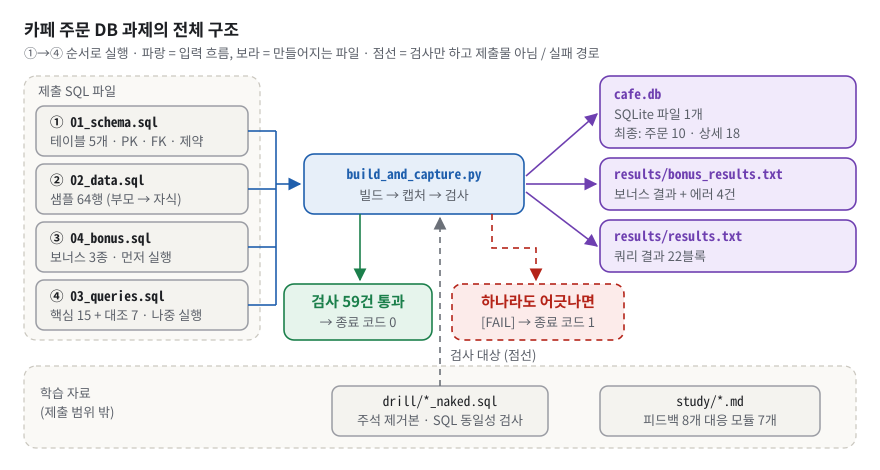
*그림 1. 네 SQL 파일이 ①→④ 순서로 실행되어 cafe.db 와 결과 텍스트를 만들고, 검사 59건이 모두 맞아야 종료 코드 0 이 된다.*

그림 1 에서 봐야 할 것은 세 가지다.

- **실행 순서의 번호.** 파일 이름은 01·02·03·04 인데 실행은 01 → 02 → **04 → 03** 이다. 03 의 끝부분(Q14)이 취소된 주문을 지우는데, 그 뒤에 보너스를 돌리면 취소 주문만 있던 박지호가 "아메리카노를 주문한 고객" 목록에서 빠져 4명이 3명이 되기 때문이다([§3.6](#36-sql-네-동사와-멱등성--읽기는-안전하고-쓰기는-무겁다), Q6.1-5).
- **가운데 파란 상자.** `build_and_capture.py` 는 결과를 "찍기만" 하지 않고 스키마·행 수·FK·제약 위반·최종 상태를 기대값과 **대조**한다. 초록 상자(통과 59건 → 종료 코드 0)와 빨간 점선 상자(하나라도 어긋나면 종료 코드 1)가 그 결과다. 단, Q8 의 행 수나 Q10 의 금액 같은 **쿼리 결과 값 자체는 대조하지 않는다**(§7.2 격차 17).
- **맨 아래 영역.** `drill/` 과 `study/` 는 제출물이 아니라 학습 자료다. 다만 `drill/*_naked.sql` 은 "원본에서 주석만 뺀 사본인가" 를 스크립트가 매번 검사한다(점선).

### 1.2 평가자는 무엇을 보나

체크리스트(`checklists_md/relational_database_sql.md`)는 4영역 15문항이다. 이 문서는 모든 문항을 §6 에 그대로 옮겨 두었다.

| 영역 | 문항 수 | 평가자가 확인하는 것 | 대비하는 곳 |
|---|---|---|---|
| 1. 기능 동작 검증 | 5 | 테이블·PK, FK 차단, 10행, 쿼리 15개, 결과 첨부를 **직접 보여 주는가** | [§5](#5-시연-리허설--평가장에서-그대로) 시연, [§6.1](#61-기능-동작-검증) |
| 2. 구현 구조 설명 | 4 | 테이블 분리 이유, 1:N 의 도메인 의미, 컬럼 타입, 인덱스 컬럼 선택 | [§3.2](#32-테이블행열과-타입--sqlite-의-이름표는-권장-사항이다)~[§3.4](#34-fk-와-1n--자식이-부모-번호를-든다), [§3.11](#311-인덱스--어떻게-저장되고-어떻게-탐색되나), [§6.2](#62-구현-구조-설명) |
| 3. 핵심 개념 이해 | 4 | 엑셀과의 차이, PK/FK, INNER vs LEFT, GROUP BY 와 집계 | [§3.1](#31-db-는-엑셀과-무엇이-다른가--관계와-규칙을-지키는-서랍장), [§3.3](#33-pk--행의-주민번호), [§3.4](#34-fk-와-1n--자식이-부모-번호를-든다), [§3.8](#38-join--inner-와-left-그리고-on-과-where), [§3.9](#39-group-by-와-집계--펼친-행을-바구니로-접는다), [§6.3](#63-핵심-개념-이해) |
| 4. 확장 사고·트러블슈팅 | 2 | 가장 복잡한 쿼리를 단계별로, 가장 어려웠던 부분과 해결 | [§4.2](#42-핵심-시나리오-따라가기), [§6.4](#64-확장-사고--트러블슈팅) |

**이 학습자는 이미 한 번 평가를 받았다.** 그때 받은 피드백 8개(`study/README.md:20-29`)는 체크리스트 밖에서 "한 칸 아래" 를 파고드는 질문이었다. 이번 평가에서도 같은 방향으로 물을 가능성이 높으므로, 각 피드백이 이 문서 어디에서 풀리는지 먼저 짚어 둔다.

| # | 평가자가 한 말 (요지) | 이 문서에서 | 심화 모듈 |
|---|---|---|---|
| 1 | "데이터베이스 사용법에 대해 조금 더 공부했으면 좋겠습니다." | [§3.14](#314-트랜잭션과-동시성--db-사용법의-기본기), [§6.5](#65-한-칸-더--평가자가-파고드는-원리-질문) Q6.5-16~18, [§7.1](#71-실제-평가에서-받은-지적-8개) | [study/07-db-selection.md](study/07-db-selection.md) |
| 2 | 쿼리 읽는 속도가 느리다. 조인과 서브쿼리가 느리다 | [§3.7](#37-select-읽는-순서--주석-없이-3초-안에-입을-연다), [§6.5](#65-한-칸-더--평가자가-파고드는-원리-질문) Q6.5-1·2, [§7.1](#71-실제-평가에서-받은-지적-8개) | [study/01-reading-drill.md](study/01-reading-drill.md) |
| 3 | CHECK 같은 키워드가 실질적으로 어떻게 작동하는지 | [§3.5](#35-제약조건과-check-의-실제-동작--insert-가-지나는-관문-4개), [§6.5](#65-한-칸-더--평가자가-파고드는-원리-질문) Q6.5-3·4, [§7.1](#71-실제-평가에서-받은-지적-8개) | [study/04-constraint.md](study/04-constraint.md) |
| 4 | "어떠한 상황에서 그 데이터베이스를 이용해야 하는지를 학습했으면 합니다." | [§3.15](#315-상황별-db-선택--이름이-아니라-접근-패턴으로), [§6.5](#65-한-칸-더--평가자가-파고드는-원리-질문) Q6.5-18~20, [§7.1](#71-실제-평가에서-받은-지적-8개) | [study/07-db-selection.md](study/07-db-selection.md) |
| 5 | 인덱싱이 왜 인덱싱인지, 어떻게 저장되고 탐색되는지 | [§3.11](#311-인덱스--어떻게-저장되고-어떻게-탐색되나), [§6.5](#65-한-칸-더--평가자가-파고드는-원리-질문) Q6.5-5~9, [§7.1](#71-실제-평가에서-받은-지적-8개) | [study/05-index.md](study/05-index.md) |
| 6 | 쿼리에 달린 주석을 지웠으면 한다 | [§3.7](#37-select-읽는-순서--주석-없이-3초-안에-입을-연다), [§6.5](#65-한-칸-더--평가자가-파고드는-원리-질문) Q6.5-1·2, [§7.1](#71-실제-평가에서-받은-지적-8개) | [study/01-reading-drill.md](study/01-reading-drill.md), [drill/03_queries_naked.sql](drill/03_queries_naked.sql) |
| 7 | 정규화, N:M 은 브릿지 테이블로 1:N + N:1 | [§3.13](#313-정규화와-nm-브릿지-테이블), [§6.5](#65-한-칸-더--평가자가-파고드는-원리-질문) Q6.5-14·15, [§7.1](#71-실제-평가에서-받은-지적-8개) | [study/06-normalization.md](study/06-normalization.md) |
| 8 | 서브쿼리와 조인을 자신감 있게 설명했으면 | [§3.8](#38-join--inner-와-left-그리고-on-과-where), [§3.10](#310-서브쿼리와-join--언제-무엇을-쓰나), [§6.5](#65-한-칸-더--평가자가-파고드는-원리-질문) Q6.5-2·10~13, [§7.1](#71-실제-평가에서-받은-지적-8개) | [study/02-join.md](study/02-join.md), [study/03-subquery.md](study/03-subquery.md) |

피드백을 한 줄로 줄이면 평가자의 성향은 이렇다. **기능이 아니라 메커니즘**을 묻고("CHECK 가 실제로 어떻게"), **이름이 아니라 선택 기준**을 묻고("어떤 상황에서"), **주석 없이도** 읽히는지 본다. 그래서 이 문서의 모든 답은 "첫 문장에 결론 → 근거 숫자 → 코드 위치" 순서로 짜여 있다.

### 1.3 30초 자기소개 스크립트

평가가 시작되면 아래를 그대로 말한다. 30초 안팎이다.

> "카페 주문 관리 데이터베이스를 SQLite 로 만들었습니다. 고객, 카테고리, 메뉴, 주문 헤더, 주문 상세 다섯 테이블이고, FK 로 연결된 1:N 관계가 네 개입니다. 핵심 설계는 두 가지입니다. 첫째, 주문 한 건과 그 안의 메뉴 줄을 헤더와 상세로 나눴고, 주문 상세가 주문과 메뉴의 N:M 을 푸는 브릿지 테이블입니다. 둘째, 주문 시점 단가를 상세에 따로 저장해서 메뉴 가격을 바꿔도 과거 매출이 바뀌지 않습니다. `build_and_capture.py` 한 번으로 DB 를 새로 만들고 결과를 캡처한 뒤, 테이블·행 수·FK·제약 위반 4종·최종 상태를 검사 59건으로 확인해 하나라도 어긋나면 종료 코드 1 로 멈춥니다. 지난 평가 뒤에는 CHECK 와 인덱스의 내부 동작, 주석 없이 읽기를 따로 보강했습니다."

## 2. 명세 정독 — 무엇을 요구받았나

### 2.1 요구사항 지도

"원문 요지" 칸은 과제 PDF 문장 그대로다. 상태: ✅ 충족 · ⚠️ 부분 · ❌ 미충족 · 🔍 검증 불가.

| ID | 원문 요지 (PDF 그대로) | 쉬운 말 | 왜 이런 요구를? | 내 구현 | 상태 |
|---|---|---|---|---|---|
| `R1-1` | 로컬에서 실행 가능한 DB를 설치/준비한다. (예: SQLite, MySQL, PostgreSQL, H2 중 택1) | 내 컴퓨터에서 도는 DB 하나 | 서버 없이 전 과정을 재현하게 | `01_schema.sql:3` "DBMS: SQLite 3", `cafe.db` | ✅ |
| `R1-2` | DB에 접속해 SQL을 실행할 수 있는 도구를 준비한다. (예: DBeaver, TablePlus, DataGrip, CLI 등) | SQL 을 돌릴 도구 | 쿼리를 실제로 돌려야 결과가 남는다 | `build_and_capture.py`(표준 라이브러리 **러너** — SQL 파일을 차례로 실행·캡처·검사하는 스크립트), README "sqlite3 CLI 로 직접 실행하기" 절 | ✅ |
| `R1-3` | DB 고유 문법을 사용한 경우, 해당 쿼리에 어떤 DB 전용 문법인지 주석으로 명시한다. | SQLite 전용 문법에 표시 | 다른 DB 로 옮길 때 깨질 곳을 미리 알게 | `01_schema.sql:8-12`, `02_data.sql:7-9`, `03_queries.sql:20-24`, `04_bonus.sql:76` | ✅ |
| `R1-3a` | DB별 문법 차이(날짜 함수, 자동 증가 키 등)가 존재하므로, 가급적 표준 SQL 범위 내에서 작성을 권장한다. | 되도록 표준 SQL | 다른 DB 로 옮기기 쉽게 | 대부분 표준 SQL, 전용 문법은 `[SQLite 전용]` 으로 표시(위 R1-3). 옮길 때 깨지는 곳은 Q6.5-20 | ✅ |
| `R2-1` | 최소 4개 테이블을 설계한다. | 표 4개 이상 | 관계를 만들 재료 | 5개: `01_schema.sql:32`, `:65`, `:73`, `:97`, `:120` | ✅ |
| `R2-2` | 각 테이블은 PK를 가진다. | 행마다 고유 번호 | 한 행을 정확히 가리키려고 | 5개 모두 `id INTEGER PRIMARY KEY AUTOINCREMENT` | ✅ |
| `R2-3` | 최소 2개 이상의 FK를 사용해 1:N 관계를 만든다. | 부모-자식 연결 2개 이상 | JOIN 과 무결성의 핵심 | 4개: `01_schema.sql:91`, `:114`, `:137`, `:140` | ✅ |
| `R2-4` | 컬럼 타입을 의미에 맞게 선택한다. ( TEXT/VARCHAR , INTEGER , DATE/DATETIME 등) | 값 성격에 맞는 타입 | 타입이 최소한의 검증·정렬 규칙 | `01_schema.sql:39-55`, `:80-87`, `:101-105`. SQLite 어피니티 한계는 §7.2 | ✅ |
| `R2-5` | 테이블/컬럼 이름은 역할이 드러나도록 작성한다. | 이름만 봐도 역할 | 이름이 곧 문서 | `order_header`, `order_detail`, `joined_at`, `unit_price`, `is_available` | ✅ |
| `R2-6` | "서비스 주제(데이터 종류)"는 학습자가 직접 정하되, 최소 4개 테이블과 2개 이상의 1:N 관계를 포함할 수 있는 수준으로 선택한다. | 주제는 자유 | 관계 설계를 연습할 만한 주제로 | 카페 주문 관리(`01_schema.sql:2`). 원문 예시 목록에도 "카페 주문" 이 있다 | ✅ |
| `R3-1` | 최소 1개 컬럼에 NOT NULL 을 적용한다. | 빈 값 금지 1개 이상 | 필수 값 보장 | phone 을 뺀 모든 일반 컬럼. 유일한 NULL 허용은 `01_schema.sql:48` | ✅ |
| `R3-2` | 최소 1개 컬럼에 UNIQUE 를 적용한다. | 중복 금지 1개 이상 | 자연키 보호 | email `01_schema.sql:44`, category.name `:67`, menu.name `:78` | ✅ |
| `R3-3` | FK가 실제로 동작하도록 설정한다. (없는 값 참조가 막혀야 한다) | 없는 부모 번호 거부 | 선언만으로는 안 막히는 DB 가 있다 | 네 파일 모두 `PRAGMA foreign_keys = ON;` (`01_schema.sql:20` 등), 증거 `results/bonus_results.txt:78` | ✅ |
| `R4-1` | 각 테이블에 최소 10행 이상의 데이터를 입력한다. | 표마다 10줄 이상 | 집계·LEFT JOIN 결과가 의미 있게 | 10 / 10 / 12 / 12 / 20 (`02_data.sql:15-101`) | ✅ |
| `R4-2` | FK로 연결된 데이터가 실제로 관계를 갖도록 입력한다. | 번호가 실제로 이어지게 | 조인 결과가 나와야 | FK ON 상태에서 전량 입력, 커밋본 `PRAGMA foreign_key_check` 빈 결과 | ✅ |
| `R4-3` | 데이터 입력 시, FK가 참조하는 부모 테이블에 데이터가 먼저 존재해야 한다. | 부모 먼저 INSERT | FK 는 즉시 검사한다 | `02_data.sql:4` 의 순서대로 `:15` → `:30` → `:47` → `:63` → `:81` | ✅ |
| `R5-1` | 기본 조회 4개 이상 ( WHERE , ORDER BY , LIMIT 포함) | 기본 SELECT 4개 | 거르기·정렬·자르기 | Q1~Q4 `03_queries.sql:35-70`. 세 요소를 한 쿼리에 모두 가진 것은 Q4 | ✅ |
| `R5-2` | 조인 4개 이상 ( INNER JOIN 2개 이상, LEFT JOIN 1개 이상 포함) | 조인 4개 | 관계형의 본질 | Q5·Q6·Q8(INNER) + Q7(LEFT), 대조 Q8-B | ✅ |
| `R5-3` | 집계 3개 이상 ( COUNT , SUM , AVG 중 2개 이상 + GROUP BY ) | 집계 3개 | 실무 리포트 | Q9 COUNT · Q10 SUM · Q11 AVG | ✅ |
| `R5-4` | 서브쿼리 1개 이상 | 쿼리 안 쿼리 | 값처럼 쓰는 쿼리 | Q12 `03_queries.sql:257-261`, 보너스에 IN · EXISTS | ✅ |
| `R5-5` | 데이터 수정 및 삭제 2개 이상 ( UPDATE , DELETE ) | 고치기·지우기 | 쓰기의 위험 인식 | Q13 `03_queries.sql:272-274`, Q14 `:286-287` | ✅ |
| `R5-6` | 인덱스 1개 이상 ( CREATE INDEX + 적용 이유 1줄) | 인덱스 + 이유 | 성능과 비용 판단 | Q15 `03_queries.sql:321-325`, 이유 `:312-319` | ✅ |
| `R5-7` | 아래 범주의 쿼리를 모두 합쳐 총 15개 이상 작성한다. | 총 15개 | 범주 하한의 합 | 핵심 15 + 대조 7 | ✅ |
| `R6-1` | 쿼리마다 실행 결과를 확인할 수 있어야 한다. | 결과가 보여야 | 동작의 증거 | `results/results.txt` 22블록. Q15 블록 본문은 비어 있음(§7.2) | ✅ |
| `R6-2` | 각 쿼리에는 “무엇을 확인하는 쿼리인지” 한 줄 설명을 붙인다. | 한 줄 설명 | 요구→SQL 번역 훈련 | `-- >> [Qn] …` 라벨 22개 + 보너스 12개 | ✅ |
| `R6-3` | 결과 확인은 스크린샷 또는 결과 텍스트로 남긴다. | 텍스트도 된다 | — | `results/` 폴더 | ✅ |
| `R7` | 스키마 생성 SQL 1개 파일 / 샘플 데이터 INSERT SQL 1개 파일 / 쿼리 15개 SQL 1개 파일 / 실행 결과 캡처(이미지 또는 텍스트) 폴더 1개 | 파일 4종 | 제출물 표준화 | `01_schema.sql`, `02_data.sql`, `03_queries.sql`, `results/` | ✅ |
| `R7-선택` | (선택) ERD 다이어그램 이미지 1개 | ERD 는 선택 | — | README "3. 데이터 모델" 의 Mermaid ERD(이미지 파일은 없음). 선택 항목 | ✅ |

README "0.10 과제 수행 점검" 의 판정은 **필수 37 / 부분 0 / 미충족 0 / 검증 불가 0** 이다. 이 문서 작성 중 복사본에서 러너를 다시 돌린 결과도 검사 59건 모두 통과였다. 감점 사유는 없지만 "물으면 흔들릴 곳" 은 있다. 그것은 §7 에 모았다.

### 2.2 지켜야 할 제약과 그 이유

| 원문 (PDF 7절 그대로) | 왜 이런 제약을 거나 | 이 저장소에서 |
|---|---|---|
| "백엔드 프레임워크 사용 금지: Spring/Django/Express 등으로 API나 화면을 만들지 않는다." | **ORM**(테이블을 코드의 객체처럼 다루게 해 SQL 을 대신 만들어 주는 라이브러리)이 대신 해 주는 JOIN·FK 를 손으로 써 봐야 나중에 ORM 이 만드는 SQL 을 읽을 수 있다. 원문 미션 소개도 "ORM이 해주는 일을 "SQL 관점에서" 이해할 수 있는 기반" 이라고 적는다. | `build_and_capture.py:39-44` 의 import 는 `os`·`re`·`sqlite3`·`sys`·`unicodedata`·`datetime` 뿐이다. API 도 화면도 없는 실행·캡처 도구다. |
| "DB: 로컬에서 실행 가능한 DB만 사용한다." | 누구나 같은 결과를 재현하게 하려고. | SQLite 파일 하나(`cafe.db`). |
| "뷰(View), 프로시저, 트리거 같은 고급 기능은 사용하지 않는다." | 기본기(테이블·키·조인)에 집중하게. **뷰**는 저장해 둔 조회, **트리거**는 행이 바뀔 때 자동 실행되는 규칙, **프로시저**는 DB 안에 저장한 함수다. | SQLite 에는 프로시저가 아예 없다. 뷰·트리거 0개를 매 실행 검사한다(`build_and_capture.py:349-355`). |
| "정규화 이론을 과도하게 깊게 파지 않는다. 대신 “관계가 자연스럽고 쿼리가 잘 나오는 구조”를 목표로 한다." | 이론 암기가 아니라 실용 설계를 보려고. | 5테이블. 정규화는 "이상 현상을 없앴다" 로 설명한다(§3.13). |

### 2.3 출력·형식 규칙

이 과제에는 "한 글자도 다르면 안 되는" 고정 출력 형식이 없다. 형식 규칙은 원문의 세 문장뿐이다.

1. 각 쿼리에 "무엇을 확인하는 쿼리인지" 한 줄 설명 → 모든 쿼리 위의 `-- >> [Qn] 범주 - 설명` 라벨. 이 라벨은 캡처 파일의 섹션 제목으로 그대로 옮겨진다(`build_and_capture.py:191`, `:243-247`).
2. DB 고유 문법에는 "어떤 DB 전용 문법인지 주석" → `[SQLite 전용]` 표시와 파일 머리의 요약(`01_schema.sql:8-12`, `03_queries.sql:20-24`).
3. 인덱스는 "CREATE INDEX + 적용 이유 1줄" → `03_queries.sql:312-319` 의 사유 1·2 와 비용 주석.

캡처 파일은 각자 첫 8줄에 **생성 시각·SQLite 버전·Python 버전·`foreign_keys : ON`** 을 적는다(`results/results.txt:1-8`). 결과가 "FK 가 켜진 상태에서 나왔다" 는 것을 파일이 스스로 증명하게 하려는 장치다.

### 2.4 보너스 과제

세 개 모두 했다.

| 보너스 (원문) | 한 것 | 위치 · 결과 |
|---|---|---|
| "같은 요구를 JOIN 으로도 풀고, 서브쿼리로도 풀어보고 차이를 비교해본다." | "아메리카노를 한 번이라도 주문한 고객" 을 JOIN · IN · EXISTS 세 방식으로 풀고 실행계획까지 비교 | `04_bonus.sql:33-39`, `:45-54`, `:62-72`, 계획 `:78-101`, 요약 `:103-127`. 세 방식 모두 4행(김민준·이서연·박지호·정우진). 단, IN·EXISTS 의 괄호 안에도 JOIN 이 2개씩 있어 대조가 완전하지는 않다(§7.2 격차 18) |
| "일부러 FK 에러가 나는 입력을 시도하고, 왜 막히는지와 어떻게 고쳐야 하는지 기록해본다." | FK · UNIQUE · CHECK · NOT NULL 위반 4종을 일부러 일으키고, 해결법을 `BEGIN … ROLLBACK` 으로 시연 | `04_bonus.sql:134-180`, 에러 캡처 `results/bonus_results.txt:78`, `:83`, `:88`, `:93` |
| "이 DB로 뽑을 수 있는 핵심 지표 3개"를 정의하고, 각각을 구하는 SQL을 최종본으로 정리한다. | 일자별 매출 · 인기 메뉴 TOP 5 · VIP 고객 TOP 3, "매출 = COMPLETED 만" 으로 정의 | `04_bonus.sql:197-204`, `:211-220`, `:227-236`, 정의 `:184-186` |

## 3. 배경 개념 — 처음부터 차근차근

개념은 쉬운 것에서 어려운 것 순서로 쌓는다. 뒤 칸에서 자세히 다룰 용어가 앞에 먼저 나오면 괄호로 짧게 풀고 어느 절에서 정의하는지 적어 둔다. 피드백 번호가 붙은 칸(피드백 1~8)은 지난 평가에서 실제로 파고든 주제다.

### 3.1 DB 는 엑셀과 무엇이 다른가 — 관계와 규칙을 지키는 서랍장

**비유로 먼저.** 엑셀은 **종이 장부 묶음**이다. 어느 칸에 무엇을 적든 막지 않는다. 데이터베이스는 **규칙을 아는 장부 관리인**이 딸린 서랍장이다. 없는 고객 번호로 쓴 주문서를 내밀면 관리인이 받아 주지 않는다.

비유의 한계: 관리인은 **적어 둔 규칙만** 지킨다. 규칙에 없는 실수(예: 가격 칸에 글자를 넣기)는 SQLite 관리인이 통과시킨다(§3.2).

**정확히 말하면.** **데이터베이스(DB)** 는 규칙과 관계를 가진 채로 데이터를 저장하고 꺼내는 저장소다. 그것을 관리하는 소프트웨어를 **DBMS**(Database Management System, 데이터베이스 관리 시스템)라고 부른다. DBMS 는 저장·조회·무결성(규칙 지키기)·동시성(여러 사용자 조율)을 맡는다. **SQLite** 는 서버 프로세스 없이 프로그램 안에서 파일 하나(`cafe.db`)를 직접 읽고 쓰는 DBMS 다. MySQL·PostgreSQL 은 별도의 서버 프로그램이 떠 있어야 한다.

과제 원문이 짚은 차이는 크기가 아니다. "엑셀과 DB의 차이는 '데이터가 얼마나 많냐'가 아닙니다. 테이블 사이의 '관계'를 표현할 수 있냐의 차이입니다."

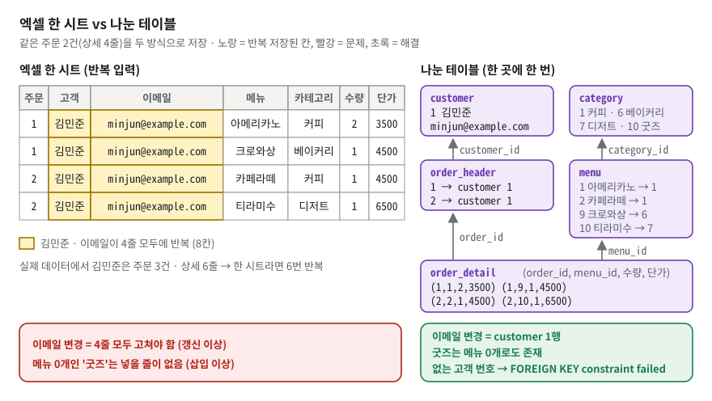
*그림 2. 한 시트에서는 김민준의 이메일이 4번 반복되지만, 나눈 테이블에서는 customer 한 행만 고치면 된다.*

**구체적인 숫자로.** 그림 2 왼쪽의 노란 칸을 세어 보자. 김민준의 주문 1·2 만 적어도 이름과 이메일이 4번 반복된다. 주문 12 까지 합치면 김민준의 줄은 **6줄**이다(`results/results.txt:111-130` 의 Q6 결과에서 김민준 행 6개). 이메일이 바뀌면 6줄을 전부 찾아 고쳐야 하고, 한 줄이라도 빠뜨리면 "같은 사람의 이메일이 두 개" 가 된다. 이것을 **갱신 이상**이라고 부른다. 메뉴가 0개인 카테고리 '굿즈' 는 적을 줄이 아예 없다. 이것이 **삽입 이상**이다.

그림 2 오른쪽처럼 나누면 이메일 변경은 `customer` 1행 수정으로 끝나고, '굿즈' 는 메뉴 없이도 `category` 에 존재한다. 없는 고객 번호로 주문을 넣으면 `FOREIGN KEY constraint failed` 로 거부된다(실측, §5.2).

**이 과제에서는.** 세 가지 차이를 실제로 보여 줄 수 있다.
1. **관계를 강제한다** — **FK**(외래 키. 자식 행이 부모 행의 번호를 드는 칸, [§3.4](#34-fk-와-1n--자식이-부모-번호를-든다))가 없는 부모를 가리키는 입력을 막는다(`04_bonus.sql:138` → `results/bonus_results.txt:78`).
2. **그래서 나눌 수 있다** — 엑셀에서 표를 나누면 사람이 번호를 맞춰야 하니 한 시트에 몰게 된다. DB 는 나눠 저장하고 **JOIN**(번호가 같은 행끼리 이어 붙이는 명령, [§3.8](#38-join--inner-와-left-그리고-on-과-where))으로 필요한 모양으로 다시 합친다(Q6 은 4개 테이블을 합쳐 20행을 만든다).
3. **규칙을 DB 가 지킨다** — NOT NULL(빈 값 금지) · UNIQUE(중복 금지) · CHECK(조건식 검사)가 애플리케이션이 실수해도 데이터를 지킨다([§3.5](#35-제약조건과-check-의-실제-동작--insert-가-지나는-관문-4개)).

**한 칸 아래.** "DB 는 여러 사람이 동시에 쓸 수 있다" 는 말은 DBMS 에 따라 다르다. SQLite 는 **쓰기 잠금이 파일 전체**에 걸린다. 연결 A 가 아메리카노 가격을 고치는 중(아직 확정 전)이면, 연결 B 는 읽기는 되지만 전혀 다른 행(녹차)을 고치려 해도 `database is locked` 로 막힌다(실측). 자세한 순서는 [§3.14](#314-트랜잭션과-동시성--db-사용법의-기본기)의 그림 10 에서 본다.

> [!WARNING]
> **흔한 오해.** "DB 는 데이터가 많을 때 쓰는 것" → 틀렸다. 12행짜리 주문 표도 관계와 규칙이 필요하면 DB 가 맞다. 올바른 설명은 "DB 는 테이블 사이의 **관계**와 입력 **규칙**을 DBMS 가 강제하는 저장소" 다.

### 3.2 테이블·행·열과 타입 — SQLite 의 이름표는 권장 사항이다

**비유로 먼저.** 테이블은 칸마다 이름표가 붙은 표다. 열(column)은 이름표 붙은 칸, 행(row)은 한 건의 기록이다. 이름표에는 "여기엔 숫자" 같은 **타입**이 적혀 있다.

비유의 한계: SQLite 의 이름표는 "가능하면 숫자로 바꿔 주세요" 라는 **권장**이지 강제가 아니다.

**정확히 말하면.** 대부분의 DBMS 는 선언한 타입과 다른 값을 거부한다. SQLite 는 컬럼 선언에서 **타입 어피니티**(affinity, 선호 타입: TEXT · NUMERIC · INTEGER · REAL · BLOB)만 정하고, 값마다 실제 저장 타입을 따로 가진다. 실제 저장 타입은 `typeof()` 로 볼 수 있다. 바꿀 수 있는 값은 선호 타입으로 바꿔 저장하고, 바꿀 수 없으면 그대로 저장한다. `DATE`·`DATETIME` 은 SQLite 에 **실제 타입이 없고** NUMERIC 어피니티 힌트일 뿐이다.

**구체적인 숫자로.** 이 문서 작성 중 복사본 실측:

| 넣은 값 | 컬럼 | 저장 결과 (`typeof`) |
|---|---|---|
| `'2025-08-01'` | `customer.joined_at DATE` | `text` |
| `'2026-04-15 09:12:00'` | `order_header.order_date DATETIME` | `text` |
| `3500` | `menu.price INTEGER` | `integer` |
| `'5000'` (문자열) | `menu.price INTEGER` | `5000`, `integer` 로 변환됨 |
| `'비싼값'` | `menu.price INTEGER` | 그대로 `text` 로 저장됨. `CHECK (price >= 0)` 도 통과 |

마지막 줄이 핵심이다. SQLite 는 문자열을 숫자보다 크다고 비교하므로 `'비싼값' >= 0` 이 참이 되어 CHECK 도 통과한다. 이를 막으려면 3.37 부터 생긴 **STRICT 테이블**을 쓴다. 실측: `CREATE TABLE s (price INTEGER) STRICT` 에 `'비싼값'` 을 넣으면 `cannot store TEXT value in INTEGER column s.price` 로 거부된다.

**이 과제에서는.** 컬럼마다 이유가 주석에 있다(`01_schema.sql`).

| 컬럼 | 타입 | 이유 | 위치 (`01_schema.sql`) |
|---|---|---|---|
| `name`, `email` | TEXT | 길이가 가변이고 계산하지 않는다 | `:39-44` |
| `phone` | TEXT, NULL 허용 | `010-…` 의 하이픈과 앞자리 0 을 보존. 유일하게 NULL 허용 | `:46-48` |
| `joined_at`, `order_date` | DATE, DATETIME | 실제로는 TEXT 저장. `YYYY-MM-DD` 형식은 글자순 정렬 = 날짜순 정렬이라 Q3 의 `ORDER BY joined_at DESC` 가 맞게 동작 | `:50-55`, `:101-105` |
| `price`, `unit_price` | INTEGER | 원화는 소수점이 없다. REAL(부동소수)은 합계에 오차가 쌓인다 | `:80-81`, `:126-129` |
| `quantity` | INTEGER + `CHECK (quantity > 0)` | 0개·음수 주문 차단 | `:124` |
| `is_available` | INTEGER 0/1 + CHECK | SQLite 에 BOOLEAN 타입이 없다 | `:85-87` |
| `status` | TEXT + CHECK 화이트리스트 | 허용 상태 3개를 DB 가 강제 | `:107-110` |

**한 칸 아래.** 기본값 `DATE('now')` 와 `CURRENT_TIMESTAMP` 는 **UTC**(세계 표준시)다. 한국 시간이 필요하면 `DATE('now','localtime')` 이어야 한다(`01_schema.sql:53-54`, `:103-104` 가 스스로 적어 둠). 이 차이는 "일자별 매출"(지표 1)의 날짜 경계를 9시간 어긋나게 할 수 있다.

> [!WARNING]
> **흔한 오해.** "INTEGER 로 선언했으니 정수만 들어간다" → SQLite 에서는 틀렸다. 올바른 설명은 "SQLite 의 선언 타입은 어피니티(선호)일 뿐이고, 강제하려면 STRICT 테이블이나 `CHECK (typeof(price) = 'integer')` 가 필요하다" 다.

### 3.3 PK — 행의 주민번호

**비유로 먼저.** 주민번호가 한 사람을 정확히 가리키듯 **PK**(Primary Key, 기본 키)는 테이블에서 한 행을 정확히 가리킨다. 두 사람이 같은 번호를 가질 수 없고, 번호가 없는 사람도 없다.

비유의 한계: 주민번호에는 생년월일 같은 의미가 있지만 이 스키마의 `id` 는 의미 없는 일련번호다.

**정확히 말하면.** PK 는 중복과 NULL 이 모두 금지된 식별 컬럼이다(표준 SQL 기준. SQLite 의 예외는 아래 한 칸 아래에서 본다). 현실 의미가 있는 값(이메일 등)을 PK 로 쓰면 **자연키**, 의미 없는 번호를 쓰면 **대리키**라고 부른다. SQLite 에서 정확히 `INTEGER PRIMARY KEY` 라고 선언한 컬럼은 행마다 매겨지는 내부 번호 **rowid** 의 별칭이 된다. 즉 별도 인덱스가 아니라 테이블 저장 구조의 키 그 자체다. `AUTOINCREMENT` 를 덧붙이면 "지운 번호를 다시 쓰지 않는다" 는 보장이 추가되고, SQLite 는 그 최댓값을 `sqlite_sequence` 라는 시스템 표에 적어 둔다.

**구체적인 숫자로.** 복사본 실측. 1·2·3 번 행을 넣고 3번을 지운 뒤 새 행을 넣으면:
- `INTEGER PRIMARY KEY` 만 쓴 표 → 새 행 id **3** (지운 번호 재사용)
- `INTEGER PRIMARY KEY AUTOINCREMENT` 표 → 새 행 id **4**

01+02 직후 `sqlite_sequence` 는 category 10 · customer 10 · menu 12 · order_detail 20 · order_header 12 다. PK 로 한 행을 찾으면 **실행계획**(DBMS 가 고른 조회 경로, [§3.12](#312-실행계획-읽기--주장을-증거로-바꾸는-도구))이 `SEARCH customer USING INTEGER PRIMARY KEY (rowid=?)` 로 나온다.

**이 과제에서는.** 다섯 테이블 모두 `id INTEGER PRIMARY KEY AUTOINCREMENT` 다(`01_schema.sql:37`, `:66`, `:74`, `:98`, `:121`). 이유는 주석에 있다.

```sql
    -- [SQLite 전용] INTEGER PRIMARY KEY 는 그 자체로 rowid 의 별칭이라 이미 자동 증가한다.
    --   AUTOINCREMENT 를 덧붙이면 "삭제된 id 를 재사용하지 않는다"는 보장이 추가된다.
    --   주문/결제처럼 과거 식별자가 재사용되면 안 되는 도메인이라 명시적으로 붙였다.
    --   대신 sqlite_sequence 테이블을 유지하는 약간의 쓰기 비용이 생긴다.
    id          INTEGER PRIMARY KEY AUTOINCREMENT,
```
(`01_schema.sql:33-37`) 이메일은 바뀔 수 있으므로 PK 가 아니라 `UNIQUE` 로 두었다(`01_schema.sql:42-44`). 이메일을 PK 로 쓰면 이메일이 바뀔 때 그것을 가리키는 모든 자식 행을 같이 고쳐야 한다.

**한 칸 아래.** PK 위반 메시지는 이름과 달리 `UNIQUE constraint failed: customer.id` 로 나온다. 그러나 확장 에러 코드는 `SQLITE_CONSTRAINT_PRIMARYKEY`(1555)로 UNIQUE(2067)와 구분된다(복사본 실측). **확장 에러 코드**는 SQLite 가 제약 위반의 기본 번호 19(`SQLITE_CONSTRAINT`)를 종류별로 나눠 붙인 번호다. 앱은 버전마다 바뀌기 쉬운 메시지 문자열 대신 이 번호나 그 이름(`SQLITE_CONSTRAINT_PRIMARYKEY` 등)으로 에러 종류를 가른다. 또 `INT PRIMARY KEY` 처럼 철자가 조금만 달라도 rowid 별칭이 되지 않는다. 실측으로 `INT PRIMARY KEY` 표에는 `sqlite_autoindex_a_1` 이라는 별도 인덱스가 생기고, PK 조회 계획도 `SEARCH a USING INDEX sqlite_autoindex_a_1 (id=?)` 로 바뀌었다(`study/05-index.md` §2 참고).

**SQLite 의 PK 예외.** 표준과 달리 SQLite 는 `INTEGER PRIMARY KEY` 가 **아닌** PK 에 NULL 을 허용한다(오래된 버그를 하위 호환 때문에 남겨 둔 것). 실측: `CREATE TABLE t (a TEXT PRIMARY KEY)` 에 NULL 을 두 번 넣으면 2행이 들어간다. 이 스키마는 전부 `INTEGER PRIMARY KEY` 라서 id 에 NULL 을 넣으면 번호가 자동으로 매겨질 뿐이다(실측: id 1). 다른 타입을 PK 로 쓴다면 `NOT NULL` 을 직접 적는다(`study/06-normalization.md` 도 같은 점을 짚는다).

> [!WARNING]
> **흔한 오해.** "AUTOINCREMENT 가 있어야 자동 증가한다" → 틀렸다. `INTEGER PRIMARY KEY` 만으로 자동 증가한다. `AUTOINCREMENT` 가 추가로 보장하는 것은 **번호 재사용 금지**다.

### 3.4 FK 와 1:N — 자식이 부모 번호를 든다

**비유로 먼저.** 택배 송장에는 "받는 사람 번호" 가 적혀 있다. 주문 상세 한 줄은 "나는 몇 번 주문서에 속한다" 는 번호표를 단다. 없는 주문서 번호를 적은 번호표는 접수 창구에서 거부된다.

비유의 한계: SQLite 의 접수 창구는 **스위치를 켜야** 번호를 확인한다(`PRAGMA foreign_keys`).

**정확히 말하면.** **FK**(Foreign Key, 외래 키)는 자식 테이블의 컬럼이 부모 테이블의 PK(또는 UNIQUE 컬럼)를 가리키게 하는 선언이다. FK 가 지키는 성질을 **참조 무결성**이라고 한다. "가리키는 대상이 반드시 존재한다" 는 뜻이다. **1:N** 은 부모 하나에 자식이 여럿 달리는 관계다. FK 는 항상 **N 쪽(자식)** 에 붙는다. 한 칸에는 값이 하나만 들어가므로 부모가 자식 목록을 들 수 없고, 자식이 자기 부모 번호 하나를 드는 것이다. 그래서 조인 조건은 늘 `부모.id = 자식.부모_id` 모양이다.

부모를 지울 때의 규칙을 **삭제 정책**이라고 한다. `ON DELETE CASCADE` 는 부모를 지우면 자식도 같이 지우고, 아무것도 안 쓰면 기본값 `NO ACTION` 이 되어 자식이 있는 부모의 삭제를 거부한다. 그 밖에 `SET NULL`(자식의 FK 칸을 NULL 로 비움)과 `RESTRICT`(NO ACTION 과 같아 보이지만 검사 시점이 다름)가 있다. 어느 것을 고를지는 Q6.5-18 에서 비교한다.

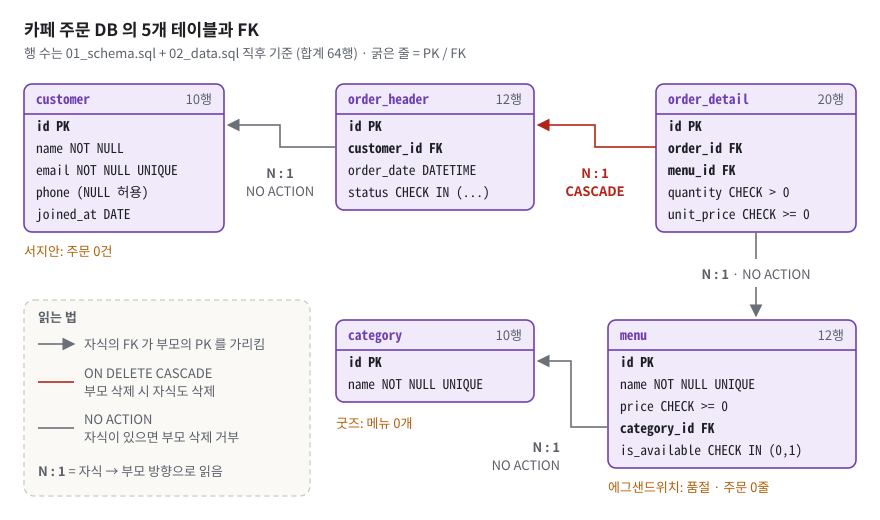
*그림 3. FK 는 항상 N 쪽(자식)에 있고 부모의 PK 를 가리킨다. 빨간 CASCADE 는 주문 헤더→상세 하나뿐이다.*

그림 3 에서 화살촉은 모두 **부모 쪽**을 향한다. 화살표의 꼬리(FK 컬럼)가 있는 상자가 N 쪽이다. 빨간 선은 하나뿐이다. 선 옆 라벨 `N : 1` 은 화살표 방향(자식 → 부모)으로 읽은 것이고, 같은 관계를 부모 쪽에서 읽으면 이 문서가 말하는 1:N 이다.

**구체적인 숫자로.** 초기 상태의 실데이터로 네 관계를 읽어 보자.

| 관계 | 부모 1 | 자식 N | 실제 예 |
|---|---|---|---|
| customer 1:N order_header | 고객 | 주문 | 김민준 → 주문 1·2·12, 서지안 → 0건 |
| order_header 1:N order_detail | 주문 | 메뉴 줄 | 주문 1 → 아메리카노 2잔 + 크로와상 1개(2줄). 주문별 줄 수 2,2,2,1,2,1,2,2,1,2,1,2 = 20 |
| category 1:N menu | 카테고리 | 메뉴 | 커피 → 아메리카노·카페라떼·바닐라라떼, 굿즈 → 0개 |
| menu 1:N order_detail | 메뉴 | 주문 줄 | 아메리카노 → 상세 id 1·7·10·15·19 (주문 1·4·6·9·12), 에그샌드위치 → 0줄 |

`order_detail` 의 첫 행 `(1, 1, 2, 3500)`(`02_data.sql:82`)은 "1번 주문에 속한 줄, 1번 메뉴(아메리카노) 2잔, 한 잔 3500원" 이라고 읽는다.

삭제 정책 실측(stdin 스크립트, FK ON): `DELETE FROM customer WHERE id = 1`, `category … id = 1`, `menu … id = 1` 세 문장은 모두 `FOREIGN KEY constraint failed` 로 거부됐다. `DELETE FROM order_header WHERE id = 1` 은 성공했고 order_detail 은 20행 → 18행이 되었으며 customer 는 10행 그대로였다.

**이 과제에서는.** FK 선언 4개(`01_schema.sql:91`, `:114`, `:137`, `:140`)와 스위치(`01_schema.sql:20`)다.

```sql
    -- 4개 FK 중 유일하게 CASCADE 를 건 곳. 주문 헤더가 사라지면 그 상세 라인은 존재 의미가 없다
    -- (주문 없는 주문상세 = 고아 데이터). 반대로 고객/카테고리/메뉴는 이력 보존이 우선이라 NO ACTION.
    FOREIGN KEY (order_id) REFERENCES order_header(id) ON DELETE CASCADE,

    -- 메뉴는 단종되더라도 과거 주문 이력이 남아야 하므로 CASCADE 를 걸지 않는다.
    FOREIGN KEY (menu_id)  REFERENCES menu(id)
```
(`01_schema.sql:131-140` 중 핵심 줄) 네 SQL 파일이 모두 주석 다음 **첫 실행 문장**으로 `PRAGMA foreign_keys = ON;` 을 켠다(`01_schema.sql:20`, `02_data.sql:10`, `03_queries.sql:27`, `04_bonus.sql:16`).

**한 칸 아래.** `PRAGMA foreign_keys` 는 **파일이 아니라 연결(connection)의 속성**이고 기본값은 0(꺼짐)이다. **하위 호환**(FK 검사가 없던 옛 버전용 프로그램이 새 버전에서도 똑같이 동작하게 하는 것) 때문이다. 세 가지를 실측으로 확인했다.
1. 새 연결에서 `PRAGMA foreign_keys;` → `0`.
2. 꺼진 연결에서 `customer_id = 999` 주문 INSERT → **그대로 들어간다**(`13|999|PENDING`). 이런 고아 행은 나중에 스위치를 켜도 잡히지 않고, `PRAGMA foreign_key_check;` 로만 찾을 수 있다(`order_header|13|customer|0`).
3. `BEGIN` 한 뒤 트랜잭션 안에서 `PRAGMA foreign_keys = ON` 을 실행하면 **에러 없이 무시**된다(조회하면 여전히 `0`).

또 SQLite 는 FK 컬럼에 인덱스를 **자동으로 만들지 않는다**. 그래서 부모를 지울 때 자식을 찾으려고 자식 표 전체를 훑는다(§3.11, `DELETE FROM category WHERE id=9` → `SCAN menu`).

> [!WARNING]
> **흔한 오해.** "FK 를 선언했으니 막힌다" → SQLite 에서는 틀렸다. 올바른 설명은 "선언은 스키마에 적힐 뿐이고, **연결마다** `PRAGMA foreign_keys = ON` 을 켜야 검사한다. MySQL(InnoDB)·PostgreSQL 은 기본으로 검사한다" 다.

### 3.5 제약조건과 CHECK 의 실제 동작 — INSERT 가 지나는 관문 4개

> [!IMPORTANT]
> 피드백 3 — "CHECK 같은 키워드가 실질적으로 어떻게 작동하는지". 평가자는 문법이 아니라 **언제, 무엇을, 어떻게 평가하고, 실패하면 무엇이 일어나는지**를 물었다.

**비유로 먼저.** INSERT 한 줄은 접수 창구의 관문 네 개를 차례로 지난다. ① 빈칸 검사 ② 규칙 검사 ③ 명부 중복 검사 ④ 부모 존재 검사. 하나라도 걸리면 그 쪽지는 통째로 돌려보내진다.

비유의 한계: 규칙 검사(CHECK) 관문은 "확실히 틀렸다" 만 돌려보낸다. "모르겠다(NULL)" 는 통과시킨다.

**정확히 말하면.** **제약조건**(constraint)은 DBMS 가 강제하는 입력 규칙이다. `NOT NULL`(빈 값 금지), `UNIQUE`(중복 금지), `CHECK (식)`(식이 거짓이면 거부), `FOREIGN KEY`(부모가 있어야 함), `PRIMARY KEY` 가 있다. CHECK 의 동작은 네 단계다.
1. **저장.** `CREATE TABLE` 때 CHECK 식은 **원문 그대로** 스키마 표 `sqlite_master` 의 `sql` 칸에 저장된다. 실측으로 `order_header` 의 저장 텍스트를 열면 `CHECK (status IN ('PENDING','COMPLETED','CANCELLED'))` 는 물론 한국어 주석 줄까지 그대로 들어 있다. SQLite 는 DB 를 열 때 이 텍스트를 다시 해석해 규칙을 복원한다.
2. **평가 시점.** INSERT·UPDATE 가 **행 하나를 만들 때마다**, 그 행의 새 값만 식에 대입해 계산한다. COMMIT 때가 아니라 문장 실행 중 즉시다.
3. **판정.** 결과가 FALSE 면 거부, TRUE 나 **UNKNOWN(NULL)** 이면 통과.
4. **실패 처리.** 그 **문장 전체**의 변경을 취소한다. 같은 **트랜잭션**(BEGIN~COMMIT 으로 묶은 작업 묶음, [§3.14](#314-트랜잭션과-동시성--db-사용법의-기본기))의 앞선 문장들은 유지된다. **드라이버**(프로그램과 DB 사이의 통역 모듈. 여기서는 파이썬 `sqlite3`)는 에러를 올린다(`sqlite3.IntegrityError`).

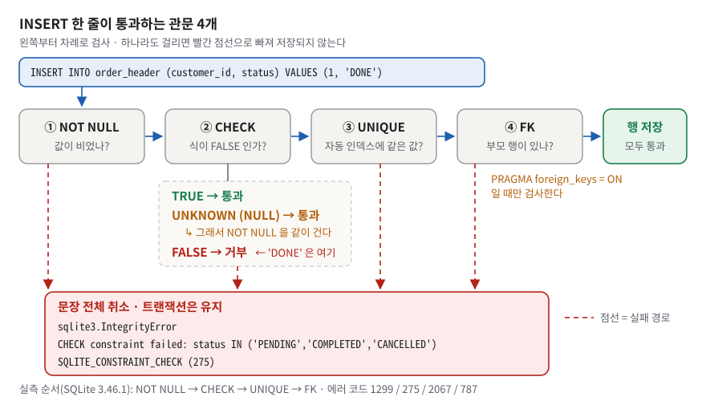
*그림 4. 한 줄은 NOT NULL → CHECK → UNIQUE → FK 순으로 검사된다. CHECK 는 FALSE 만 거부하므로 NULL(UNKNOWN)은 통과한다.*

그림 4 의 ② 아래 주황 줄이 핵심이다. `UNKNOWN (NULL) → 통과`. 그래서 이 스키마는 CHECK 를 건 컬럼에 NOT NULL 을 **항상 같이** 걸었다.

**구체적인 숫자로.** 제약 두 개를 동시에 어기는 행을 넣어 **어느 에러가 먼저 나는지**로 검사 순서를 실측했다(SQLite 3.46.1, 복사본).

| 넣은 행 | 어긴 제약 두 개 | 먼저 난 에러 |
|---|---|---|
| ① `order_header (customer_id=999, status='DONE')` | FK, CHECK | CHECK |
| ② `menu (name='아메리카노', price=-1)` | UNIQUE, CHECK | CHECK |
| ③ `menu (name='아메리카노', category_id=999)` | UNIQUE, FK | UNIQUE |
| ④ `order_detail (quantity=NULL, unit_price=-5)` | NOT NULL, CHECK | NOT NULL |

표는 어긴 두 컬럼만 줄여 적었다. 직접 재현할 때는 **나머지 컬럼을 유효한 값으로 채운** 아래 네 줄을 쓴다. 01+02 로 새로 만든 DB 에서 `PRAGMA foreign_keys = ON;` 을 먼저 켠다. 줄여 쓴 그대로 `INSERT INTO menu (name, price) VALUES ('아메리카노', -1)` 을 넣으면 빠진 `category_id` 가 먼저 걸려 `NOT NULL constraint failed: menu.category_id` 가 나서 표가 재현되지 않는다.

```sql
INSERT INTO order_header (customer_id, status) VALUES (999, 'DONE');                        -- ①
INSERT INTO menu (name, price, category_id) VALUES ('아메리카노', -1, 1);                     -- ②
INSERT INTO menu (name, price, category_id) VALUES ('아메리카노', 100, 999);                  -- ③
INSERT INTO order_detail (order_id, menu_id, quantity, unit_price) VALUES (1, 1, NULL, -5); -- ④
```

실제 메시지 원문은 이렇다.

```text
① CHECK constraint failed: status IN ('PENDING','COMPLETED','CANCELLED')
② CHECK constraint failed: price >= 0
③ UNIQUE constraint failed: menu.name
④ NOT NULL constraint failed: order_detail.quantity
```

그래서 순서는 **NOT NULL → CHECK → UNIQUE → FK** 다. 확장 에러 코드(기본 번호 19 를 종류별로 나눈 번호, §3.3)는 NOT NULL 1299 · CHECK 275 · UNIQUE 2067 · FK 787 · PK 1555 다.

3값 논리도 실측했다. `SELECT NULL >= 0, NULL IN (0,1), NULL = 'COMPLETED', NULL IS NULL` → `NULL, NULL, NULL, 1`. `CREATE TABLE t (v INTEGER CHECK (v > 0))` 에 NULL 을 넣으면 **성공**, -1 을 넣으면 `CHECK constraint failed: v > 0`.

**이 과제에서는.** CHECK 는 다섯 군데다: `price >= 0`(`01_schema.sql:81`), `is_available IN (0, 1)`(`:86-87`), `status IN (...)`(`:109-110`), `quantity > 0`(`:124`), `unit_price >= 0`(`:129`). 다섯 컬럼 모두 `NOT NULL` 이 같이 걸려 있다. 보너스 (2-c)가 CHECK 를 일부러 어긴다.

```sql
INSERT INTO order_header (customer_id, status) VALUES (1, 'DONE');
```
(`04_bonus.sql:147`) → `Runtime error: IntegrityError: CHECK constraint failed: status IN ('PENDING','COMPLETED','CANCELLED')`(`results/bonus_results.txt:88`). 메시지에 제약 이름 대신 **식 원문**이 찍히는 이유는 제약에 이름(`CONSTRAINT chk_… CHECK …`)을 붙이지 않았기 때문이다.

**한 칸 아래.**
- **WHERE 와 반대다.** WHERE 는 "TRUE 여야 통과", CHECK 는 "FALSE 가 아니면 통과" 다. 같은 UNKNOWN 이 WHERE 에서는 탈락하고 CHECK 에서는 통과한다.
- **인덱스를 만들지 않는다.** CHECK 는 행 하나 안에서만 계산하므로 다른 행을 볼 필요가 없다. 반대로 UNIQUE 는 "다른 행에 같은 값이 있나" 를 매번 찾아야 해서 `sqlite_autoindex_*` 라는 인덱스를 자동으로 만든다(§3.11).
- **다른 테이블을 볼 수 없다.** 실측: `CHECK (v IN (SELECT 1))` → `subqueries prohibited in CHECK constraints`. 다른 테이블을 참조하는 규칙은 FK 의 일이다.
- **애플리케이션까지의 길.** 엔진이 제약 위반 코드(기본 19, 확장 275)를 내고 → 파이썬 드라이버가 `sqlite3.IntegrityError` 로 바꾸고 → 앱은 메시지 문자열이 아니라 `e.sqlite_errorname`(파이썬 3.11+, 예: `SQLITE_CONSTRAINT_CHECK`)으로 종류를 가른다. 메시지는 버전·DBMS 마다 바뀐다(`study/04-constraint.md` §5).

> [!WARNING]
> **흔한 오해.** "CHECK (price >= 0) 이면 NULL 도 막힌다" → 틀렸다. NULL 비교는 UNKNOWN 이고 CHECK 는 UNKNOWN 을 통과시킨다. NULL 을 막는 것은 `NOT NULL` 이다. 또 "CHECK 는 COMMIT 때 검사한다" 도 틀렸다. 문장 실행 중 행마다 즉시 검사한다.

### 3.6 SQL 네 동사와 멱등성 — 읽기는 안전하고 쓰기는 무겁다

**비유로 먼저.** SELECT 는 장부 열람, INSERT 는 새 줄 쓰기, UPDATE 는 고쳐 쓰기, DELETE 는 지우기다. 열람은 백 번 해도 장부가 그대로지만, 고쳐 쓰기는 한 번 할 때마다 장부가 바뀐다.

**정확히 말하면.** SQL 명령은 크게 **DDL**(Data Definition Language, 구조를 만드는 명령: `CREATE`, `DROP`)과 **DML**(Data Manipulation Language, 데이터를 다루는 명령: `SELECT`, `INSERT`, `UPDATE`, `DELETE`)로 나눈다. 이 저장소가 쓰는 `BEGIN` · `COMMIT` · `ROLLBACK` 은 둘 다 아닌 **트랜잭션 제어(TCL, Transaction Control Language)** 로 따로 분류한다([§3.14](#314-트랜잭션과-동시성--db-사용법의-기본기)). 쓰기 명령에서 중요한 성질이 **멱등성**이다. 여러 번 실행해도 결과가 한 번 실행한 것과 같은 성질을 말한다.

**구체적인 숫자로.** 복사본 실측. 아메리카노(3500원)에 상대 변경 `SET price = price + 500` 을 세 번 실행하면 4000 → 4500 → 5000 으로 계속 오른다. 절대값 대입 `SET price = 4000` 은 두 번 실행해도 4000, 4000 이다.

**이 과제에서는.** 과제 목표 3 "SELECT / INSERT / UPDATE / DELETE 를 언제 쓰는지" 를 파일 구조로 보여 준다.

| 동사 | 언제 | 이 저장소의 예 |
|---|---|---|
| SELECT | 상태를 바꾸지 않고 읽을 때 | Q1~Q12 |
| INSERT | 새 사실이 생길 때(부모 먼저) | `02_data.sql` 전체, 보너스 (2-e) |
| UPDATE | 기존 사실이 바뀔 때 | Q13 아메리카노 가격 조정 |
| DELETE | 사실을 없앨 때(되돌릴 수 없음) | Q14 취소 주문 삭제 → CASCADE 로 상세 2줄도 삭제 |

Q13 은 멱등하게 썼다(`03_queries.sql:265-268` 이 이유를 적어 둠).

```sql
UPDATE menu
SET    price = 4000
WHERE  name = '아메리카노';
```
(`03_queries.sql:272-274`) `WHERE name = …` 으로 한 행만 고를 수 있는 이유는 `menu.name` 이 UNIQUE 이기 때문이다(`01_schema.sql:76-78`). 캡처에는 영향받은 행 수가 남는다: `-- UPDATE 완료: 변경된 행 1개`(`results/results.txt:293`), `-- DELETE 완료: 변경된 행 2개`(`results/results.txt:303`).

**한 칸 아래.** 쓰기가 섞인 파일에서는 **읽기의 순서도 결과를 바꾼다.** Q12(평균가보다 비싼 메뉴)는 Q13(가격 인상)보다 앞에 있어야 한다(`03_queries.sql:255`). 보너스 파일은 Q14 보다 앞에 실행해야 한다. 실측으로 03 을 먼저 돌린 DB 에서는 보너스 자가진단이 `(10, 0, 18, 4000)` 으로 기대값 `12 / 2 / 20 / 3500` 과 어긋나고, (1-a) 결과가 4행에서 3행(김민준·이서연·정우진)으로 줄었다. 실무 습관: UPDATE·DELETE 전에 같은 WHERE 로 SELECT 를 먼저 돌려 대상 행을 확인하고, 실행 뒤에는 영향받은 행 수를 본다.

> [!WARNING]
> **흔한 오해.** "SELECT 는 순서와 무관하다" → 같은 스크립트에 UPDATE·DELETE 가 섞이면 틀렸다. SELECT 자체는 상태를 바꾸지 않지만, **앞선 쓰기가 SELECT 의 결과를 바꾼다.**

### 3.7 SELECT 읽는 순서 — 주석 없이 3초 안에 입을 연다

> [!IMPORTANT]
> 피드백 2 "쿼리 읽는 속도가 느리다. 조인과 서브쿼리가 느리다" 와 피드백 6 "쿼리에 달린 주석을 지웠으면 한다". 둘은 같은 증상이다. **주석이라는 목발 없이** 쿼리를 보고 말이 나오기까지 시간이 걸렸다. 평가자는 "겁먹지 말고 스키마 테이블을 보면서 이야기해도 좋습니다" 라고도 했다.

**비유로 먼저.** 요리 레시피를 완성 사진(SELECT)부터 읽으면 무슨 재료가 어디서 왔는지 모른다. 재료(FROM) → 합치기(JOIN) → 고르기(WHERE) → 나누어 담기(GROUP BY) → 담은 그릇 고르기(HAVING) → 차림(SELECT) → 줄 세우기(ORDER BY) → 몇 개만(LIMIT) 순서로 읽으면 막히지 않는다.

**정확히 말하면.** SQL 은 **쓰는 순서**(SELECT → FROM → …)와 **논리 실행 순서**가 다르다. 논리 실행 순서는 FROM → JOIN(ON) → WHERE → GROUP BY → HAVING → SELECT → DISTINCT → ORDER BY → LIMIT 이다. 읽을 때는 논리 실행 순서를 따르고, 단계마다 **행 수가 어떻게 바뀌는지**를 말한다. 결과 한 행이 무엇을 뜻하는지를 **그레인**(grain)이라고 부른다. FROM 에 둔 테이블이 보통 그레인을 선언한다.

| 단계 | 할 말 | 행 수 |
|---|---|---|
| FROM | "결과 한 줄은 ○○ 한 건" | 원본 |
| JOIN | 붙는 쪽이 PK 면 "유지", FK 면 "늘어남" | 유지/증가 |
| WHERE | "행을 잘라 낸다" | 감소 |
| GROUP BY | "○○ 별로 접는다" | 키 종류 수 |
| HAVING | "접은 바구니를 거른다" | 감소 |
| SELECT · ORDER BY · LIMIT | 마지막에 본다 | 불변/감소 |

**구체적인 숫자로.** Q10 을 주석 없이 읽으면 행 수는 10 → 12 → 20 → 10 으로 움직인다(§4.2 그림 12). 3초 안에 말할 문장의 틀은 하나다(`study/01-reading-drill.md` §2).
> "이건 [조회] 쿼리고, [customer] 기준으로 [2]개를 [LEFT] 조인한 뒤 [고객별로 묶는] 쿼리입니다."

이 문장은 쿼리를 완전히 이해하기 **전에도** 말할 수 있다. 첫 3초에 이 말을 하면 그다음 30초 동안 조용히 읽을 시간을 번다.

**이 과제에서는.** 별칭 함정이 하나 있다. `03_queries.sql` 에서 `c` 는 Q6·Q7·Q7-B·Q10·Q10-B 에서는 **customer**, Q5·Q8·Q8-B·Q11·Q11-B 에서는 **category** 다. 그래서 쿼리를 받으면 FROM·JOIN 줄만 먼저 훑어 별칭 표(`c = customer`, `oh = order_header`, `od = order_detail`)를 만든 뒤 SELECT 를 읽는다. `oh`·`od`·`m` 은 두 파일 전체에서 예외 없이 order_header·order_detail·menu 다.

주석 없이 읽는 훈련본이 `drill/03_queries_naked.sql`(206줄)과 `drill/04_bonus_naked.sql`(144줄)이다. 원본 `03_queries.sql` 은 349줄 중 주석 전용 줄이 178줄이다. 훈련본은 원본에서 **주석만** 뺀 것인지 `build_and_capture.py` 의 `check_drill_copies()`(`build_and_capture.py:422-435`)가 매번 검사한다(`[PASS] drill/03_queries_naked.sql == 03_queries.sql (주석 제거·공백 정규화 후, 32문장)`).

> [!WARNING]
> 훈련본의 `-- [n]` 은 **Q 번호가 아니라 문장 순번**이다(첫 문장 PRAGMA 는 번호가 없다). 평가자가 "[10] 을 읽어 보세요" 라고 하면 그것은 Q10 이 아니라 **Q8** 이다. Q10 은 [13] 이다.

훈련본 번호와 원본 Q 번호의 대응표다(복사본에서 원본 문장 순서와 하나씩 대조해 확인).

| 훈련본 | 원본 | 훈련본 | 원본 | 훈련본 | 원본 |
|---|---|---|---|---|---|
| [1]~[4] | Q1~Q4 | [11] | Q8-B | [17] | Q12 |
| [5] | Q4-B | [12] | Q9 | [18]~[19] | Q13 (UPDATE + 확인) |
| [6] | Q5 | [13] | **Q10** | [20]~[22] | Q14 (DELETE + 확인 2개) |
| [7] | Q6 | [14] | Q10-B | [23]~[26] | Q15-A |
| [8] | Q7 | [15] | Q11 | [27]~[28] | Q15 |
| [9] | Q7-B | [16] | Q11-B | [29]~[31] | Q15-B |
| [10] | **Q8** | | | | |

보너스 훈련본 `drill/04_bonus_naked.sql` 은 [1] 자가진단, [2] (1-a) JOIN, [3] (1-b) IN, [4] (1-c) EXISTS, [5]~[7] 세 방식의 실행계획, [8]~[11] 위반 4종 (2-a)~(2-d), [12]~[17] 트랜잭션 (2-e)와 롤백 확인, [18]~[20] 지표 1~3 순서다.

**한 칸 아래.** "FROM 에 무엇을 두느냐가 결과를 바꾼다" 는 INNER JOIN 에서는 틀렸다. INNER JOIN 은 순서를 바꿔도 같은 결과이고, 실제 조인 순서는 옵티마이저(실행 경로를 고르는 DBMS 부품)가 정한다. 실측으로 보너스 (1-a)는 FROM 에 customer 를 썼지만 실행계획 첫 줄은 `SEARCH m USING COVERING INDEX sqlite_autoindex_menu_1 (name=?)`, 즉 메뉴 이름으로 아메리카노 1행부터 찾는다(`results/bonus_results.txt:55`). "가장 잘게 쪼개진 테이블을 FROM 에" 는 사람이 그레인을 읽기 위한 약속이다.

> [!WARNING]
> **흔한 오해.** "SELECT 절부터 읽어야 결과를 안다" → 그렇게 읽으면 아직 존재하지 않는 `c`, `od` 를 해석하려다 막힌다. 올바른 순서는 FROM·JOIN 으로 별칭과 그레인을 잡고, 행 수를 따라가며, SELECT 는 마지막이다.

### 3.8 JOIN — INNER 와 LEFT, 그리고 ON 과 WHERE

> [!IMPORTANT]
> 피드백 8 "서브쿼리와 조인을 자신감 있게 설명했으면". 자신감은 **행 수를 즉답**하는 데서 나온다. "몇 행이 나오나요?" 에 숫자로 답할 수 있으면 설명이 흔들리지 않는다.

**비유로 먼저.** 두 명부를 번호로 짝지어 단체 사진을 찍는다. **INNER JOIN** 은 짝이 있는 사람만 사진에 나온다. **LEFT JOIN** 은 왼쪽 명부 전원이 사진에 나오고, 짝이 없으면 옆자리가 빈 의자(NULL)다.

**정확히 말하면.** JOIN 은 개념상 두 테이블의 모든 조합(**카티션 곱**)을 만든 뒤 ON 조건으로 거르는 것이다. INNER JOIN 은 ON 을 만족하는 짝만 남긴다. LEFT JOIN 은 왼쪽 행이 짝을 못 찾으면 오른쪽 컬럼을 NULL 로 채워 한 줄을 남긴다. 붙는 쪽이 PK 면(자식이 부모를 붙임) 행 수가 유지되고, 붙는 쪽이 FK 면(부모가 자식을 붙임) 행 수가 늘어난다.

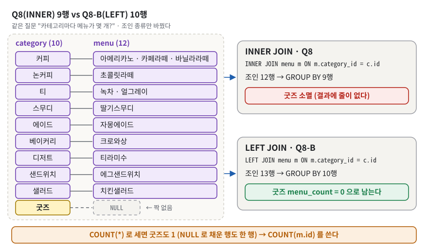
*그림 5. 메뉴가 0개인 '굿즈'는 INNER JOIN 에서 사라지고(9행), LEFT JOIN 에서는 NULL 과 짝지어 남아 0 으로 세어진다(10행).*

그림 5 에서 노란 '굿즈' 옆 점선 상자가 LEFT JOIN 이 채운 NULL 이다. INNER 는 이 줄을 버리고, LEFT 는 남긴다.

**구체적인 숫자로.** 초기 상태 실측이다.

| 조인 | 행 수 | 설명 |
|---|---|---|
| customer × order_header (조건 없음) | 120 | 10 × 12 모든 조합 |
| 위에 `ON oh.customer_id = c.id` (INNER) | 12 | 짝이 맞는 것만 |
| customer LEFT JOIN order_header | 13 | 12 + 서지안 NULL 1줄 |
| category INNER JOIN menu | 12 → GROUP BY 후 **9** | 굿즈 소멸 (Q8) |
| category LEFT JOIN menu | 13 → GROUP BY 후 **10** | 굿즈 NULL 1줄 → `menu_count = 0` (Q8-B) |

LEFT JOIN 도 행 수를 "유지" 하는 것이 아니다. category(10) LEFT JOIN menu 는 13행이다. 커피 한 행이 메뉴 3개와 짝지어 3줄, 티 한 행이 메뉴 2개(녹차·얼그레이)와 짝지어 2줄로 늘기 때문이다(10 + 2 + 1 = 13). LEFT 가 보장하는 것은 "왼쪽 행이 **사라지지 않는다**" 뿐이다.

**이 과제에서는.** 같은 요구를 두 방식으로 풀어 나란히 두었다.

```sql
SELECT  c.name AS category_name,
        COUNT(m.id) AS menu_count
FROM    category c
LEFT    JOIN menu m ON m.category_id = c.id
GROUP   BY c.id, c.name
ORDER   BY menu_count DESC, c.name;
```
(`03_queries.sql:158-163`, Q8-B. Q8 은 `:145-150` 에서 `INNER` 만 다르다.) 결과는 `results/results.txt:170-184`(9행)와 `:187-202`(10행, 마지막 줄 `굿즈 │ 0`).

함정이 두 개 있고, 둘 다 쿼리로 남겨 두었다.
1. **`COUNT(*)` 함정.** LEFT JOIN 이 만든 NULL 줄도 "한 행" 이다. `COUNT(*)` 는 행을 세므로 1, `COUNT(m.id)` 는 NULL 이 아닌 값을 세므로 0. Q7-B 가 이를 보여 준다: 서지안 `cnt_star 1`, `cnt_column 0`(`results/results.txt:166`). Q8-B 를 `COUNT(*)` 로 바꾸면 굿즈도 1 이 된다(실측).
2. **ON vs WHERE 함정.** LEFT JOIN 에서 오른쪽 테이블 조건을 WHERE 에 두면 NULL 줄이 조건에서 탈락해 사실상 INNER 가 된다. Q10 은 status 조건을 ON 에 두어 10행을 얻고, WHERE 에 두면 7행이 된다(§4.2 그림 12, `03_queries.sql:181-185`).

**한 칸 아래.** 엔진은 120행짜리 곱집합을 실제로 만들지 않는다. SQLite 의 조인 알고리즘은 **중첩 루프** 하나다. 바깥 테이블을 한 줄씩 돌며 안쪽 테이블에서 짝을 찾는다. 안쪽을 찾을 인덱스가 있으면 `SEARCH`, 없으면 안쪽을 그대로 `SCAN` 하거나, 그편이 비싸다고 옵티마이저가 판단하면 그 자리에서 임시 인덱스(`AUTOMATIC … INDEX`)와 짝 없는 행을 미리 거르는 `BLOOM FILTER` 를 만든다. 예를 들어 보너스 (1-a) 는 바깥 m 이 1행(아메리카노)뿐이라 안쪽 od 를 임시 인덱스 없이 그냥 SCAN 했다(`results/bonus_results.txt:55-56`). 실측 Q6 계획: `SCAN od` → `SEARCH oh USING INTEGER PRIMARY KEY (rowid=?)` → `SEARCH c …` → `SEARCH m …`. ON 은 NULL 을 채우기 **전**에, WHERE 는 채운 **뒤**에 평가된다. 이것이 ON/WHERE 차이의 정체다.

> [!WARNING]
> **흔한 오해.** "ON 과 WHERE 는 같다" → INNER JOIN 에서만 같다. LEFT JOIN 에서는 오른쪽 테이블 조건의 위치가 결과 행 수를 바꾼다. 또 "LEFT JOIN 은 행 수를 유지한다" 도 틀렸다. 왼쪽 행이 사라지지 않을 뿐, 짝이 여럿이면 늘어난다.

### 3.9 GROUP BY 와 집계 — 펼친 행을 바구니로 접는다

**비유로 먼저.** 영수증 더미를 고객별 바구니에 나눠 담고, 바구니마다 합계를 적는다. 바구니 수가 곧 결과 행 수다.

**정확히 말하면.** **GROUP BY** 는 같은 키 값을 가진 행들을 한 그룹으로 접는다. **집계 함수**(COUNT · SUM · AVG · MAX …)는 그룹 안의 행들을 훑어 값 하나를 만든다. 거르는 곳이 두 군데다. **WHERE** 는 접기 **전**에 개별 행을 거르고, **HAVING** 은 접은 **뒤** 그룹을 거른다. NULL 규칙 세 가지를 외워 둔다.
- `COUNT(*)` 는 **행**을 센다. `COUNT(col)` 은 col 이 NULL 이 **아닌** 행만 센다. `COUNT(DISTINCT col)` 은 서로 다른 값의 개수다.
- 대상 값이 하나도 없으면 `COUNT` 는 0 이지만 `SUM`·`AVG`·`MAX` 는 **NULL** 이다(빈 표 실측: `0, 0, NULL, NULL, NULL`).
- NULL 을 다른 값으로 바꾸는 함수가 **COALESCE** 다. `COALESCE(NULL, 0)` → 0.

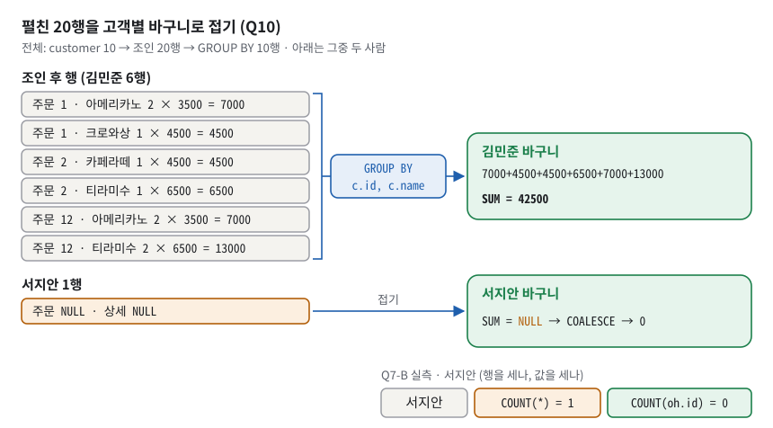
*그림 6. 조인으로 6행까지 펼쳐진 김민준을 GROUP BY 가 한 바구니로 접어 42,500 을 만든다. 주문이 없는 서지안은 SUM 이 NULL 이라 COALESCE 로 0 이 된다.*

그림 6 의 왼쪽 여섯 줄을 손으로 더해 보자. 7,000 + 4,500 + 4,500 + 6,500 + 7,000 + 13,000 = **42,500**. 오른쪽 아래 주황 칸은 Q10 이 아니라 옆 쿼리 **Q7-B**(고객 LEFT JOIN 주문, status 조건 없음)의 실측값으로, 주문이 없는 서지안이 `COUNT(*)` 로는 1 로 세어지는 함정을 보여 준다. Q10 자체에는 COUNT 가 없다.

**구체적인 숫자로.** 초기 상태 캡처 값이다.
- Q9 — `status` 로 접어 COMPLETED 9 / CANCELLED 2 / PENDING 1(`results/results.txt:205-213`). 12행이 3그룹이 된다.
- Q10 — customer 10 → 조인 20행 → 고객별 10그룹. 김민준 42,500 … 박지호·윤하늘·서지안 0(`results/results.txt:216-231`). `COALESCE` 를 빼면 이 세 명이 `None` 으로 나온다(실측).
- Q11 — 카테고리별 AVG. 커피 = (3500 + 4500 + 5000) / 3 = 4333.33… → `CAST(ROUND(AVG(m.price)) AS INTEGER)` → 4333(`results/results.txt:264`).
- Q11-B — WHERE `m.price >= 4000` 이 아메리카노(3500)를 먼저 빼고, HAVING `COUNT(m.id) >= 2` 가 메뉴 2개 이상 그룹만 남긴다 → 커피 2개/9,500, 티 2개/8,000(`results/results.txt:269-276`).

**이 과제에서는.** 집계 쿼리 3개가 COUNT·SUM·AVG 를 하나씩 쓴다(Q9 `03_queries.sql:170-174`, Q10 `:188-196`, Q11 `:224-229`). Q11 의 반올림 순서는 주석에 이유가 있다(`03_queries.sql:220-222`). `ROUND()` 는 REAL 을 돌려주므로(`4333.0`) CAST 로 정수화하고, CAST 만 쓰면 버림이 된다. 이 데이터의 커피는 둘 다 4333 이지만, 평균이 4333.6 이면 `CAST` 만 쓰면 4333, `ROUND` 후 `CAST` 는 4334 다(실측).

보너스 지표에서는 "매출" 을 `status = 'COMPLETED'` 로 정의했다(`04_bonus.sql:184-186`). 실측으로 COMPLETED 합계는 125,500원, `status <> 'CANCELLED'` 로 쓰면 미결제 PENDING 3,500원이 섞여 129,000원이다. 허용 목록(화이트리스트)이 제외 목록보다 안전하다는 사례다.

**한 칸 아래.** **fan-out**(집계 폭발)을 알아 둔다. 부모에 자식을 조인하면 부모 행이 자식 수만큼 복제된다. customer → order_header → order_detail 로 조인한 뒤 김민준의 `COUNT(oh.id)` 를 세면 **6**(실제 주문 3건)이다. PK 인 `oh.id` 를 `COUNT(DISTINCT oh.id)` 로 세면 3 으로 돌아온다(실측). Q10 의 SUM 이 멀쩡한 것은 더하는 값(`quantity × unit_price`)이 가장 잘게 쪼개진 order_detail 자신의 컬럼이기 때문이다. 헤더 쪽 금액을 더했다면 부풀었을 것이다. **GROUP BY 는 내부에서 어떻게 묶나.** 같은 키끼리 붙어 있어야 한 번에 접을 수 있다. 그래서 키에 인덱스가 없으면 SQLite 는 행을 키 순서로 **임시 B-tree**(쿼리 동안만 쓰는 정렬 구조, [§3.11](#311-인덱스--어떻게-저장되고-어떻게-탐색되나))에 넣은 뒤 차례로 읽는다. 키 값이 바뀌는 순간 한 그룹을 끝내고, 그때까지 쌓아 둔 COUNT·SUM(AVG 는 합과 개수)을 값 하나로 내보낸다. 계획으로 보면(실측):
- Q9 그대로 → `SCAN order_header` / `USE TEMP B-TREE FOR GROUP BY` / `USE TEMP B-TREE FOR ORDER BY`
- 복사본에서 `order_header(status)` 인덱스를 만든 뒤 → `SCAN order_header USING COVERING INDEX idx_status` / `USE TEMP B-TREE FOR ORDER BY`. 인덱스가 이미 status 순서라 GROUP BY 용 임시 B-tree 가 사라진다(ORDER BY 는 건수 순이라 남는다).

> [!WARNING]
> **흔한 오해.** "SUM 할 값이 없으면 0 이다" → NULL 이다. 그래서 Q10 은 `COALESCE(SUM(…), 0)` 을 쓴다(`03_queries.sql:190`). 또 "LEFT JOIN 뒤에는 `COUNT(*)` 로 세면 된다" 도 틀렸다. 짝 없는 행이 1 로 세어지므로 오른쪽 테이블의 PK 를 센다(Q7 `COUNT(oh.id)`).

### 3.10 서브쿼리와 JOIN — 언제 무엇을 쓰나

> [!IMPORTANT]
> 피드백 8(서브쿼리와 조인 자신감)과 피드백 2(서브쿼리가 느리다)의 두 번째 절반이다. 괄호를 만나면 **안쪽부터 해석하지 말고**, 괄호를 상자로 덮은 채 바깥 뼈대를 먼저 읽는다(`study/03-subquery.md` §0).

**비유로 먼저.** 서브쿼리는 "먼저 답을 구해 놓고 그 답을 값처럼 쓰기" 다. 예: 평균 가격을 먼저 계산해 쪽지에 적고, 그 쪽지와 메뉴 가격을 하나씩 비교한다. **EXISTS** 는 "있냐 없냐" 만 확인하고 하나 찾으면 바로 멈추는 질문이다.

**정확히 말하면.** **서브쿼리**는 쿼리 안에 괄호로 넣은 쿼리다. 세 축으로 분류하면 즉시 읽힌다.
- **위치**: SELECT · FROM · WHERE · HAVING.
- **반환 모양**: 값 하나(1행 1열, **스칼라**) / 목록(`IN`) / 표(FROM 절의 **파생 테이블**) / 존재 여부(`EXISTS`).
- **상관 여부**: 괄호 안이 바깥 쿼리의 별칭을 쓰면 **상관 서브쿼리**다. 논리적으로 바깥 행마다 다시 평가된다.

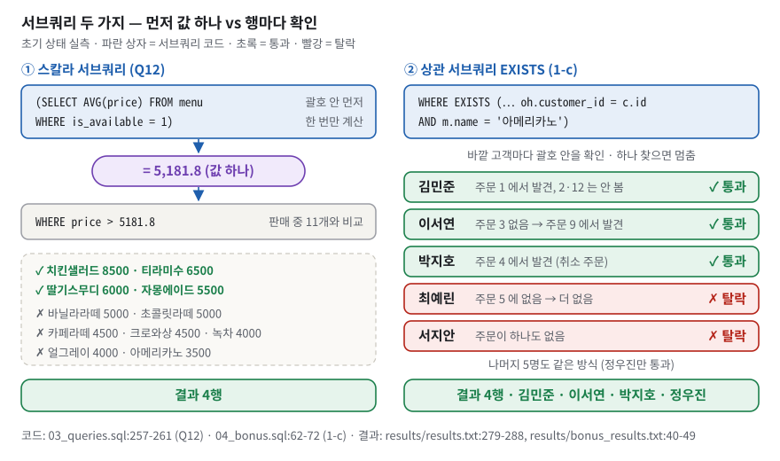
*그림 7. 스칼라 서브쿼리(Q12)는 괄호 안을 먼저 한 번 계산해 값 하나로 바꾼 뒤 바깥에서 비교한다. 상관 서브쿼리(EXISTS)는 고객마다 짝을 찾다가 하나 찾으면 멈춘다.*

그림 7 의 왼쪽은 "괄호를 값 하나로 덮고 읽는" 방법 그대로다. ① 괄호 안이 5,181.8 이 되고 ② 바깥은 `price > 5181.8` 이라는 평범한 WHERE 가 된다. 오른쪽은 바깥 c 를 괄호 안이 쓰는 상관 서브쿼리다. 김민준은 첫 주문(1번)에서 아메리카노를 찾아 2·12번은 보지 않고, 최예린은 주문 5번을 다 봐도 없어서 탈락한다.

**구체적인 숫자로.** Q12 의 기준선 `SELECT AVG(price) FROM menu WHERE is_available = 1` 은 5,181.8… 이다(실측). 판매 중인 11개 메뉴 중 이보다 비싼 것은 치킨샐러드 8500 · 티라미수 6500 · 딸기스무디 6000 · 자몽에이드 5500 의 4행이다(`results/results.txt:279-288`). 품절 메뉴까지 넣은 평균은 5,316.7 이라 기준선이 달라진다. 그래서 기준선과 대상 모두 `is_available = 1` 로 맞췄다(`03_queries.sql:252-254`).

**이 과제에서는.** Q12 가 WHERE 절 스칼라 서브쿼리다.

```sql
SELECT  name, price
FROM    menu
WHERE   is_available = 1
  AND   price > (SELECT AVG(price) FROM menu WHERE is_available = 1)
ORDER   BY price DESC, id;
```
(`03_queries.sql:257-261`) 보너스 B1 은 "아메리카노를 한 번이라도 주문한 고객" 을 세 방식으로 풀었고 세 결과가 모두 4행(김민준·이서연·박지호·정우진)이다(`results/bonus_results.txt:16-49`).

| 방식 | 위치 | 특징 (실행계획 실측) |
|---|---|---|
| (1-a) JOIN + DISTINCT | `04_bonus.sql:33-39` | 김민준이 아메리카노를 두 번 주문해 행이 중복된다. DISTINCT 를 빼면 5행(실측). 계획에 `USE TEMP B-TREE FOR DISTINCT` 와 `FOR ORDER BY` 두 개 |
| (1-b) IN | `04_bonus.sql:45-54` | `LIST SUBQUERY 1` 로 customer_id 목록을 한 번 만든 뒤 customer 를 PK 로 SEARCH |
| (1-c) EXISTS (상관) | `04_bonus.sql:62-72` | `CORRELATED SCALAR SUBQUERY 1` 아래에서 고객마다 존재만 확인하고 조기 종료. 그 아래 `SCAN oh`(고객마다 주문 헤더를 훑음), od 쪽에 `BLOOM FILTER` + `AUTOMATIC COVERING INDEX`(쿼리 동안만 쓰는 임시 인덱스) |

선택 기준은 파일에 적어 두었다(`04_bonus.sql:121-126`). 자식 쪽 컬럼(주문일시·수량)을 결과에 보여야 하면 **JOIN**, 부모 컬럼만 필요하고 존재로 거르면 **EXISTS / IN**, 부정 조건이면 **NOT EXISTS**.

**JOIN 을 한 번도 쓰지 않는 서브쿼리 버전.** (1-b)·(1-c) 는 괄호 안에 JOIN 이 2개씩 있어 "JOIN 대 서브쿼리" 대조가 완전하지 않다(`04_bonus.sql:58` 이 스스로 인정한다). 안쪽부터 메뉴 id → 주문 id 목록 → 고객 id 목록으로 IN 을 세 겹 쌓으면 JOIN 없이 풀린다.

```sql
SELECT id, name FROM customer
WHERE  id IN (SELECT customer_id FROM order_header
              WHERE id IN (SELECT order_id FROM order_detail
                           WHERE menu_id = (SELECT id FROM menu WHERE name = '아메리카노')))
ORDER  BY id;
```
복사본 실측 결과는 같은 4명(1 김민준 · 2 이서연 · 3 박지호 · 5 정우진)이고, 계획은 `LIST SUBQUERY 3` → `LIST SUBQUERY 2` → `SCALAR SUBQUERY 1` 이 안쪽으로 한 단계씩 들여쓰기되어 중첩된다(맨 안쪽은 `SEARCH menu USING COVERING INDEX sqlite_autoindex_menu_1 (name=?)`).

**한 칸 아래.** `NOT IN` 은 NULL 에 약하다. `x NOT IN (a, b, NULL)` 은 `x <> a AND x <> b AND x <> NULL` 인데, 마지막 비교가 UNKNOWN 이라 전체가 TRUE 가 될 수 없다. 실측: "주문이 없는 고객" 을 `NOT IN (SELECT customer_id FROM order_header)` 로 구하면 서지안 1행이지만, 목록에 NULL 을 하나 섞으면 **0행**이다. `NOT EXISTS` 와 `LEFT JOIN … WHERE oh.id IS NULL` 은 NULL 과 무관하게 서지안 1행이다.

> [!WARNING]
> **흔한 오해.** "상관 서브쿼리는 항상 느리다" 는 단정할 수 없고 계획으로 판단한다. 이 데이터에서 JOIN 은 DISTINCT·ORDER BY 용 임시 B-tree 2개를, IN 은 고객 목록(`LIST SUBQUERY`) 1개를, EXISTS 는 정렬 대신 안쪽 order_detail 용 자동 인덱스 1개와 블룸 필터를 만들었다. 종류가 다를 뿐 셋 다 임시 구조를 만든다. 12행에서는 속도를 판단할 수 없고 계획의 모양만 비교한다. 또 "IN 과 EXISTS 는 항상 같다" 도 틀렸다. 긍정형은 결과가 같지만 **NOT 형태에서 NULL 처리가 다르다.**

### 3.11 인덱스 — 어떻게 저장되고 어떻게 탐색되나

> [!IMPORTANT]
> 피드백 5 — "인덱싱이 왜 인덱싱인지, 어떻게 저장되고 탐색되는지" + "컴퓨터 언어에서 인덱싱은 어떤 것들이 있는지". 기능("빨라진다")이 아니라 **구조와 경로**를 말해야 한다.

**비유로 먼저.** 책 뒤의 **색인**이다. 가나다순으로 정렬된 단어 옆에 쪽 번호가 적혀 있다. 본문을 처음부터 넘기지 않고 색인에서 쪽 번호를 찾아 바로 그 쪽을 편다. index 라는 말 자체가 라틴어로 "가리키는 것(집게손가락)" 이다. 인덱스는 데이터 자체가 아니라 **위치를 가리키는 정렬된 목록**이다.

비유의 한계: 색인은 책을 두껍게 만들고, 본문이 바뀌면 색인도 다시 고쳐야 한다. 인덱스도 파일을 키우고 쓰기를 느리게 한다.

**정확히 말하면.** SQLite 의 인덱스는 테이블과 **별도의 B-tree**다. 엔트리 하나는 `(인덱스 컬럼 값, rowid)` 이고 값 순서로 정렬되어 저장된다. **B-tree** 는 노드 하나에 키를 수백 개 담는 넓고 낮은 정렬 트리다.

용어부터 정리한다. **트리**는 위에서 아래로 가지를 치는 목차 구조다. 상자 하나를 **노드**(SQLite 에서는 **페이지** 한 장 = DB 파일을 읽고 쓰는 단위, 여기서는 4,096 바이트)라고 부르고, 맨 위 노드를 **루트**, 맨 아래 노드를 **리프**(잎)라고 부른다. 그림 8 의 보라 상자 하나가 노드다. 참고로 커밋된 `cafe.db` 는 57,344 바이트 = 4,096 바이트 페이지 14장이다(`PRAGMA page_size` 4096, `page_count` 14, 복사본 실측).

탐색은 두 번 내려간다.
1. 인덱스 B-tree 를 루트 → 리프로 내려가 조건에 맞는 엔트리들의 **rowid** 를 얻는다.
2. 테이블 B-tree(rowid 가 키)를 다시 내려가 그 rowid 의 행을 읽는다.

필요한 컬럼이 인덱스 안에 모두 있으면 2단계를 건너뛴다. 이것을 **커버링 인덱스**라고 한다. 인덱스 없이 처음부터 끝까지 읽는 것은 **풀스캔**(SCAN)이다.

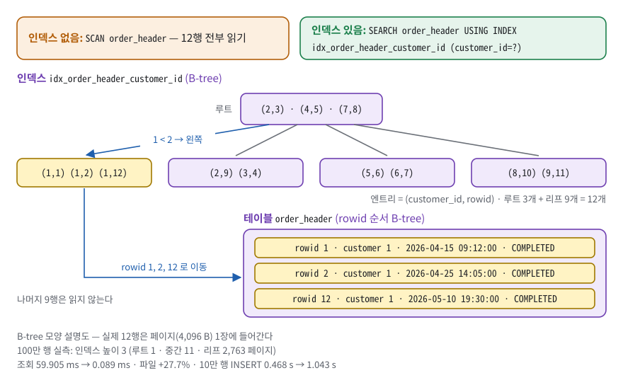
*그림 8. 인덱스는 (customer_id, rowid) 를 정렬해 둔 별도 트리다. customer_id = 1 은 한 리프에 붙어 있어 rowid 1·2·12 만 골라 테이블에서 읽는다. 루트의 (2,3)·(4,5)·(7,8) 도 실제 엔트리라 리프에 다시 나오지 않는다(실제 SQLite 인덱스 B-tree 와 같은 모양).*

**구체적인 숫자로.** 초기 상태 `order_header` 12행에 `customer_id` 인덱스를 만들면 엔트리는 다음 순서로 저장된다(실측 정렬 순서): `(1,1) (1,2) (1,12) (2,3) (2,9) (3,4) (4,5) (5,6) (6,7) (7,8) (8,10) (9,11)`. `customer_id = 1` 인 엔트리 세 개가 **한곳에 붙어 있다.** 그림 8 의 파란 화살표를 따라가면, 루트의 첫 엔트리 (2,3) 과 비교해 "1 < 2 이니 왼쪽" 으로 내려가 첫 리프에서 rowid 1·2·12 를 얻고, 테이블에서 그 세 행만 읽는다. 루트에는 엔트리 3개, 리프 넷에는 3·2·2·2개가 있어 합계 12개다. B-tree 에서는 루트의 엔트리도 진짜 엔트리라서 `customer_id = 2` 를 찾으면 루트에서 (2,3) 을, 둘째 리프에서 (2,9) 를 얻는다. 인덱스가 없으면 그림 8 왼쪽 위 주황 띠처럼 12행을 전부 읽는다.

그림 8 은 개념도다. 실제 12행은 4,096 바이트 페이지 한 장에 들어가므로 트리 높이는 1 이다. 규모 효과는 100만 행 복사본에서 쟀다(이 문서 작성 중 실측, 절대 시간은 장비에 따라 다르고 배율만 의미가 있다).

| 항목 | 인덱스 없음 | 인덱스 있음 |
|---|---|---|
| `WHERE customer_id = ?` 조회 평균(무작위 키 200개) | 59.905 ms | 0.089 ms |
| 파일 크기 | 41,054,208 B | 52,420,608 B (+27.7%) |
| 10만 행 INSERT | 0.468 s | 1.043 s (약 2.2배) |
| 인덱스 트리 모양(`dbstat`) | — | 높이 3: 루트 1 · 중간 11 · 리프 2,763 페이지 |

**이 과제에서는.** 직접 만든 인덱스는 두 개이고, 이유가 쿼리 옆에 있다.

```sql
--   사유 1) order_header(customer_id) : "고객별 주문 조회"(Q7, Q10)에서 반복적으로
--           조인 키이자 검색 조건으로 쓰인다. 데이터가 늘수록 풀스캔 비용이 선형으로 커진다.
--   사유 2) order_detail(order_id)    : FK 이면서 ON DELETE CASCADE 대상이다.
--           부모 주문을 지울 때마다 "이 주문에 딸린 상세가 뭐냐"를 찾아야 하는데,
--           인덱스가 없으면 부모 1행 삭제마다 자식 테이블 전체를 훑는다
CREATE INDEX IF NOT EXISTS idx_order_header_customer_id
    ON order_header (customer_id);
```
(`03_queries.sql:312-322` 중 핵심 줄) 효과는 실행계획으로 확인했다. Q15-A `SCAN order_header` → Q15-B `SEARCH order_header USING INDEX idx_order_header_customer_id (customer_id=?)`(`results/results.txt:319-334`). 사유 2 도 실측했다. FK 를 켠 상태에서 `DELETE FROM order_header WHERE status='CANCELLED'` 의 계획은 인덱스 전 `SCAN order_header` + `SCAN order_detail`, 인덱스 후 `SCAN order_header` + `SEARCH order_detail USING COVERING INDEX idx_order_detail_order_id (order_id=?)` 다. 단, 이것은 따로 떠 본 계획이다. 주석(`03_queries.sql:317`)이 가리키는 "Q14 의 DELETE 실행계획" 은 캡처에 없고, 인덱스는 Q14 **다음에** 만들어지므로 이 실행에서 사유 2 가 실제로 쓰이지는 않는다(§7.2 격차 20). 최종 DB 의 인덱스는 5개다: 직접 만든 2개 + UNIQUE 가 자동으로 만든 `sqlite_autoindex_*` 3개(`results/results.txt:335-343`).

**한 칸 아래.**
- **왜 이진 트리가 아닌가.** 디스크와 DB 파일은 **페이지**(여기서는 4,096 바이트) 단위로 읽는다. 한 페이지에 키 수백 개를 담으면 트리가 낮아진다. 100만 행 인덱스의 중간 페이지 하나는 평균 약 251개(2,763 ÷ 11)의 자식을 가리키고(이 수를 **팬아웃**이라고 한다), 그래서 높이가 3 이다. 이진 트리(노드 하나에 키 하나, 자식 둘)였다면 log₂(1,000,000) ≈ 20층이다(2 를 20번 곱하면 약 100만). 층 하나가 페이지 읽기 한 번이다. (`study/05-index.md` §3 의 팬아웃 162 · 리프 5,036 은 `(customer_id, status)` **복합 인덱스**를 잰 값이라 엔트리가 길어 팬아웃이 작다. 평가장에서는 이 문서의 단일 컬럼 값 하나만 말한다.)
- **B-tree 와 B+tree.** SQLite 의 **테이블** 트리는 데이터를 리프에만 두는 **B+tree** 형태다(리프 셀 1,000,000). **인덱스** 트리는 내부 페이지에도 엔트리를 두는 **B-tree** 형태다(내부 셀 2,762 + 리프 셀 997,238 = 1,000,000). 그림 8 의 루트가 바로 이 모양이다. 여기서 **셀**은 페이지 안의 엔트리 한 칸이고, **`dbstat`** 은 페이지마다 종류·셀 수를 보여 주는 SQLite 가상 테이블이다(100만 행 복사본에서 실측).
- **UNIQUE 는 왜 인덱스를 만드나.** 유일성 검사가 곧 "같은 값이 있나" 조회이기 때문이다.
- **어디에 걸면 안 되나.** 값 종류가 적은 컬럼(`is_available` 0/1)은 걸러 내는 효과가 작고 쓰기 비용만 는다. 앞에 `%` 가 붙는 `LIKE '%라떼%'`(Q4-B)는 정렬된 B-tree 에서 시작점을 못 잡으므로 이 인덱스를 쓸 수 없다(`03_queries.sql:75-76`). 부분 일치는 다른 종류의 인덱스(역색인, [§3.15](#315-상황별-db-선택--이름이-아니라-접근-패턴으로))의 일이다.

> [!WARNING]
> **흔한 오해.** "인덱스를 걸면 항상 빨라진다" → 12행 표에서는 차이가 측정되지 않는다. 그래서 이 과제는 시간이 아니라 **실행계획**(SCAN → SEARCH)으로 효과를 검증했다. 또 "FK 를 걸면 인덱스도 생긴다" 는 SQLite·PostgreSQL 에서 틀렸다(MySQL InnoDB 만 자동 생성).

### 3.12 실행계획 읽기 — 주장을 증거로 바꾸는 도구

**비유로 먼저.** 내비게이션의 "경로 미리보기" 다. 출발 전에 어느 길로 갈지 보여 준다. 실제로 달리지는 않는다.

**정확히 말하면.** `EXPLAIN QUERY PLAN <쿼리>`(SQLite 전용 문법)는 쿼리를 실행하지 않고 DBMS 가 고른 경로를 보여 준다. 자주 나오는 표현은 이것뿐이다.

| 표기 | 뜻 |
|---|---|
| `SCAN t` | 테이블 전체를 훑는다. 행 수 N 에 비례 |
| `SEARCH t USING INDEX i (c=?)` | 인덱스로 범위를 좁혀 찾는다. 대략 log N + 찾은 행 수(log N = 행이 몇 배로 늘어도 단계는 조금씩만 늘어나는 정도. 100만 행에서 3단계) |
| `USING COVERING INDEX` | 인덱스만으로 답해 테이블을 읽지 않는다 |
| `USING INTEGER PRIMARY KEY (rowid=?)` | rowid 로 바로 찾아간다 |
| `USE TEMP B-TREE FOR ORDER BY / GROUP BY / DISTINCT` | 정렬·묶기·중복 제거용 임시 구조를 만든다 |
| `AUTOMATIC … INDEX` | 쿼리 도중 임시 인덱스를 즉석에서 만든다(옵티마이저가 이득이라고 볼 때만. 아니면 그냥 SCAN) |
| `BLOOM FILTER` | "확실히 없는" 짝을 빠르게 걸러 내는 확률적 필터 |

**구체적인 숫자로.** Q10 을 인덱스 만들기 전 상태에서 뜨면(실측) `SCAN c` → `BLOOM FILTER ON oh (customer_id=? AND status=?)` → `SEARCH oh USING AUTOMATIC PARTIAL COVERING INDEX (customer_id=? AND status=?) LEFT-JOIN` → `BLOOM FILTER ON od (order_id=?)` → `SEARCH od USING AUTOMATIC COVERING INDEX (order_id=?) LEFT-JOIN` → `USE TEMP B-TREE FOR ORDER BY` 다. 인덱스가 없으니 SQLite 가 쿼리마다 임시 인덱스를 만들고 있다는 뜻이다. 이것이 "Q7·Q10 에서 반복 쓰이는 조인 키에 인덱스를 건다" 의 근거다.

**이 과제에서는.** `03_queries.sql:302-336`(Q15 전후 비교), `04_bonus.sql:78-101`(세 방식 비교). 캡처는 `build_and_capture.py:180-185` 의 `render_query_plan()` 이 찍는다.

**한 칸 아래.** 계획은 원래 **트리**다. sqlite3 CLI 는 `|--` 와 들여쓰기로 부모-자식을 보여 준다. 예를 들어 (1-b) 는 CLI 에서 `` `--LIST SUBQUERY 1 `` 아래에 세 줄이 들여쓰기되어 "이 세 단계는 서브쿼리 안쪽" 임이 보인다. 그런데 이 저장소의 캡처는 모든 줄 앞에 `` `-- `` 만 붙여 **한 층으로 평평하게** 찍는다(`results/bonus_results.txt:61-66`). 평가자가 물으면 "캡처가 들여쓰기를 잃었다" 고 먼저 말한다(§7.2). MySQL 은 `EXPLAIN` 의 `type`(ALL / ref), PostgreSQL 은 `Seq Scan` / `Index Scan` 이 같은 역할이다.

> [!WARNING]
> **흔한 오해.** "실행계획은 쿼리마다 고정이다" → 인덱스·통계에 따라 바뀐다. 실측으로 Q6 은 인덱스 전에 `SCAN od` → oh → c → m 순이었고, 인덱스 두 개를 만든 뒤에는 `SCAN od USING INDEX idx_order_detail_order_id` → m → oh → c 로 시작 방식과 조인 순서가 모두 바뀌었다.

### 3.13 정규화와 N:M 브릿지 테이블

> [!IMPORTANT]
> 피드백 7 — 평가자는 "브릿지 테이블을 놓아서 1:N + N:1 구조를 만드는 것" 이라고 알려 주었다. 이 스키마의 `order_detail` 이 **이미 그 브릿지 테이블**이다. 못 한 것이 아니라, 한 것에 이름을 붙여 말하지 못한 것이다.

**비유로 먼저.** 주문서와 메뉴판 사이를 **영수증 줄**이 중개한다. 영수증 한 줄은 "이 주문에서 이 메뉴를 몇 개, 얼마에 샀다" 는 사실 하나다. 주문 한 건에는 메뉴가 여러 개 들어가고, 메뉴 하나는 여러 주문에 나온다. 그 주문을 누가 했는지는 주문서(헤더)에 적혀 있으니, "어느 고객이 어느 메뉴를 샀나" 도 주문서를 한 번 거쳐 알 수 있다.

**정확히 말하면.** **정규화**는 중복 때문에 생기는 **이상 현상**(삽입·갱신·삭제 이상)을 없애려고 테이블을 나누는 일이다. 단계를 말하려면 용어 넷이 먼저 필요하다.
- **함수 종속**: A 값을 알면 B 값이 하나로 정해지는 관계다(A → B 로 쓴다). 예: 메뉴 id 3 을 알면 가격이 하나로 정해진다(menu.id → price).
- **결정자**: 함수 종속의 왼쪽(A)이다.
- **후보 키**: 한 행을 유일하게 가리킬 수 있는 최소 컬럼(조합)이다. customer 에서는 id 와 email 둘 다 후보 키이고, 그중 id 를 골라 PK 로 삼았다.
- **복합 키**: 컬럼 두 개 이상을 합친 키다(예: 주문번호 + 메뉴).

단계별로 한 문장씩이다.
- **1NF**: 한 칸에 값 하나. "아메리카노, 크로와상" 을 한 칸에 넣지 않는다.
- **2NF**: 복합 키의 일부에만 종속된 컬럼(**부분 종속**)을 떼어 낸다. 한 시트로 적은 가상의 주문 줄 표에서 주문번호+메뉴를 복합 키로 본다면, 주문일시·상태는 주문번호에만 종속된다 → `order_header` 로 분리.
- **3NF**: A → B → C 처럼 키가 아닌 컬럼을 거쳐 정해지는 **이행 종속**을 떼어 낸다. 메뉴 → 카테고리번호 → 카테고리이름 → `category` 로 분리.
- **BCNF**: 모든 결정자가 후보 키여야 한다. 이 스키마에서 다른 컬럼을 결정하는 컬럼은 각 표의 id 와 UNIQUE 인 email(customer)·name(category·menu) 뿐이고, 모두 후보 키다.

**N:M**(다대다) 관계는 두 테이블만으로 표현할 수 없다. 한 칸에 값 하나라서 주문 행에 메뉴 목록을 넣을 수도, 메뉴 행에 주문 목록을 넣을 수도 없다. 그래서 가운데에 **브릿지 테이블**(교차 테이블)을 두고 1:N 두 개로 푼다. 브릿지 쪽에서 보면 양쪽이 모두 N:1 이라, 평가자가 말한 "1:N + N:1" 이 이 모양이다.

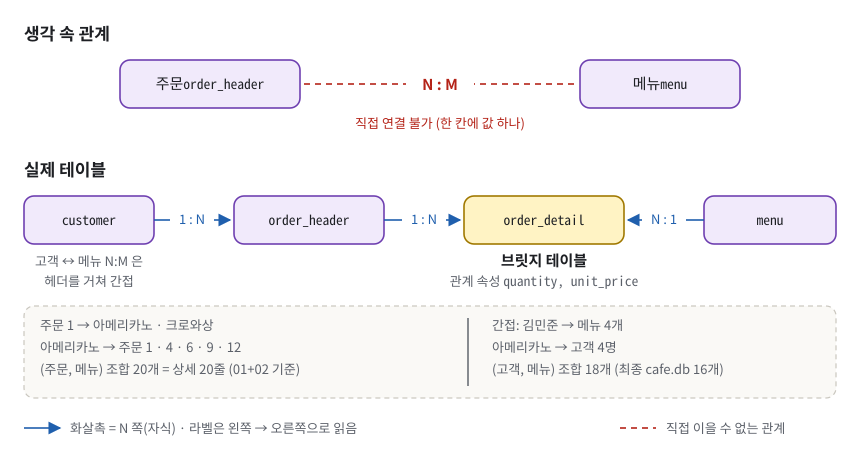
*그림 9. 주문과 메뉴의 N:M 은 두 테이블로 직접 이을 수 없어, order_detail 을 가운데 두고 1:N 두 개로 푼다. 고객과 메뉴의 N:M 은 그 위에 customer 1:N order_header 가 얹혀 간접으로 표현된다.*

그림 9 의 화살촉은 모두 N 쪽(자식)을 가리키고, 선 위 라벨은 **왼쪽에서 오른쪽으로** 읽는다. 그래서 order_detail 과 menu 사이는 `N : 1` 이다(화살표 자체는 다른 선처럼 1(menu) → N(order_detail) 방향). 그림 3 의 FK 화살표(자식 → 부모)와는 화살촉 방향이 반대다.

**구체적인 숫자로.** 초기 상태 실측. 주문 1 → 아메리카노·크로와상(메뉴 2개). 아메리카노 → 주문 1·4·6·9·12(주문 5건). 서로 다른 (주문, 메뉴) 조합은 **20개**로 상세 20줄과 같다(지금 데이터에는 같은 주문·같은 메뉴 중복 줄이 없다). 고객 쪽은 간접이다. 김민준 → 아메리카노·카페라떼·크로와상·티라미수(메뉴 4개), 아메리카노 → 김민준·이서연·박지호·정우진(고객 4명)이고, 서로 다른 (고객, 메뉴) 조합은 **18개**다(최종 cafe.db 에서는 취소 주문이 지워져 16개). 18 이 20 보다 작은 이유는 김민준이 아메리카노와 티라미수를 각각 두 번(주문 1·12, 2·12) 샀기 때문이다.

**이 과제에서는.** `order_detail` 은 `order_id`(→ order_header)와 `menu_id`(→ menu) 두 FK 를 가진, 주문과 메뉴 사이의 브릿지다(`01_schema.sql:118` 주석이 "order_header 1:N order_detail, menu 1:N order_detail" 이라고 적는다). 고객은 order_header 의 `customer_id` 를 거쳐 한 번 더 이어진다. 이 브릿지는 관계 자체의 속성인 `quantity`, `unit_price` 까지 가진다(`01_schema.sql:120-146`). `unit_price` 는 겉보기엔 `menu.price` 를 복사한 **반정규화**(일부러 중복 저장해 정규형을 어기는 것)처럼 보이지만, 실제로는 "주문 시점 가격" 이라는 **별개 사실의 스냅샷**이다. 그래서 정규형을 어기지 않는다(아래 '한 칸 아래').

```sql
    -- 주문 시점 단가 스냅샷. menu.price 를 조인해서 쓰지 않는 이유:
    --   가격이 바뀌면 과거 매출까지 소급 변경되어 버린다.
    unit_price      INTEGER NOT NULL CHECK (unit_price >= 0),
```
(`01_schema.sql:126-129` 중 핵심 줄) 실측: Q13 으로 아메리카노가 4000원이 된 뒤에도 김민준의 결제 합계는 `unit_price` 기준 42,500원이다. `menu.price` 로 다시 계산하면 44,500원이 되어 과거 매출이 바뀐다.

**한 칸 아래.** 이 스키마는 3NF 이고, 후보 키가 모두 단일 컬럼이라 3NF 가 곧 BCNF 다(`study/06-normalization.md` §2-4). `unit_price` 가 정규화 위반이 아닌 이유: 주문 시점 가격은 `menu.price` 에 함수적으로 종속하지 않는다. 시간이 지나면 둘은 다른 값이 되므로 별개의 사실이다. `(order_id, menu_id)` 복합 UNIQUE 는 일부러 걸지 않았다(`01_schema.sql:142-145`). 같은 주문에 아메리카노 ICE 1잔과 HOT 1잔을 별도 줄로 받기 위해서다. 대가는 "같은 주문에 같은 메뉴 두 줄" 이 막히지 않는다는 것이다. 속성이 없는 순수 브릿지는 `menu_tag(menu_id, tag_id)` 에 복합 PK 를 거는 모양이다(`study/06-normalization.md` §4-3).

> [!WARNING]
> **흔한 오해.** "정규화는 많이 할수록 좋다" → 과제 원문도 "정규화 이론을 과도하게 깊게 파지 않는다" 고 적었다. 목표는 이상 현상 제거와 "쿼리가 잘 나오는 구조" 다. 과거 가격처럼 **시간이 지나면 달라지는 사실**은 복제해 두는 것이 옳다.

### 3.14 트랜잭션과 동시성 — DB 사용법의 기본기

> [!IMPORTANT]
> 피드백 1 — "데이터베이스 사용법에 대해 조금 더 공부했으면 좋겠습니다." SQL 문법 밖의 기본기(트랜잭션·동시성·바인딩·백업)를 묻는 말이다.

**비유로 먼저.** 은행 이체는 출금과 입금이 **같이 되거나 같이 안 되어야** 한다. 카페 주문 한 건도 같다. 주문 헤더 1행과 상세 N행이 함께 들어가야 한다. 헤더만 들어가고 상세가 빠지면 "빈 주문" 이 생긴다.

**정확히 말하면.** **트랜잭션**은 전부 되거나 전부 안 되는 작업 묶음이다. `BEGIN` 으로 시작해 `COMMIT` 으로 확정하거나 `ROLLBACK` 으로 취소한다. 트랜잭션이 보장하는 네 성질을 **ACID** 라고 한다. 원자성(Atomicity, 쪼개지지 않음), 일관성(Consistency, 제약을 지킴), 격리성(Isolation, 동시에 돌아도 서로 간섭 없음), 지속성(Durability, 확정되면 사라지지 않음).

**구체적인 숫자로.** 보너스 (2-e)가 원자성을 보여 준다. `BEGIN` 안에서 신규 고객과 그 주문을 넣으면 트랜잭션 안에서는 `신규고객 │ 13 │ PENDING` 이 보이고, `ROLLBACK` 뒤에는 `customer_left 0 / order_left 0` 이다(`results/bonus_results.txt:96-109`).

동시성도 실측했다. 초기 상태 DB(`fresh.db`) 복사본과 커밋본 `cafe.db` 복사본 모두 `PRAGMA journal_mode` 가 `delete` 다. **저널**은 확정 전 변경을 되돌릴 수 있게 따로 적어 두는 파일이고, `delete` 는 SQLite 의 기본 저널 방식이다. 초기 상태 복사본에서 연결 A 가 `BEGIN` 후 아메리카노 가격을 9999 로 바꾸고 아직 확정하지 않았을 때, 연결 B 는 옛 값 3500 을 **읽을 수는 있었지만**, 전혀 다른 행(녹차)을 UPDATE 하려 하자 `OperationalError: database is locked` 가 났다. A 가 `ROLLBACK` 한 뒤에는 B 의 녹차 UPDATE 가 성공했다. 커밋본 복사본에서 같은 실험을 하면 B 가 읽는 옛 값이 Q13 이 적용된 4000 일 뿐, 잠금 결과는 같았다.

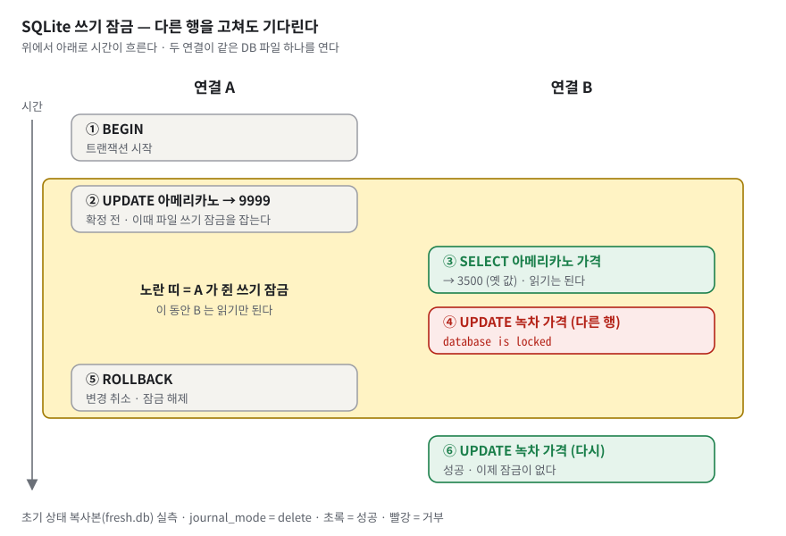
*그림 10. SQLite 는 쓰기 잠금이 파일 전체에 걸린다. 연결 A 가 확정하기 전까지 연결 B 는 옛 값을 읽을 수는 있지만 다른 행도 고칠 수 없다.*

그림 10 의 노란 띠가 A 가 잠금을 쥔 구간이다. B 의 ③ 읽기는 통과하고 ④ 쓰기만 막힌다. 막힌 행은 A 가 고치는 행과 **다른 행**이라는 점이 핵심이다. 행 단위로 잠그는 PostgreSQL 에서는 이런 쓰기끼리 서로를 기다리지 않는다. 그래서 SQLite 의 한계는 행 수가 아니라 동시 쓰기다([§3.15](#315-상황별-db-선택--이름이-아니라-접근-패턴으로)).

**이 과제에서는.** 트랜잭션은 `04_bonus.sql:158-180` 한 곳이다. 러너는 이 SQL 을 쓴 그대로 동작시키려고 자동 커밋 모드로 연결한다.

```python
    # isolation_level=None : 자동 커밋 모드.
    #   BEGIN / ROLLBACK 을 SQL 에 쓴 그대로 동작시키려면 파이썬이 트랜잭션에 개입하면 안 된다.
    con = sqlite3.connect(DB_PATH, isolation_level=None)
    con.execute("PRAGMA foreign_keys = ON")
```
(`build_and_capture.py:495-498`) 파이썬 `sqlite3` 모듈은 기본 설정에서 DML 앞에 스스로 `BEGIN` 을 끼워 넣는다. 그러면 SQL 파일의 `BEGIN` 과 겹쳐 의도가 흐려진다.

**한 칸 아래.** 실무에서 "DB 사용법" 이라고 부르는 것들을 이 저장소 기준으로 정리한다(자세한 실측은 `study/07-db-selection.md` §1).
- **파라미터 바인딩.** 값을 SQL 문자열에 이어 붙이지 않고 `?` 로 따로 넘긴다. `study/07-db-selection.md` §1.3 의 실측: 이메일에 `' OR 1=1 --` 를 문자열로 조립하면 customer 10행이 전부 나오고, `?` 로 바인딩하면 0행이다. 이 저장소의 러너도 값을 넘길 때는 `?` 바인딩을 쓰고(`build_and_capture.py:352-354`), 바인딩이 안 되는 테이블 이름을 문자열로 조립하는 곳에는 "상수에서만 오므로 외부 입력과 닿지 않는다" 는 주석을 달았다(`build_and_capture.py:314`).
- **동시 쓰기 대응.** WAL 저널(`PRAGMA journal_mode=WAL`)이면 읽기와 쓰기가 서로 막지 않는다. 그래도 쓰는 쪽은 한 번에 하나다. `busy_timeout` 으로 잠금이 풀릴 때까지 기다리게 할 수 있다.
- **점검과 백업.** 커밋본 복사본에서 `PRAGMA integrity_check` → `ok`, `PRAGMA foreign_key_check` → 빈 결과(실측). 쓰는 중인 파일을 `cp` 하면 찢어진 복사본이 생길 수 있으므로 `.backup` 이나 `VACUUM INTO` 를 쓴다.
- **마이그레이션(스키마 변경).** `01_schema.sql` 은 DROP 후 다시 만드는 방식이라 실습에서는 여러 번 돌려도 같은 결과(멱등)지만, 운영 중인 DB 에 돌리면 데이터가 전부 사라진다. 운영에서는 `ALTER TABLE … ADD COLUMN` 같은 변경을 번호 붙은 파일로 쌓아 한 번씩만 적용한다. SQLite 는 기존 테이블에 CHECK 를 더하거나 컬럼 타입을 바꾸는 것을 ALTER 로 못 해서, 새 테이블 생성 → 데이터 복사 → 이름 교체로 한다(`study/07-db-selection.md` §1.4).

> [!WARNING]
> **흔한 오해.** "트랜잭션은 성능 옵션이다" → 정합성의 경계다. 한 주문의 헤더와 상세가 같은 트랜잭션에 있어야 "상세 없는 헤더" 가 생기지 않는다.

### 3.15 상황별 DB 선택 — 이름이 아니라 접근 패턴으로

> [!IMPORTANT]
> 피드백 4 — "데이터베이스에 따라 사용 용도가 정해진 게 아니라, 어떠한 상황에서 그 데이터베이스를 이용해야 하는지를 학습했으면 합니다." "로그는 몽고DB, 캐시는 Redis" 식 대응표 암기를 **명시적으로 교정**하라는 말이다.

**비유로 먼저.** 공구는 이름이 아니라 작업 모양으로 고른다. 나사를 돌려야 하면 드라이버, 못을 박아야 하면 망치다. "이 공구는 목수용" 이라고 외우지 않는다.

**정확히 말하면.** 데이터를 **어떻게 읽고 쓰는지**를 **접근 패턴**이라고 한다. 키 하나로 찍어 읽는가, 범위로 훑는가, 전체를 집계하는가, 단어로 검색하는가, 쓰기가 폭주하는가. 접근 패턴이 필요한 **자료구조**를 정하고, 그 자료구조를 잘 구현한 DBMS 가 후보가 된다.

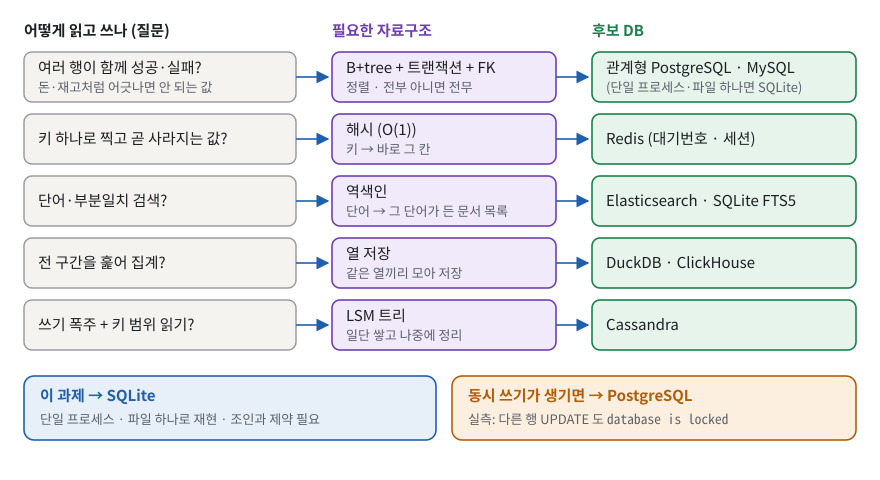
*그림 11. "로그니까 몽고DB" 가 아니라, 어떻게 읽고 쓰는지(접근 패턴)가 필요한 자료구조를 정하고 그 자료구조가 DB 를 정한다.*

그림 11 은 왼쪽에서 오른쪽으로 읽는다. 질문 → 자료구조 → 후보. 맨 아래 파란 상자가 이 과제의 답이고, 주황 상자가 그 답이 깨지는 조건이다.

**구체적인 숫자로.** 같은 카페 안에서도 기능마다 답이 다르다.

| 기능 | 접근 패턴 | 자료구조 | 후보 |
|---|---|---|---|
| 주문·결제 원장 | 헤더+상세가 함께 성공·실패, 조인, 제약 | B+tree + 트랜잭션 + FK | PostgreSQL · MySQL (단일 프로세스면 SQLite) |
| 대기번호·세션 | 키 하나로 찍고 곧 사라짐 | 해시 | Redis |
| 메뉴 검색 `%라떼%` | 단어·부분 일치 | 역색인 | Elasticsearch · SQLite FTS5 |
| 월별 매출 리포트 | 전 구간을 훑어 집계 | 열 저장 | DuckDB · ClickHouse |
| 매장 센서 로그 | 쓰기 폭주 + 키 범위 읽기 | LSM 트리 | Cassandra |
| 주문 화면 하나를 한 번에 읽기 | 화면 하나 = 문서 하나, 조인 없음, 모양이 자주 바뀜 | 문서(B+tree 위에 JSON 비슷한 BSON 문서) | MongoDB · PostgreSQL JSONB |

표의 자료구조를 한 줄씩 풀면 이렇다.
- **해시**: 키를 계산해 저장 칸 번호를 바로 얻는다. 데이터가 늘어도 찾는 단계가 늘지 않는다(**O(1)** = 데이터 크기와 상관없이 한 번에 찾음). 대신 순서가 없어 범위 검색은 못 한다.
- **역색인**: 책 뒤 색인처럼 단어(또는 세 글자 조각)마다 그것이 나오는 행 목록을 들고 있다. 그래서 `%라떼%` 같은 부분 일치를 빨리 찾는다. 실측: SQLite FTS5 를 `tokenize='trigram'` 으로 만든 표에서 `name LIKE '%카페라%'` 의 계획은 `SCAN mf VIRTUAL TABLE INDEX 0:L0` 으로, LIKE 조건이 FTS 인덱스로 넘어갔다.
- **열 저장**: 행이 아니라 열(price 끼리, date 끼리)을 모아 저장한다. 합계처럼 한두 열만 전부 훑는 집계에 유리하다.
- **LSM 트리**: 쓰기를 메모리에 모았다가 한꺼번에 정렬해 파일로 내린다. 쓰기가 몰려도 버틴다.
- **문서**: 주문 한 건과 그 상세를 한 덩어리(문서)로 저장한다. 조인 없이 한 번에 읽지만, 메뉴 이름을 바꾸면 그 메뉴가 박힌 모든 주문 문서를 고쳐야 한다(`study/07-db-selection.md` §2).

**이 과제에서는.** SQLite 를 고른 근거는 세 가지다. 서버 없이 **파일 하나로 누구나 재현**, 프로세스 하나가 순서대로 실행, **조인과 제약이 필요**. 과제 원문도 SQLite 를 "설치가 가장 간단하고, 파일 기반으로 별도 서버가 필요 없다. (입문자 추천)" 이라고 소개한다.

**한 칸 아래.** SQLite 의 한계는 행 수가 아니다. `study/07-db-selection.md` §3 의 추정처럼 하루 주문 1,000건이면 1년 36.5만 행이고, 이 정도는 B-tree 높이 3 안팎이라 문제가 없다(§3.11 의 100만 행 실측 참고). 한계는 **동시 쓰기**다. [§3.14](#314-트랜잭션과-동시성--db-사용법의-기본기) 그림 10 처럼 한 연결이 쓰는 동안 다른 연결은 **다른 행**을 고치려 해도 `database is locked` 를 받는다. 포스 단말 여러 대가 동시에 주문을 넣는 순간이 PostgreSQL 로 옮길 시점이다.

> [!WARNING]
> **흔한 오해.** "SQLite 는 장난감이라 실서비스에 못 쓴다" → 틀렸다. 한 프로세스가 쓰고 파일 하나로 배포하는 접근 패턴에서는 맞는 선택이다. 올바른 기준은 "동시 쓰기가 몇 개인가" 다.

## 4. 내 코드 투어

### 4.1 폴더·파일 지도

| 파일 | 줄 수 | 책임 한 줄 |
|---|---|---|
| `01_schema.sql` | 157 | PRAGMA → DROP(자식→부모, `:23-27`) → CREATE 5개(PK · FK · NOT NULL · UNIQUE · CHECK · DEFAULT). 주석 전용 90줄 |
| `02_data.sql` | 101 | 부모 → 자식 순서로 INSERT 64행(10 · 12 · 10 · 12 · 20) |
| `03_queries.sql` | 349 | 핵심 Q1~Q15 + 대조 7개. 라벨 `-- >> [Qn] …` 가 캡처 제목. Q13·Q14 가 DB 를 바꾸므로 맨 마지막 실행 |
| `04_bonus.sql` | 236 | 자가진단 → B1 (1-a)~(1-d) → B2 (2-a)~(2-e), 일부러 실패 4건 → B3 지표 1~3 |
| `build_and_capture.py` | 581 | 빌드 → 캡처 → 검사 59건 → 종료 코드. 표준 라이브러리만 |
| `results/results.txt` | 343 | 03 캡처(헤더 8줄 + 22블록) |
| `results/bonus_results.txt` | 150 | 04 캡처(헤더 8줄 + 자가진단 + 12블록) |
| `cafe.db` | 57,344 B | 03 까지 적용된 최종 상태. 새로 만든 것과 md5 동일(`ef958e953ea6c40bd4296404abbe5f26`) |
| `drill/03_queries_naked.sql`, `drill/04_bonus_naked.sql` | 206 / 144 | 주석을 뺀 낭독 훈련본(32문장 / 21문장). 제출 범위 밖 |
| `study/*.md`, `study/study-kit.html` | — | 피드백 8개 대응 심화 모듈 7개. 제출 범위 밖 |
| `README.md` | 903 | 0장(과제 명세·학습 지도·수행 점검) + 1~8장 설명 |

### 4.2 핵심 시나리오 따라가기

시나리오는 셋이다. **B 가 가장 중요하다**(체크리스트 4-1 "가장 복잡한 쿼리" 의 답).

**A. `python3 build_and_capture.py` 한 줄이 하는 일.** 함수 호출 순서대로다.

1. `main()`(`build_and_capture.py:534`)이 `results/` 폴더를 만든다(`:536`).
2. `build_database()`(`:491-506`)가 `cafe.db` 를 지우고(`:492-493`), 자동 커밋 모드로 연결하고(`:497`), `PRAGMA foreign_keys = ON` 을 켠 뒤(`:498`), `01_schema.sql` · `02_data.sql` 을 `executescript` 로 실행한다. 파일마다 실행 후 PRAGMA 를 다시 켠다(`:500-504`). 그 줄의 주석(`:503`)과 README 7.1(`README.md:799`)은 "executescript 가 트랜잭션을 커밋하며 PRAGMA 가 초기화될 수 있어서" 라고 적지만, 실측으로 executescript 뒤에도 `foreign_keys` 는 1 그대로였다(`BEGIN; … COMMIT;` 을 담은 스크립트도 같음). 근거 없는 방어 코드이고, .sql 파일의 PRAGMA 누락을 가리는 부작용이 있어 파일 선언 검사를 따로 뒀다(§7.2 격차 22).
3. 행 수를 찍고(`:541-544`) `check_schema_and_data()`(`:302-329`)가 테이블 5개 · 행 수 · FK 4개 · PRAGMA 상태를 검사한다. **파괴적 DML 이전**에 보는 것이 요점이다.
4. `write_capture(… 04_bonus.sql …, allow_errors=True)`(`:549`)가 헤더 8줄(`header_lines`, `:509-520`)을 만들고 `run_script()`(`:233-273`)를 부른다. `run_script` 는 `parse_statements()`(`:194-227`)로 파일을 문장 단위로 자르고(라벨 `-- >>` 는 `LABEL_RE` `:191` 로 뽑음), 문장마다 실행한다(`:251`). 에러는 메시지를 모으고(`:252-257`), SELECT 면 박스 표(`render_box`)나 계획(`render_query_plan`)으로, DML 이면 `변경된 행 N개` 로 적는다(`:259-271`).
5. `check_violations()`(`:332-340`)가 "일부러 실패해야 할 4문장이 정말 실패했는가" 를 본다.
6. `write_capture(… 03_queries.sql …, allow_errors=False)`(`:554`). 여기서는 에러가 하나라도 나면 즉시 예외로 멈춘다.
7. `check_final_state()` · `check_forbidden_objects()`(`:558-559`) → 연결 종료 → 파일만 보는 검사 세 개: `check_pragma_declarations()` · `check_drill_copies()` · `check_readme_tag_refs()`(`:561-563`).
8. 요약을 찍고 실패가 있으면 `return 1`(`:571-572`), 없으면 `return 0`. `sys.exit(main())`(`:581`)이 그 값을 종료 코드로 만든다.

**B. Q10 한 문장의 일생 — 가장 복잡한 쿼리.** 요구는 "고객별 총 결제 금액, 주문이 없는 고객도 0원으로" 다.

```sql
SELECT  c.id,
        c.name,
        COALESCE(SUM(od.quantity * od.unit_price), 0) AS total_paid
FROM    customer c
LEFT    JOIN order_header oh ON oh.customer_id = c.id
                            AND oh.status = 'COMPLETED'
LEFT    JOIN order_detail od ON od.order_id   = oh.id
GROUP   BY c.id, c.name
ORDER   BY total_paid DESC, c.id;
```
(`03_queries.sql:188-196`)

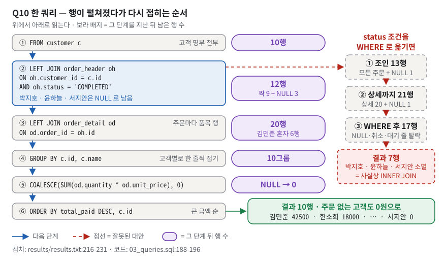
*그림 12. Q10 은 10행에서 시작해 조인으로 20행까지 펼친 뒤 고객별로 다시 10행으로 접는다. 조건을 WHERE 로 옮기면 주문 없는 고객 3명이 사라진다.*

그림 12 의 번호를 따라 읽는다(행 수는 초기 상태 실측).

| 단계 | 무엇을 하나 | 행 수 | 말할 것 |
|---|---|---|---|
| ① `FROM customer c` | 고객 전원에서 시작 | 10 | "결과 한 줄은 고객 한 명입니다" |
| ② `LEFT JOIN order_header … AND oh.status = 'COMPLETED'` | 결제 완료 주문만 붙인다 | 12 (짝 9 + NULL 3) | "박지호·윤하늘(취소만 함), 서지안(주문 없음)은 NULL 로 남습니다" |
| ③ `LEFT JOIN order_detail` | 주문마다 메뉴 줄을 붙인다 | 20 | "김민준은 주문 3건 × 줄 2개 = 6행으로 펼쳐집니다" |
| ④ `GROUP BY c.id, c.name` | 고객별로 접는다 | 10그룹 | "동명이인을 id 로 가릅니다. name 은 id 에 따라 정해지니 결과는 같고, 그룹 키가 한눈에 보이게 같이 적었습니다" |
| ⑤ `COALESCE(SUM(수량 × 단가), 0)` | 바구니 합계, NULL 은 0 | — | "스냅샷 단가를 곱하고, 짝 없는 고객의 NULL 을 0 으로 바꿉니다" |
| ⑥ `ORDER BY total_paid DESC, c.id` | 금액 순, 동점은 id 순 | 10 | "0원 세 명의 순서를 id 로 고정해 캡처가 재현됩니다" |

결과는 김민준 42,500 · 한소희 18,000 · 이서연 16,000 · 최예린 15,000 · 장민서 14,500 · 정우진 10,500 · 오재현 9,000 · 박지호 0 · 윤하늘 0 · 서지안 0 이다(`results/results.txt:216-231`). 합계 125,500원은 보너스 지표 1 의 일자별 매출 합과 같다.

**대안과의 대조.** 그림 12 오른쪽 빨간 점선이 잘못된 대안이다. 논리 실행 순서는 FROM → JOIN → WHERE 이므로(§3.7), status 조건을 WHERE 로 옮기면 두 LEFT JOIN 이 **먼저 모두** 끝난다. customer LEFT JOIN order_header 가 13행(주문 12 + 서지안 NULL 1), 여기에 상세를 붙이면 21행(주문 12건의 상세 20줄 + 서지안 NULL 1줄)이다. 그다음 WHERE 가 NULL 줄과 취소·미결제 주문의 줄을 버려 17행이 되고, 고객별로 접으면 **7행**이다. 박지호·윤하늘·서지안이 사라져 사실상 INNER JOIN 이 된다(복사본 실측 13 → 21 → 17 → 7, `03_queries.sql:181-185` 주석의 7행과 일치).

**결과 해석의 한 걸음 더.** 0원 세 명은 성격이 다르다. Q10-B 가 "주문했으나 결제 완료 0건"(박지호·윤하늘)과 "주문 이력 없음"(서지안)을 가른다(`results/results.txt:234-249`). Q10-B 에는 금액 컬럼이 없고 주문 건수 세 개와 segment 만 있다.

**C. 제약 위반이 "증거" 가 되는 길 — (2-a).** 한 문장이 증거가 되기까지 일곱 단계를 거친다.

1. `04_bonus.sql:138` 의 `INSERT INTO order_header (customer_id, status) VALUES (999, 'PENDING');` 을 실행한다.
2. SQLite 가 FK 검사에서 거부한다(확장 코드 787).
3. 파이썬 드라이버가 이를 `sqlite3.IntegrityError` 로 올린다.
4. `run_script` 가 `Runtime error: IntegrityError: FOREIGN KEY constraint failed` 를 캡처에 쓰고 멈추지 않고 계속 진행한다(`build_and_capture.py:252-257`, `allow_errors=True`).
5. 그 줄이 `results/bonus_results.txt:78` 에 남는다.
6. `check_violations()` 가 모인 에러를 기대 문자열 목록(`build_and_capture.py:84-89`)과 대조한다.
7. `[PASS] (2-a) FK 위반이 차단됨` 이 찍힌다.

**성공이 아니라 실패를 기대하는 검사**다. 복사본에서 (2-a) 앞뒤를 `PRAGMA foreign_keys = OFF / ON` 으로 감싸 INSERT 가 성공하게 만들어 보니, "의도된 제약 위반 에러 건수"(기대 4 / 실제 3)와 "(2-a) FK 위반이 차단됨" 이 `[FAIL]` 이 되었고, 들어간 고아 주문이 남아 "order_header 행수 (Q14)" 도 기대 10 / 실제 11 로 `[FAIL]` 이 되어 종료 코드는 1 이었다(파일을 고친 탓에 drill 동일성 검사도 함께 실패했다).

### 4.3 설계 결정과 이유

| 결정 | 대안 | 왜 이걸 골랐나 | 대가 |
|---|---|---|---|
| SQLite | MySQL · PostgreSQL | 서버 없이 파일 하나로 누구나 재현. 과제 원문의 입문자 추천 | 타입 어피니티, 연결마다 FK OFF, 파일 단위 쓰기 잠금, FK 인덱스 자동 생성 없음 |
| 전 테이블 대리키 `id INTEGER PRIMARY KEY AUTOINCREMENT` | 자연키(email) · 복합키 | 조인 규칙이 `부모.id = 자식.부모_id` 하나로 통일, 키 변경 전파 없음, 번호 재사용 금지 | `sqlite_sequence` 갱신 비용, 같은 주문·같은 메뉴 중복 줄을 PK 가 못 막음 |
| order_header / order_detail 분리 | 주문 테이블 하나 | 주문 1건과 메뉴 줄 N개는 개수가 다르다(12 vs 20). 2NF(주문번호+메뉴 장부 기준) | 조회마다 JOIN, fan-out 주의 |
| `unit_price` 스냅샷 | `menu.price` 조인 | 가격 변경이 과거 매출을 바꾸지 않음(42,500 유지) | 저장 중복 |
| CASCADE 는 `order_detail.order_id` 하나 | 전부 CASCADE / 전부 NO ACTION / SET NULL / 지우지 않고 표시(soft delete) | 헤더 없는 줄은 무의미. 고객·메뉴·카테고리는 이력 보존. 메뉴 단종은 `is_available = 0` 으로 처리(Q6.5-18) | CASCADE 삭제는 되돌릴 수 없음(Q14), 고객 탈퇴를 표현할 컬럼은 아직 없음 |
| `status TEXT` + CHECK 화이트리스트 | 상태 코드 테이블 + FK · MySQL ENUM | 단순하고 DB 가 허용 집합을 강제 | 상태 추가 시 테이블 재생성(SQLite ALTER 한계), 제약 이름이 없어 메시지가 식 원문 |
| 금액·불리언 INTEGER | REAL · BOOLEAN | 원화는 정수, SQLite 에 BOOLEAN 없음 | 어피니티로 문자열이 들어갈 수 있음 |
| 인덱스 2개를 03 의 Q15 에 둠 | 01 스키마에 두기 · FK 4개 전부 | 과제가 인덱스를 "쿼리 범주" 로 요구 + 전/후 계획 대조 | Q1~Q14 실행 시점엔 인덱스 없음, `menu_id`·`category_id` 누락 |
| 파이썬 러너로 텍스트 캡처 | sqlite3 CLI · 스크린샷 | CLI 없어도 재생성, diff 가능, 한글 2칸 폭 정렬(`dwidth`, `build_and_capture.py:145-147`) | CLI 출력과 형식이 다름, 계획 트리가 평평해짐 |
| 실행 순서 보너스 → 쿼리 + 자가진단 | 파일마다 새 DB | 파일 하나로 끝, 상태가 결과에 스스로 드러남(`04_bonus.sql:19-22`) | 순서 의존성이 숨어 있음 |
| Q13 절대값 대입, Q15-A `DROP INDEX IF EXISTS` | 상대 변경 · 없음 | 멱등, 대조군 고정 | — |
| 기대값 표 + 검사 59건 + 종료 코드 | 눈으로 캡처 비교 | "규칙은 문서가 아니라 검사에" | 쿼리 결과 값 자체(Q8 행 수, Q10 금액, 자가진단 4칸)와 결과 파일의 줄 번호 좌표는 검사 밖(§7.2 격차 2·17) |
| `drill/` 주석 제거본 + 동일성 검사 | 원본 주석 삭제 | 명세가 요구한 주석(한 줄 설명·DB 전용 표시·인덱스 이유)은 제출본에 남기고 읽기 훈련은 사본으로 | 파일 두 벌(검사로 동기화) |

### 4.4 어떻게 검증했나

단위 테스트 폴더는 없다. 검증은 `build_and_capture.py` 의 **검사 59건**이고, 결과는 종료 코드로 말한다. 아래 표가 59건의 내역이다. 쿼리 결과 값(Q8 행 수, Q10 금액 등)을 대조하는 검사는 이 중에 없다.

| 검사 함수 (`build_and_capture.py`) | 건수 | 무엇을 |
|---|---|---|
| `check_schema_and_data` (`:302-329`) | 8 | 테이블 목록 1 + 행 수 ≥ 10 다섯 개 + FK 관계 1 + `PRAGMA foreign_keys` 1 |
| `check_violations` (`:332-340`) | 5 | 에러 건수 = 4 + 위반 4종이 각각 차단됨 |
| `check_final_state` (`:343-346`) | 4 | 아메리카노 4000 · 주문 10 · 상세 18 · 직접 만든 인덱스 2 |
| `check_forbidden_objects` (`:349-355`) | 2 | 뷰 0 · 트리거 0 |
| `check_pragma_declarations` (`:411-419`) | 4 | 네 SQL 파일이 각자 PRAGMA 를 선언 |
| `check_drill_copies` (`:422-435`) | 2 | drill 두 파일이 원본에서 주석만 뺀 것 |
| `check_readme_tag_refs` (`:462-488`) | 34 | README 가 태그 좌표를 씀 1 + 태그 32개가 실제 라벨을 가리킴 + 줄번호 좌표 금지 1 |

**실제 실행(이 문서 작성 중, 복사본).** 앞부분과 끝부분만 발췌한다.

```text
[1/4] cafe.db 재생성 (01_schema.sql + 02_data.sql)
      행수: customer=10, category=10, menu=12, order_header=12, order_detail=20
      [PASS] 테이블 목록 (R2-1)
      ...
[2/4] 04_bonus.sql -> results/bonus_results.txt  (파괴적 DML 이전 상태에서 캡처)
      ...
      [PASS] (2-a) FK 위반이 차단됨
      ...
[4/4] 기대값 대조
      [PASS] 아메리카노 price (Q13)
      ...
검사 결과: 통과 59건 / 실패 0건
커밋되는 cafe.db 최종 상태 (README 1장 서술과 일치 확인됨):
  아메리카노 price (Q13) = 4000
  order_header 행수 (Q14) = 10
  order_detail 행수 (Q14 CASCADE) = 18
  직접 만든 인덱스 개수 (Q15) = 2
```
종료 코드는 0 이었다. 다시 만든 `cafe.db` 는 커밋본과 md5 가 같다(`ef958e953ea6c40bd4296404abbe5f26`). 즉 실행해서 바뀌는 것은 두 캡처 파일의 **생성 시각 줄**뿐이다.

**검사가 진짜로 실패하는지도 확인했다.** `02_data.sql` 에서 `PRAGMA foreign_keys = ON;` 줄(`02_data.sql:10`)을 지운 복사본으로 돌리면:

```text
검사 결과: 통과 58건 / 실패 1건
  x 02_data.sql 이 PRAGMA foreign_keys = ON 을 선언함 (R3-3) - 선언이 없다 - sqlite3 CLI 경로에서는 FK 가 꺼진다

기대값과 어긋났다. results/ 와 cafe.db 는 만들어졌지만 제출 가능한 상태가 아니다.
```
종료 코드는 1 이었다. 러너는 PRAGMA 를 스스로 한 번 더 켜기 때문에(`build_and_capture.py:498`) 연결 상태만 보면 이 결함을 못 잡는다. 그래서 "파일에 그 선언이 있는가" 를 따로 검사한다(`build_and_capture.py:105-111` 의 주석이 이유를 설명).

**반대로 검사가 못 잡는 것도 확인했다.** 복사본을 일부러 망가뜨려도 통과한 경우가 셋이다.

| 망가뜨린 것 | 캡처에 드러난 변화 | 러너 결과 |
|---|---|---|
| `02_data.sql:82` 단가 3500 → 1 | Q10 김민준 42500 → 35502 | 통과 59건 / 실패 0건, 종료 코드 0 |
| `02_data.sql:31` 아메리카노 3500 → 3000 | 자가진단 `americano_expect_3500 │ 3000` | 통과 59건 / 실패 0건, 종료 코드 0 |
| `02_data.sql` 의 PRAGMA 줄을 파일 맨 끝으로 이동 | 없음 | `[PASS] 02_data.sql 이 PRAGMA … 선언함`, 59 / 0 |

검사 59건은 스키마·행 수·제약 위반·최종 상태·파일 선언을 볼 뿐, **쿼리 결과 값과 선언 위치는 보지 않는다.** 결과가 맞는지는 사람이 캡처를 읽어 확인한 것이다. 이 격차는 §7.2 격차 17·19 에서 다룬다.

**다른 사람의 검수 기록.** `review/review_all.md` 의 B5-1 절은 체크리스트 15개 전부 충족, 반증 검증에서 뒤집힌 항목 0건으로 판정했다.

## 5. 시연 리허설 — 평가장에서 그대로

체크리스트 1절(기능 동작 검증) 다섯 문항을 순서대로 시연한다. 아래 출력은 모두 이 문서 작성 중 복사본에서 sqlite3 3.46.1 CLI 와 파이썬으로 실제로 얻은 것이다.

### 5.0 준비

> [!CAUTION]
> **이 작업 환경에는 sqlite3 CLI 가 없다**(`which sqlite3` → 없음. README 도 "sqlite3 CLI 미설치" 로 적는다, `README.md:376`). 이 문서의 CLI 출력은 따로 풀어 둔 3.46.1 바이너리로 얻은 것이다. 평가장 컴퓨터에서 먼저 `sqlite3 --version` 을 쳐 본다. 없으면 `python3 build_and_capture.py` 한 줄로 1-1 · 1-2 · 1-3 · 1-5 를 보이고, 아래 각 절의 **파이썬 대체**를 쓴다(파이썬 표준 라이브러리만 쓰므로 설치할 것이 없다).

원본 저장소를 건드리지 않도록 **복사본에서** 한다. 러너를 원본에서 돌리면 결과 파일 두 개의 생성 시각 줄이 바뀌고, 데모용 DB 파일이 저장소에 남는다.

```bash
rm -rf /tmp/b51 && cp -r codyssey_B5-1 /tmp/b51 && cd /tmp/b51
rm -f fresh.db
sqlite3 fresh.db < 01_schema.sql     # 출력 없음, 종료 코드 0
sqlite3 fresh.db < 02_data.sql       # 출력 없음, 종료 코드 0
```

파이썬 대체(실측 출력 `[10, 10, 12, 12, 20]`):

```bash
rm -f fresh.db
python3 - <<'PY'
import sqlite3
c = sqlite3.connect('fresh.db')
for f in ('01_schema.sql', '02_data.sql'):
    c.executescript(open(f, encoding='utf-8').read())
print([c.execute(f'SELECT COUNT(*) FROM {t}').fetchone()[0]
       for t in ('customer', 'category', 'menu', 'order_header', 'order_detail')])
PY
```

`fresh.db` 는 초기 상태(주문 12 · 상세 20)다. 저장소의 `cafe.db` 는 최종 상태(주문 10 · 상세 18)라 교재 숫자와 다르다.

**가장 빠른 한 방**은 `python3 build_and_capture.py` 다. §4.4 의 출력(통과 59건, 종료 코드 0)이 1-1 · 1-2 · 1-3 · 1-5 를 한 화면에 보여 준다. 시간이 있으면 아래처럼 하나씩 보여 준다.

### 5.1 테이블 5개와 PK — 체크리스트 1-1

```bash
sqlite3 fresh.db ".tables"
sqlite3 -header -column fresh.db <<'SQL'
SELECT m.name AS table_name, p.name AS pk_column, p.type
FROM   sqlite_master m
JOIN   pragma_table_info(m.name) p ON p.pk = 1
WHERE  m.type = 'table' AND m.name NOT LIKE 'sqlite_%'
ORDER  BY m.rowid;
SQL
```
```text
category      customer      menu          order_detail  order_header
table_name    pk_column  type
------------  ---------  -------
customer      id         INTEGER
category      id         INTEGER
menu          id         INTEGER
order_header  id         INTEGER
order_detail  id         INTEGER
```

파이썬 대체:

```bash
python3 - <<'PY'
import sqlite3
c = sqlite3.connect('fresh.db')
tables = [r[0] for r in c.execute(
    "SELECT name FROM sqlite_master WHERE type='table' AND name NOT LIKE 'sqlite_%' ORDER BY rowid")]
for t in tables:
    print(t, [(r[1], r[2]) for r in c.execute(f"PRAGMA table_info({t})") if r[5] == 1])
PY
```
```text
customer [('id', 'INTEGER')]
category [('id', 'INTEGER')]
menu [('id', 'INTEGER')]
order_header [('id', 'INTEGER')]
order_detail [('id', 'INTEGER')]
```
말할 것: "테이블 다섯 개이고 전부 `id INTEGER PRIMARY KEY` 입니다. SQLite 에서 이것은 rowid 의 별칭이라 별도 인덱스가 아니라 테이블 저장 구조의 키 자체입니다. 선언은 `01_schema.sql` 37번째 줄에 있습니다."

### 5.2 FK 1:N 4개와 실제 차단 — 체크리스트 1-2

```bash
sqlite3 -header -column fresh.db <<'SQL'
SELECT m.name AS child_table, f."from" AS fk_column,
       f."table" AS parent_table, f."to" AS parent_column, f.on_delete
FROM   sqlite_master m
JOIN   pragma_foreign_key_list(m.name) f
WHERE  m.type = 'table'
ORDER  BY m.rowid, f.id;
SQL
```
```text
child_table   fk_column    parent_table  parent_column  on_delete
------------  -----------  ------------  -------------  ---------
menu          category_id  category      id             NO ACTION
order_header  customer_id  customer      id             NO ACTION
order_detail  menu_id      menu          id             NO ACTION
order_detail  order_id     order_header  id             CASCADE
```

이어서 FK 스위치를 켠 연결과 안 켠 연결을 나란히 보인다. 한 번의 `sqlite3` 실행이 연결 하나다.

```bash
cp fresh.db fk_demo.db
sqlite3 fk_demo.db "PRAGMA foreign_keys;"          # ① 새 연결의 스위치 값
sqlite3 fk_demo.db <<'SQL'                          # ② 켜고 넣기
PRAGMA foreign_keys = ON;
INSERT INTO order_header (customer_id, status) VALUES (999, 'PENDING');
SQL
sqlite3 fk_demo.db <<'SQL'                          # ③ 안 켜고 넣기
INSERT INTO order_header (customer_id, status) VALUES (999, 'PENDING');
SELECT id, customer_id, status FROM order_header WHERE customer_id = 999;
PRAGMA foreign_key_check;
SQL
```
```text
0
Runtime error near line 2: FOREIGN KEY constraint failed (19)
13|999|PENDING
order_header|13|customer|0
```
② 의 종료 코드는 1 이고(에러가 난 줄 번호 2 = INSERT), ③ 은 0 이다. ③ 에서는 없는 고객 999 의 주문이 그대로 들어가고, `foreign_key_check` 만 그것을 고아 행으로 찾아낸다.

파이썬 대체(`fresh.db` 를 다시 `fk_demo.db` 로 복사한 뒤):

```bash
cp fresh.db fk_demo.db
python3 - <<'PY'
import sqlite3
c = sqlite3.connect('fk_demo.db')
print('foreign_keys =', c.execute('PRAGMA foreign_keys').fetchone()[0])
c.execute('PRAGMA foreign_keys = ON')
try:
    c.execute("INSERT INTO order_header (customer_id, status) VALUES (999, 'PENDING')")
except sqlite3.IntegrityError as e:
    print('켠 연결:', e)
c.close()
d = sqlite3.connect('fk_demo.db')          # 새 연결 = 다시 꺼짐
d.execute("INSERT INTO order_header (customer_id, status) VALUES (999, 'PENDING')")
d.commit()
q = "SELECT id, customer_id, status FROM order_header WHERE customer_id = 999"
print('안 켠 연결:', d.execute(q).fetchall())
print('foreign_key_check:', d.execute('PRAGMA foreign_key_check').fetchall())
PY
```
```text
foreign_keys = 0
켠 연결: FOREIGN KEY constraint failed
안 켠 연결: [(13, 999, 'PENDING')]
foreign_key_check: [('order_header', 13, 'customer', 0)]
```
`c.close()` 를 빼면 첫 연결이 열어 둔 트랜잭션이 잠금을 쥐고 있어 두 번째 연결의 INSERT 가 `database is locked` 로 막힌다(실측). FK 목록은 `PRAGMA foreign_key_list(<테이블>)` 로 본다.

말할 것: "FK 는 네 개이고 CASCADE 는 주문 상세 하나입니다. 새 연결은 FK 검사가 0, 즉 꺼져 있습니다. 켜면 999번 고객 주문이 거부되고, 안 켜면 고아 행이 그대로 들어가서 `foreign_key_check` 로만 찾을 수 있습니다. 그래서 네 SQL 파일 모두 첫 실행 문장으로 PRAGMA 를 켭니다."

부모 삭제까지 보여 주려면 아래 스크립트를 `fresh.db` 의 복사본에 넣는다.

```bash
cp fresh.db del_demo.db
sqlite3 del_demo.db <<'SQL'
PRAGMA foreign_keys = ON;
DELETE FROM customer WHERE id = 1;
DELETE FROM category WHERE id = 1;
DELETE FROM menu WHERE id = 1;
SELECT 'details_before', COUNT(*) FROM order_detail;
DELETE FROM order_header WHERE id = 1;
SELECT 'header_deleted', changes();
SELECT 'details_after', COUNT(*) FROM order_detail;
SELECT 'customers', COUNT(*) FROM customer;
SQL
```
```text
Runtime error near line 2: FOREIGN KEY constraint failed (19)
Runtime error near line 3: FOREIGN KEY constraint failed (19)
Runtime error near line 4: FOREIGN KEY constraint failed (19)
details_before|20
header_deleted|1
details_after|18
customers|10
```
2·3·4번째 줄(customer · category · menu 삭제)은 NO ACTION 이라 거부되고, CASCADE 인 주문 1번 삭제는 성공해 상세가 20 → 18행이 된다. 에러가 있었으므로 이 명령의 종료 코드는 1 이다.

### 5.3 테이블마다 10행 이상 — 체크리스트 1-3

```bash
sqlite3 -header -column fresh.db <<'SQL'
SELECT 'customer' AS tbl, COUNT(*) AS n FROM customer
UNION ALL SELECT 'category',     COUNT(*) FROM category
UNION ALL SELECT 'menu',         COUNT(*) FROM menu
UNION ALL SELECT 'order_header', COUNT(*) FROM order_header
UNION ALL SELECT 'order_detail', COUNT(*) FROM order_detail;
SQL
```
```text
tbl           n
------------  --
customer      10
category      10
menu          12
order_header  12
order_detail  20
```
파이썬 대체는 §5.0 의 스크립트다(출력 `[10, 10, 12, 12, 20]`). 러너의 `[1/4]` 줄 `행수: customer=10, category=10, menu=12, order_header=12, order_detail=20` 도 같은 증거다.

말할 것: "전부 10행 이상이고, 그냥 채운 것이 아니라 대조가 생기도록 넣었습니다. 메뉴 0개인 '굿즈', 주문 0건인 '서지안', 취소 주문만 있는 박지호·윤하늘, 품절 에그샌드위치가 그 재료입니다. 저장소의 cafe.db 는 Q13·Q14 가 끝난 상태라 주문 10, 상세 18 입니다."

### 5.4 쿼리 15개와 범주 — 체크리스트 1-4

```bash
grep -n '^-- >>' 03_queries.sql
grep -c '^-- >> \[Q[0-9]*\]' 03_queries.sql
```
첫 명령은 라벨 22줄(Q1 `:30` … Q15-B `:328`), 둘째 명령은 `15` 를 출력한다(실측).

말할 것: "기본 조회 4개(Q1~Q4), 조인 4개(INNER 3개 + LEFT 1개), 집계 3개(COUNT·SUM·AVG), 서브쿼리 1개, UPDATE·DELETE 2개, 인덱스 1개로 정확히 15개이고, 같은 요구를 다르게 푼 대조 쿼리 7개가 더 있습니다. WHERE·ORDER BY·LIMIT 을 한 쿼리에 모두 쓴 것은 Q4 입니다."

### 5.5 실행 결과 첨부 — 체크리스트 1-5

```bash
ls results/
head -8 results/results.txt
grep -c '^\[Q' results/results.txt
grep -n 'Runtime error' results/bonus_results.txt
```
```text
bonus_results.txt  results.txt
======================================================================
  소스 파일    : 03_queries.sql
  생성 시각    : 2026-09-21T13:24:18+00:00
  SQLite 버전  : 3.46.1
  Python 버전  : 3.14.4 (linux)
  foreign_keys : ON
  생성 명령    : python build_and_capture.py
======================================================================
22
78:Runtime error: IntegrityError: FOREIGN KEY constraint failed
83:Runtime error: IntegrityError: UNIQUE constraint failed: customer.email
88:Runtime error: IntegrityError: CHECK constraint failed: status IN ('PENDING','COMPLETED','CANCELLED')
93:Runtime error: IntegrityError: NOT NULL constraint failed: customer.email
```
헤더는 커밋본 그대로다(`results/results.txt:1-8`). 러너를 다시 돌린 복사본이라면 "생성 시각" 줄만 다르다.

말할 것: "결과는 텍스트로 22개 블록이 라벨 문구를 제목으로 남아 있고, 보너스는 에러 4건까지 증거로 남겼습니다. 파일 머리에 `foreign_keys : ON` 이 찍혀 있어서 FK 가 켜진 상태에서 뽑았다는 것을 파일이 스스로 증명합니다. 텍스트라서 다시 만든 결과와 diff 로 비교할 수 있습니다."

### 5.6 3절 문답에서 펼쳐 보일 캡처 위치

| 주제 | 파일:줄 | 무엇이 보이나 |
|---|---|---|
| INNER vs LEFT | `results/results.txt:170-202` | Q8 9행 / Q8-B 10행(굿즈 0) |
| `COUNT(*)` 함정 | `results/results.txt:152-167` | 서지안 cnt_star 1 / cnt_column 0 |
| GROUP BY + SUM | `results/results.txt:216-231` | Q10 김민준 42500 … 서지안 0 |
| 0원의 두 종류 | `results/results.txt:234-249` | Q10-B segment |
| WHERE vs HAVING | `results/results.txt:269-276` | Q11-B 커피 2/9500, 티 2/8000 |
| 인덱스 전후 | `results/results.txt:317-343` | SCAN → SEARCH, 인덱스 5개 |
| JOIN vs 서브쿼리 계획 | `results/bonus_results.txt:52-73` | TEMP B-TREE 2개 / LIST SUBQUERY / CORRELATED |

**재현 범위.** 모든 항목이 로컬 SQLite 로 재현된다. CLI 가 없으면 §5.1~§5.3 은 각 절의 파이썬 대체로, §5.4~§5.5 는 `grep`·`ls`·`head` 로, 전체는 `python3 build_and_capture.py` 로 보인다.

## 6. 구술 문답 — 체크리스트 전 문항 + 꼬리 질문

질문만 보고 먼저 소리 내어 답한 뒤 펼친다. 답은 모두 "결론 → 근거 → 코드 위치" 순서다.

### 6.1 기능 동작 검증

<details>
<summary><b>Q6.1-1</b> 최소 4개 테이블이 존재하고, 각 테이블에 PK가 정의되어 있나요? <sub>체크리스트 1-1</sub></summary>

**핵심 한 줄.** 테이블 5개이고, 다섯 개 모두 `id INTEGER PRIMARY KEY AUTOINCREMENT` 를 PK 로 가진다.

**말로 하는 답 (30초).**
> "네, 다섯 개입니다. customer, category, menu, order_header, order_detail 이고, 모두 id 를 `INTEGER PRIMARY KEY AUTOINCREMENT` 로 선언했습니다. SQLite 에서 `INTEGER PRIMARY KEY` 는 rowid 의 별칭이라 그 자체로 자동 증가하고, AUTOINCREMENT 는 지운 번호를 다시 쓰지 않는다는 보장을 더합니다. 주문 번호가 재사용되면 안 되는 도메인이라 붙였습니다. 선언은 `01_schema.sql` 37번째 줄부터 각 CREATE TABLE 첫 컬럼에 있습니다."

**보여 줄 것.** `01_schema.sql:37`, `:66`, `:74`, `:98`, `:121` / §5.1 의 `.tables` 와 PK 조회 → 5행 모두 `id | INTEGER`.

**꼬리 질문.**
- **Q.** AUTOINCREMENT 를 빼면 자동 증가가 안 되나요? → **A.** 됩니다. 차이는 최댓값 행을 지운 뒤입니다. 실측으로 1·2·3 중 3을 지우고 넣으면 AUTOINCREMENT 없는 표는 3, 있는 표는 4 가 나왔습니다. 대가는 `sqlite_sequence` 를 갱신하는 약간의 쓰기 비용입니다.
- **Q.** 이메일을 PK 로 쓰지 않은 이유는? → **A.** 이메일은 바뀔 수 있는 자연키라, 바뀌면 그것을 가리키는 자식 행을 전부 고쳐야 합니다. 그래서 의미 없는 대리키 id 를 PK 로, 이메일은 UNIQUE 로 두었습니다(`01_schema.sql:42-44`).
- **Q.** `sqlite_sequence` 가 뭔가요? → **A.** AUTOINCREMENT 테이블마다 지금까지 쓴 최대 id 를 적어 두는 시스템 표입니다. 초기 상태에서 category 10, customer 10, menu 12, order_detail 20, order_header 12 입니다.

</details>

<details>
<summary><b>Q6.1-2</b> FK를 사용한 1:N 관계가 최소 2개 이상 존재하고, 없는 값 참조가 실제로 막히나요? <sub>체크리스트 1-2</sub></summary>

**핵심 한 줄.** 1:N 관계 4개를 FK 로 선언했고, `PRAGMA foreign_keys = ON` 상태에서 없는 고객 번호 999 로 주문을 넣으면 `FOREIGN KEY constraint failed` 로 막힌다.

**말로 하는 답 (30초).**
> "네, FK 가 네 개입니다. menu 에서 category, order_header 에서 customer, order_detail 에서 order_header 와 menu 를 가리킵니다. SQLite 는 FK 검사가 연결마다 기본으로 꺼져 있어서, 네 SQL 파일 모두 주석 다음 첫 실행 문장으로 `PRAGMA foreign_keys = ON` 을 켭니다. 켠 상태에서 999번 고객으로 주문을 넣으면 거부되고, 그 에러가 `results/bonus_results.txt` 78번째 줄에 캡처돼 있습니다. 러너는 이 에러가 실제로 나지 않으면 검사를 실패시킵니다."

**보여 줄 것.** FK 선언 `01_schema.sql:91`, `:114`, `:137`, `:140` / PRAGMA `01_schema.sql:20` / §5.2 시연(꺼진 연결 `0` → 켜면 거부 → 안 켜면 `13|999|PENDING` 저장) / 캡처 `results/bonus_results.txt:78`.

**꼬리 질문.**
- **Q.** 부모를 지우면 어떻게 되나요? → **A.** 정책에 따라 다릅니다. NO ACTION 인 셋(customer·category·menu)은 자식이 있으면 삭제가 거부되고, CASCADE 인 order_header 를 지우면 상세도 같이 지워집니다. 실측으로 order_header 1번을 지우자 상세가 20행에서 18행이 되었습니다.
- **Q.** FK 가 꺼진 동안 들어간 고아 행은 나중에 켜면 잡히나요? → **A.** 안 잡힙니다. 켠 뒤의 쓰기만 검사합니다. `PRAGMA foreign_key_check` 로 따로 찾아야 하고, 실측으로 `order_header|13|customer|0` 이 나왔습니다.
- **Q.** 왜 FK 가 N 쪽에 붙나요? → **A.** 한 칸에 값은 하나라서 부모가 자식 목록을 들 수 없습니다. 자식이 자기 부모 번호 하나를 들고, 그래서 조인은 항상 `부모.id = 자식.부모_id` 입니다.

</details>

<details>
<summary><b>Q6.1-3</b> 각 테이블에 최소 10행 이상의 샘플 데이터가 입력되어 있나요? <sub>체크리스트 1-3</sub></summary>

**핵심 한 줄.** 초기 상태에서 customer 10 · category 10 · menu 12 · order_header 12 · order_detail 20, 합계 64행이다.

**말로 하는 답 (30초).**
> "네, 다섯 테이블 모두 10행 이상입니다. 고객 10, 카테고리 10, 메뉴 12, 주문 12, 주문 상세 20 입니다. 그냥 채운 것이 아니라 대조 결과가 나오도록 설계했습니다. 메뉴 0개인 '굿즈' 는 INNER 와 LEFT 의 차이를, 주문 0건인 '서지안' 은 COUNT 함정을, 취소 주문만 있는 박지호와 윤하늘은 0원의 두 종류를 보여 줍니다. 입력 순서는 부모 먼저, `02_data.sql` 4번째 줄에 적은 그대로입니다."

**보여 줄 것.** `02_data.sql:15-25`(category), `:30-42`(menu, `:41` 품절), `:47-57`(customer, `:57` 서지안), `:63-75`(order_header), `:81-101`(order_detail) / §5.3 행 수 조회 / 러너 출력 `[1/4]` 의 `행수:` 줄.

**꼬리 질문.**
- **Q.** 저장소의 cafe.db 를 열면 주문이 10건인데요? → **A.** 커밋된 cafe.db 는 Q13·Q14 까지 적용된 최종 상태라 주문 10, 상세 18, 아메리카노 4000원입니다. 10행 요구는 샘플 데이터에 대한 것이라 러너도 파괴적 DML 이전에 검사합니다(`build_and_capture.py:545-546`).
- **Q.** 자식을 부모보다 먼저 넣으면요? → **A.** FK 를 켠 상태에서는 즉시 `FOREIGN KEY constraint failed` 입니다. FK 는 문장마다 바로 검사하기 때문에 category → menu, customer → order_header → order_detail 순서로 넣었습니다.
- **Q.** 스크립트를 두 번 돌리면 행이 두 배가 되나요? → **A.** 아닙니다. `01_schema.sql:23-27` 이 자식에서 부모 순서로 DROP 하고 다시 만듭니다. 실측으로 기존 DB 에 01·02 를 다시 돌려도 에러가 없고, id 도 1 부터 다시 시작했습니다. 단, 운영 DB 였다면 이 DROP 은 데이터를 전부 지우는 사고입니다. 운영에서는 ALTER 로 바꾸는 변경 파일을 쌓습니다(§3.14 마이그레이션).

</details>

<details>
<summary><b>Q6.1-4</b> 기본 조회(4개), 조인(4개), 집계(3개), 서브쿼리(1개), 수정/삭제(2개), 인덱스(1개)를 포함한 쿼리 15개가 작성되어 있나요? <sub>체크리스트 1-4</sub></summary>

**핵심 한 줄.** `03_queries.sql` 한 파일에 핵심 Q1~Q15 가 범주 하한과 정확히 같은 4·4·3·1·2·1 = 15개이고, 대조 쿼리 7개가 더 있다.

**말로 하는 답 (30초).**
> "네, 15개입니다. 기본 조회 Q1부터 Q4, 조인 Q5부터 Q8 로 INNER 세 개와 LEFT 한 개, 집계 Q9·Q10·Q11 로 COUNT·SUM·AVG 를 하나씩, 서브쿼리 Q12, 수정·삭제 Q13·Q14, 인덱스 Q15 입니다. WHERE·ORDER BY·LIMIT 을 한 쿼리에 다 쓴 것은 Q4 입니다. 여기에 같은 요구를 다르게 푼 대조 쿼리 일곱 개가 붙어 있어서, 예를 들어 Q8 과 Q8-B 로 INNER 와 LEFT 차이를 결과로 보여 줄 수 있습니다."

**보여 줄 것.** §5.4 의 `grep` 두 줄(라벨 22줄, 핵심 15) / 본문: Q1 `03_queries.sql:35-38`, Q4 `:66-70`, Q7 `:118-124`, Q10 `:188-196`, Q12 `:257-261`, Q13 `:272-274`, Q14 `:286-287`, Q15 `:321-325`.

**꼬리 질문.**
- **Q.** Q4 의 LIMIT 10 은 실제로 자르나요? → **A.** 지금은 안 자릅니다. COMPLETED 가 9건이라서요(`03_queries.sql:63-64` 에 적어 둠). 페이징의 모양을 보여 주는 것이 목적이고, LIMIT 이 실제로 자르는 예는 고객 10명 중 5명을 뽑는 Q3 입니다.
- **Q.** Q15 는 결과가 없는데 "실행 결과" 가 되나요? → **A.** CREATE INDEX 는 DDL 이라 결과표가 없습니다. 효과는 바로 앞뒤 Q15-A 의 `SCAN` 과 Q15-B 의 `SEARCH … USING INDEX` 로 보입니다(`results/results.txt:317-343`).
- **Q.** `JOIN` 과 `INNER JOIN` 이 다른가요? → **A.** 같습니다. INNER 가 기본값입니다. 03 은 전부 `INNER JOIN` 으로 썼고, 04 의 서브쿼리 안쪽과 (2-e)·지표 1·2 는 `JOIN` 만 써서 표기가 섞여 있습니다.

</details>

<details>
<summary><b>Q6.1-5</b> 각 쿼리의 실행 결과가 스크린샷 또는 텍스트로 첨부되어 있나요? <sub>체크리스트 1-5</sub></summary>

**핵심 한 줄.** 텍스트로 첨부했다. `results/results.txt`(22블록)와 `results/bonus_results.txt`(12블록 + 자가진단 + 에러 4건)이고, 러너가 돌 때마다 제출용 SQL 파일을 직접 읽어 새로 만든다.

**말로 하는 답 (30초).**
> "네, 텍스트로 `results` 폴더에 있습니다. 쿼리 22개 블록이 각 쿼리의 한 줄 설명을 제목으로 달고 있고, 보너스 결과에는 일부러 낸 에러 네 건까지 남겼습니다. 파일 첫 여덟 줄에 SQLite 버전과 `foreign_keys : ON` 이 찍혀서 어떤 조건에서 뽑았는지 파일이 증명합니다. 캡처는 러너가 매번 제출용 SQL 을 직접 읽어 새로 만들기 때문에 캡처용 사본과 어긋날 일은 없고, 다시 만들어 diff 하면 생성 시각 줄 말고는 같습니다. 다만 커밋된 결과 파일이 최신인지는 검사하지 않으니, SQL 을 고치면 러너를 다시 돌려 갱신합니다."

**보여 줄 것.** §5.5 / `results/results.txt:1-8` 헤더 / 블록 제목 예 `results/results.txt:216` / 에러 `results/bonus_results.txt:78`, `:83`, `:88`, `:93` / 단일 원천 원칙 `build_and_capture.py:31-33`(단, 이 주석의 "어긋날 수 없다" 는 캡처용 사본이 없다는 뜻이다. SQL 을 고친 뒤 러너를 다시 돌리지 않으면 커밋된 결과는 낡는다).

**꼬리 질문.**
- **Q.** 왜 스크린샷이 아니라 텍스트인가요? → **A.** 다시 만든 결과와 diff 로 비교할 수 있고 손으로 고치기 어렵습니다. 이 문서 작성 중에도 재생성본과 cafe.db md5 가 같았습니다.
- **Q.** 04 를 CLI 로 돌리면 종료 코드가 1 이던데요? → **A.** (2-a)~(2-d) 가 일부러 실패하는 문장이라 정상입니다. 파일 머리(`04_bonus.sql:12-13`)에 그렇게 적어 두었습니다.
- **Q.** 실행 순서를 바꾸면 결과가 달라지나요? → **A.** 달라집니다. 03 을 먼저 돌리면 Q14 가 박지호의 유일한 주문(취소)을 지워서, 보너스 (1-a) 가 4행에서 3행이 되고 자가진단이 `(10, 0, 18, 4000)` 으로 기대값과 어긋납니다(실측). 그래서 러너가 보너스를 먼저 캡처합니다(`build_and_capture.py:548-554`).

</details>

### 6.2 구현 구조 설명

<details>
<summary><b>Q6.2-1</b> 테이블을 왜 이렇게 나눴는지, 각 테이블의 역할을 말해 주세요. <sub>체크리스트 2-1</sub></summary>

**핵심 한 줄.** "엑셀 한 시트였다면 무엇이 반복되는가" 를 기준으로 나눴고, 핵심은 주문 헤더와 주문 상세의 분리다.

**말로 하는 답 (30초).**
> "한 시트로 적었을 때 반복되는 것을 떼어 냈습니다. 고객 이름과 이메일이 주문 줄마다 반복되면 이메일 변경 때 모든 줄을 고쳐야 해서 customer 로, 카테고리 이름 문자열이 반복되면 오타로 집계가 갈라져서 category 로, 메뉴 이름·카테고리·현재가·판매 여부가 주문 줄마다 반복되면 메뉴 정보를 고칠 때 모든 줄을 찾아야 해서 menu 로 뺐습니다. 다만 '그때 낸 가격' 은 현재가와 다른 사실이라 order_detail.unit_price 에 일부러 남겼습니다. 가장 중요한 것은 주문 한 건과 그 안의 메뉴 줄을 헤더와 상세로 나눈 것입니다. 주문은 12건인데 줄은 20개라 개수 자체가 다르기 때문입니다."

**보여 줄 것.** 그림 2 · 그림 3 / category 분리 이유 3가지 `01_schema.sql:58-64` / 테이블 역할: customer(고객) · category(메뉴 분류) · menu(판매 품목·현재가) · order_header(주문 한 건: 누가·언제·상태) · order_detail(주문의 메뉴 한 줄: 무엇을·몇 개·그때 가격).

**꼬리 질문.**
- **Q.** 주문일시와 상태를 order_detail 에 두면 안 되나요? → **A.** 엑셀 한 시트처럼 (주문번호, 메뉴) 를 키로 보면 주문일시·상태는 주문번호에만 종속하는 부분 종속(2NF 위반)이고, 지금처럼 대리키 id 를 쓴 order_detail 에 넣으면 id → order_id → 주문일시 의 이행 종속(3NF 위반)입니다. 어느 쪽이든 주문 하나를 취소할 때 줄 수만큼 UPDATE 해야 하고, 일부만 바뀌면 한 주문이 두 상태를 갖습니다.
- **Q.** 더 쪼개야 하나요? → **A.** 과제가 "관계가 자연스럽고 쿼리가 잘 나오는 구조" 를 요구했고, 이 스키마는 3NF 이며 후보 키가 모두 단일 컬럼이라 BCNF 와 같습니다. 더 쪼개면 조인만 늘어납니다.
- **Q.** 메뉴가 없는 카테고리는 한 시트에서 어떻게 표현하나요? → **A.** 적을 줄이 없습니다. 삽입 이상입니다. 분리했기 때문에 '굿즈' 가 메뉴 0개로도 존재합니다(`01_schema.sql:63`).

</details>

<details>
<summary><b>Q6.2-2</b> FK로 연결한 1:N 관계가 실제 도메인에서 어떤 의미인지 예시를 들어 보여 주세요. <sub>체크리스트 2-2</sub></summary>

**핵심 한 줄.** 네 관계 모두 실데이터로 읽을 수 있다. 예: 김민준 한 명 → 주문 1·2·12, 주문 1번 한 건 → 아메리카노 2잔 + 크로와상 1개.

**말로 하는 답 (30초).**
> "고객과 주문은 한 고객이 여러 번 주문하는 관계입니다. 김민준은 주문 1, 2, 12번 세 건이고 서지안은 0건입니다. 주문과 주문 상세는 한 주문에 메뉴 줄이 여러 개인 관계로, 1번 주문은 아메리카노 2잔과 크로와상 1개, 두 줄입니다. 카테고리와 메뉴는 커피 하나에 아메리카노·카페라떼·바닐라라떼 세 개, 메뉴와 주문 상세는 아메리카노 하나가 주문 1, 4, 6, 9, 12번에 등장하는 관계입니다."

**보여 줄 것.** §3.4 의 관계 표 / `02_data.sql:64-75`, `:82-101` / 관계 요약 주석 `01_schema.sql:148-153` / 데이터 한 줄 `02_data.sql:82` 를 "1번 주문, 1번 메뉴, 2잔, 3500원" 으로 읽기.

**꼬리 질문.**
- **Q.** 고객과 메뉴는 무슨 관계인가요? → **A.** N:M 입니다. 김민준은 메뉴 네 개를 샀고 아메리카노는 고객 네 명이 샀습니다. 다만 order_detail 이 직접 푸는 것은 주문과 메뉴의 N:M 이고(order_id 와 menu_id 를 FK 로 듦), 고객과 메뉴는 그 위에 customer 1:N order_header 가 얹혀 간접으로 이어집니다. 초기 기준 서로 다른 고객-메뉴 조합은 18개입니다(그림 9).
- **Q.** CASCADE 는 왜 하나뿐인가요? → **A.** 헤더가 없어진 상세 줄은 존재 의미가 없어서 같이 지웁니다. 고객·메뉴·카테고리는 과거 주문 이력 보존이 우선이라 자식이 있으면 삭제를 막습니다(`01_schema.sql:131-133`, `:139`). 메뉴 단종·고객 탈퇴를 지우지 않고 처리하는 방법은 Q6.5-18 에 있습니다.
- **Q.** 식별 관계인가요? → **A.** 엄밀한 ERD 기준인 "부모 PK 가 자식 PK 에 포함되는가" 로는 네 개 모두 비식별입니다. 다섯 테이블 모두 단일 대리키 PK 라서입니다(`01_schema.sql:134-136`).

</details>

<details>
<summary><b>Q6.2-3</b> 컬럼 타입(TEXT, INTEGER, DATE 등)을 왜 그렇게 선택했나요? <sub>체크리스트 2-3</sub></summary>

**핵심 한 줄.** 값의 성격으로 골랐다: 이름·이메일·전화는 TEXT, 금액·수량·불리언은 INTEGER, 날짜는 DATE/DATETIME 이지만 SQLite 에서는 실제로 TEXT 로 저장된다.

**말로 하는 답 (30초).**
> "금액은 INTEGER 입니다. 원화는 소수점이 없고, REAL 을 쓰면 합계에 부동소수 오차가 쌓이기 때문입니다. 전화번호는 앞자리 0 과 하이픈을 지키려고 TEXT 이고, 유일하게 NULL 을 허용했습니다. 판매 여부는 SQLite 에 BOOLEAN 이 없어서 INTEGER 0/1 에 CHECK 를 걸었습니다. 날짜는 DATE 로 선언했지만 SQLite 에는 날짜 타입이 실제로 없어서 `typeof` 를 찍으면 text 로 나옵니다. 대신 `YYYY-MM-DD` 형식이라 글자순 정렬이 날짜순 정렬과 같아서 Q3 정렬이 맞게 동작합니다."

**보여 줄 것.** §3.2 의 타입 표 / `01_schema.sql:46-48`(phone), `:50-55`(joined_at), `:80-81`(price), `:85-87`(is_available) / 실측 `typeof(joined_at)` → `text`.

**꼬리 질문.**
- **Q.** INTEGER 컬럼에 문자열을 넣으면요? → **A.** SQLite 는 들어갑니다. 실측으로 price 에 '비싼값' 이 text 로 저장됐고 `CHECK (price >= 0)` 까지 통과했습니다. 막으려면 3.37 이상의 STRICT 테이블이나 `typeof` 를 검사하는 CHECK 가 필요합니다(§7.2).
- **Q.** `DATE('now')` 는 한국 날짜인가요? → **A.** UTC 입니다. 한국 시간이 필요하면 `DATE('now','localtime')` 이어야 하고, 스키마 주석(`01_schema.sql:53-54`)에 적어 두었습니다.
- **Q.** status 는 왜 TEXT 인가요? → **A.** 사람이 읽을 수 있는 값으로 두고, CHECK 화이트리스트로 허용 값 세 개를 DB 가 강제하게 했습니다(`01_schema.sql:107-110`).

</details>

<details>
<summary><b>Q6.2-4</b> 인덱스를 어떤 컬럼에 걸었고, 왜 그 컬럼이어야 하나요? <sub>체크리스트 2-4</sub></summary>

**핵심 한 줄.** `order_header(customer_id)` 와 `order_detail(order_id)` 두 개다. 앞은 고객별 조회·조인에 반복 쓰이는 키이고, 뒤는 CASCADE 삭제 때 자식을 찾는 FK 다.

**말로 하는 답 (30초).**
> "두 개를 걸었습니다. 첫째 order_header 의 customer_id 는 Q7, Q10 처럼 고객별 주문을 볼 때마다 조인 키이자 검색 조건이라 걸었습니다. 둘째 order_detail 의 order_id 는 FK 이면서 CASCADE 대상이라, 주문을 지울 때마다 딸린 상세를 찾아야 하는데 인덱스가 없으면 상세 전체를 훑습니다. 효과는 실행계획으로 확인했습니다. Q15-A 에서 `SCAN` 이던 것이 Q15-B 에서 `SEARCH … USING INDEX` 로 바뀝니다. 인덱스는 쓰기 비용이 있어서 자주 조건과 조인에 쓰이는 컬럼에만 골라 걸었습니다."

**보여 줄 것.** 이유 `03_queries.sql:312-319`, 생성 `:321-325` / 캡처 `results/results.txt:317-343` / 그림 8 / 인덱스를 건 이유로 든 쿼리의 인덱스 후 계획(복사본 실측): Q10 → `SEARCH oh USING INDEX idx_order_header_customer_id (customer_id=?) LEFT-JOIN` · `SEARCH od USING INDEX idx_order_detail_order_id (order_id=?) LEFT-JOIN`, Q7 → `SEARCH oh USING COVERING INDEX idx_order_header_customer_id (customer_id=?) LEFT-JOIN`. 인덱스 전 Q10 은 `AUTOMATIC PARTIAL COVERING INDEX` 와 `BLOOM FILTER` 를 쿼리마다 만들었다(§3.12).

**꼬리 질문.**
- **Q.** FK 네 개에 모두 걸었나요? → **A.** 아닙니다. `order_detail.menu_id` 와 `menu.category_id` 는 빠졌습니다. 실측으로 `DELETE FROM category WHERE id=9` 계획에 `SCAN menu` 가 나옵니다. SQLite 는 FK 인덱스를 자동으로 만들지 않으니, 메뉴별 판매 조회나 부모 삭제가 잦아지면 추가하겠습니다(§7.2).
- **Q.** 12행짜리 표에서 인덱스가 정말 빨라지나요? → **A.** 시간 차이는 측정되지 않는 수준이라 실행계획으로 검증했습니다. 100만 행 복사본에서는 조회 평균이 59.905 ms 에서 0.089 ms 가 됐고, 대가로 파일이 27.7% 커지고 10만 행 INSERT 가 약 2.2배 느려졌습니다.
- **Q.** 인덱스는 총 몇 개인가요? → **A.** 다섯 개입니다. 직접 만든 두 개와 UNIQUE 제약(email, category.name, menu.name)이 자동으로 만든 `sqlite_autoindex_*` 세 개입니다(`results/results.txt:338-342`).
- **Q.** Q10 은 customer_id 와 status 를 같이 쓰는데 왜 단일 인덱스인가요? → **A.** Q7·FK 조인·고객별 조회는 모두 customer_id 만 쓰기 때문입니다. 복합으로 간다면 (customer_id, status) 순서여야 합니다. **복합 인덱스**는 앞 컬럼부터 정렬되므로 customer_id 만 쓰는 Q7 도 왼쪽 앞부분(**왼쪽 접두사**)으로 쓸 수 있습니다. (status, customer_id) 로 두면 값이 3종뿐인 status 로는 좁히는 힘이 약하고, customer_id 만으로는 범위를 좁히지 못합니다. 대가는 엔트리가 길어져 파일과 쓰기 비용이 더 커지는 것입니다(`study/05-index.md` §8·§9). 실제로 인덱스 전 Q10 계획에서 SQLite 가 스스로 `AUTOMATIC PARTIAL COVERING INDEX (customer_id=? AND status=?)` 라는 복합 임시 인덱스를 만드는 것도 보였습니다(§3.12).

</details>

### 6.3 핵심 개념 이해

<details>
<summary><b>Q6.3-1</b> 데이터베이스가 엑셀과 무엇이 다른지, 왜 테이블을 나눠서 저장하는지 비교하며 설명해 주세요. <sub>체크리스트 3-1</sub></summary>

**핵심 한 줄.** DB 는 테이블 사이의 관계와 입력 규칙을 DBMS 가 **강제**한다. 그래서 중복 없이 나눠 저장하고 JOIN 으로 다시 합칠 수 있다.

**말로 하는 답 (30초).**
> "차이는 데이터 양이 아니라 관계를 강제하느냐입니다. 엑셀은 '이 값이 저 시트의 저 행' 이라는 것을 막아 주지 못해서 결국 한 시트에 몰아 적게 되고, 그러면 김민준의 이메일이 주문 줄마다 반복돼 한 번 바뀌면 여러 줄을 고쳐야 합니다. DB 는 FK 로 없는 고객 번호의 주문을 입력 자체에서 거부하니까 안심하고 나눠 저장할 수 있고, 필요할 때 JOIN 으로 합칩니다. NOT NULL, UNIQUE, CHECK 도 애플리케이션이 실수해도 DB 가 막아 줍니다."

**보여 줄 것.** 그림 2 / FK 거부 `results/bonus_results.txt:78` / Q6 이 네 테이블을 합쳐 20행을 만드는 결과 `results/results.txt:106-131`.

**꼬리 질문.**
- **Q.** 나누면 조회가 느려지지 않나요? → **A.** JOIN 비용을 치릅니다. 다만 부모를 PK 로 찾는 것은 `SEARCH … USING INTEGER PRIMARY KEY` 한 번이라 싸고, 중복을 없애 얻는 정합성이 더 큽니다. 과거 가격처럼 일부러 복제할 것은 unit_price 로 복제했습니다.
- **Q.** 엑셀에도 데이터 유효성 검사가 있잖아요? → **A.** 셀 입력 규칙은 있지만 다른 시트 행의 존재를 보장하는 참조 무결성이나, 여러 줄을 한 번에 성공·실패시키는 트랜잭션은 없습니다.
- **Q.** DB 는 여러 사람이 동시에 쓸 수 있어서 좋은 거죠? → **A.** DBMS 에 따라 다릅니다. SQLite 는 쓰기가 파일 단위로 한 번에 하나라, 실측으로 다른 행을 고쳐도 `database is locked` 가 났습니다. 동시 쓰기가 필요하면 PostgreSQL 같은 서버형이 맞습니다.

</details>

<details>
<summary><b>Q6.3-2</b> PK와 FK의 역할을 구분하고, 1:N 관계가 데이터를 어떻게 연결하는지 본인 스키마 기준으로 보여 주세요. <sub>체크리스트 3-2</sub></summary>

**핵심 한 줄.** PK 는 "나는 누구인가"(행 식별), FK 는 "나는 누구에게 속하는가"(참조 무결성)다. 1:N 에서는 N 쪽 자식이 부모의 PK 값을 FK 로 든다.

**말로 하는 답 (30초).**
> "PK 는 한 행을 유일하게 가리키는 번호로, 중복과 NULL 이 안 됩니다. 이 스키마는 전부 id 입니다. FK 는 다른 테이블의 PK 를 가리키는 컬럼이고, 부모에 실제로 있는 값만 들어가게 합니다. 예를 들어 order_detail 첫 행은 order_id 1, menu_id 1, 수량 2, 단가 3500 인데, '1번 주문에 속한 줄이고 1번 메뉴 아메리카노 두 잔' 이라는 뜻입니다. 자식이 부모 번호를 들고 있으니 JOIN 은 `oh.id = od.order_id` 처럼 부모 PK 와 자식 FK 를 맞춥니다."

**보여 줄 것.** 그림 3 / §5.2 의 `pragma_foreign_key_list` 결과 4행 / `02_data.sql:82` / Q6 의 조인 조건 `03_queries.sql:105-107`.

**꼬리 질문.**
- **Q.** unit_price 는 menu.price 의 중복 아닌가요? → **A.** 의도한 스냅샷입니다. Q13 으로 아메리카노가 4000원이 되어도 김민준의 결제 합계는 42,500원 그대로이고, menu.price 로 계산하면 44,500원이 되어 과거 매출이 바뀝니다(실측).
- **Q.** PK 를 어기면 에러가 뭐라고 나오나요? → **A.** `UNIQUE constraint failed: customer.id` 입니다. 메시지는 UNIQUE 지만 확장 코드는 PRIMARYKEY(1555)로 구분됩니다(실측).
- **Q.** FK 는 꼭 PK 를 가리켜야 하나요? → **A.** PK 나 UNIQUE 컬럼이면 됩니다. 이 스키마는 모두 부모의 id 를 가리킵니다.
- **Q.** SQLite 에서 PK 는 항상 NULL 을 막나요? → **A.** `INTEGER PRIMARY KEY` 만 그렇습니다. 다른 타입의 PK 는 SQLite 가 하위 호환 때문에 NULL 을 허용해서, 실측으로 TEXT PK 에 NULL 이 두 행 들어갔습니다. 이 스키마는 전부 INTEGER PRIMARY KEY 라 NULL 을 넣으면 번호가 자동으로 매겨집니다.

</details>

<details>
<summary><b>Q6.3-3</b> INNER JOIN과 LEFT JOIN의 차이를 실행 결과를 보며 짚어 주세요. <sub>체크리스트 3-3</sub></summary>

**핵심 한 줄.** 같은 요구 "카테고리별 메뉴 수" 를 Q8(INNER)은 9행, Q8-B(LEFT)는 10행으로 낸다. 차이는 메뉴 0개인 '굿즈' 한 줄이다.

**말로 하는 답 (30초).**
> "INNER 는 양쪽에 짝이 있는 행만 남기고, LEFT 는 왼쪽 행을 전부 남기면서 짝이 없으면 오른쪽을 NULL 로 채웁니다. Q8 과 Q8-B 는 조인 종류만 다르고 나머지가 같은데, 결과가 9행과 10행입니다. 메뉴가 없는 굿즈가 INNER 에서는 사라지고 LEFT 에서는 0 으로 남습니다. 이때 LEFT 쪽은 반드시 `COUNT(m.id)` 로 세야 합니다. `COUNT(*)` 로 세면 NULL 로 채운 줄도 한 행이라 굿즈가 1 로 나옵니다."

**보여 줄 것.** `results/results.txt:170-184`(9행)와 `:187-202`(10행) 나란히 / `03_queries.sql:145-150`, `:158-163` / 그림 5 / COUNT 함정 캡처 `results/results.txt:152-167`.

**꼬리 질문.**
- **Q.** LEFT JOIN 은 행 수를 유지하나요? → **A.** 아닙니다. 왼쪽 행이 사라지지 않는 것만 보장합니다. category 10행에 LEFT JOIN menu 를 하면 커피가 3줄, 티가 2줄로 늘어 13행입니다.
- **Q.** LEFT JOIN 에서 조건을 WHERE 에 쓰면요? → **A.** 사실상 INNER 가 됩니다. Q10 에서 status 조건을 ON 에 두면 10행, WHERE 에 두면 7행이고 박지호·윤하늘·서지안이 사라집니다. ON 은 NULL 을 채우기 전에, WHERE 는 채운 뒤에 평가되기 때문입니다.
- **Q.** 주문 없는 고객만 뽑으려면요? → **A.** `LEFT JOIN … WHERE oh.id IS NULL`, `NOT EXISTS`, `NOT IN` 세 방법 모두 서지안 1행입니다. 다만 NOT IN 은 목록에 NULL 이 섞이면 0행이 되니 NOT EXISTS 가 안전합니다(실측).

</details>

<details>
<summary><b>Q6.3-4</b> GROUP BY와 집계 함수(COUNT, SUM, AVG)가 어떻게 동작하는지 쿼리 결과를 보며 이야기해 주세요. <sub>체크리스트 3-4</sub></summary>

**핵심 한 줄.** GROUP BY 는 같은 키의 행을 한 바구니로 접고, 집계 함수는 바구니마다 값 하나를 만든다. WHERE 는 접기 전, HAVING 은 접은 뒤 거른다.

**말로 하는 답 (30초).**
> "Q9 는 주문 12건을 status 로 접어 완료 9, 취소 2, 대기 1 을 세는 COUNT 입니다. Q10 은 조인으로 20행까지 펼친 뒤 고객별로 접어 SUM 을 내는데, 김민준은 여섯 줄이 한 바구니가 되어 42,500원입니다. Q11 은 카테고리별 AVG 로 커피가 4333.33 이라 반올림해 4333 입니다. Q11-B 는 WHERE 로 4000원 미만 메뉴를 먼저 빼고, HAVING 으로 메뉴 두 개 이상인 바구니만 남겨 커피와 티만 나옵니다."

**보여 줄 것.** 그림 6 / `results/results.txt:205-213`(Q9), `:216-231`(Q10), `:252-266`(Q11), `:269-276`(Q11-B) / WHERE·HAVING 위치 `03_queries.sql:244`, `:246`.

**꼬리 질문.**
- **Q.** 합계를 낼 주문이 없는 고객은 왜 NULL 인가요? → **A.** 대상 값이 하나도 없으면 COUNT 만 0 이고 SUM·AVG·MAX 는 NULL 입니다. 그래서 `COALESCE(…, 0)` 으로 0 을 만들었습니다. 빼면 세 명이 None 으로 나옵니다(실측).
- **Q.** GROUP BY 에 c.id 와 c.name 을 둘 다 쓴 이유는? → **A.** 동명이인을 가르려고 id 로 묶었고, name 은 id 에 종속되니 결과는 같습니다. SQLite 는 집계하지 않은 컬럼을 그냥 허용하고, MySQL 5.7 이상과 PostgreSQL 은 PK 에 함수 종속된 컬럼을 허용하므로 `GROUP BY c.id` 만으로도 동작합니다. 그래도 어느 DB 에서나 그룹 키가 한눈에 보이도록, 또 SQL-92 식으로 엄격한 DB 와도 호환되도록 name 까지 적었습니다.
- **Q.** GROUP BY 는 내부에서 어떻게 묶나요? → **A.** 같은 키끼리 붙어 있어야 해서, 키에 인덱스가 없으면 행을 키 순서로 임시 B-tree 에 넣은 뒤 차례로 읽습니다. 키가 바뀌는 순간 한 그룹을 끝내고 그때까지 쌓은 COUNT·SUM(AVG 는 합과 개수)을 값 하나로 냅니다. Q9 계획의 `USE TEMP B-TREE FOR GROUP BY` 가 그것입니다. status 에 인덱스가 있으면 이미 정렬돼 있어서 `SCAN … USING COVERING INDEX` 만 남고 GROUP BY 용 임시 B-tree 가 사라집니다(실측, §3.9).
- **Q.** 조인 뒤에 COUNT 하면 부풀지 않나요? → **A.** 부풉니다. 주문과 상세까지 조인한 뒤 김민준의 `COUNT(oh.id)` 는 6 인데 실제 주문은 3건입니다. PK 를 `COUNT(DISTINCT oh.id)` 로 세면 3 입니다. Q10 의 SUM 이 맞는 것은 가장 잘게 쪼개진 상세 줄의 값을 더하기 때문입니다.

</details>

### 6.4 확장 사고 · 트러블슈팅

<details>
<summary><b>Q6.4-1</b> 작성한 쿼리 중 가장 복잡했던 쿼리를 골라, 어떻게 풀었는지 단계별로 설명해 주세요. <sub>체크리스트 4-1</sub></summary>

**핵심 한 줄.** Q10 "고객별 총 결제 금액" 이다. 10행에서 시작해 조인으로 20행까지 펼치고 고객별로 10행으로 접되, 결제 완료 조건을 **ON** 에 두어 주문 없는 고객을 살렸다.

**말로 하는 답 (30초).**
> "Q10 입니다. 요구가 '모든 고객이 나오되 결제 완료 금액만 합산' 이라 customer 에서 시작해 LEFT JOIN 을 두 번 했습니다. 첫 조인에서 status 조건을 ON 에 넣어 12행이 되고, 박지호·윤하늘·서지안은 NULL 로 남습니다. 상세를 붙이면 20행이고, 고객별로 접어 수량 곱하기 스냅샷 단가를 더합니다. 짝 없는 고객은 SUM 이 NULL 이라 COALESCE 로 0 을 만들고, 금액 내림차순에 동점은 id 로 정렬했습니다. 조건을 WHERE 로 옮기면 7행이 되어 세 명이 사라지는 것을 확인하고 ON 으로 정했습니다."

**보여 줄 것.** 그림 12 / §4.2-B 단계 표 / `03_queries.sql:188-196`, 설계 판단 주석 `:178-186` / 결과 `results/results.txt:216-231` / 후속 Q10-B `results/results.txt:234-249`.

**꼬리 질문.**
- **Q.** 더 안전한 작성법이 있나요? → **A.** 상세를 먼저 주문별 또는 고객별로 집계한 서브쿼리를 만든 뒤 고객에 1:1 로 붙이면 fan-out 걱정이 없습니다(`study/02-join.md` §4).
- **Q.** 0원 동점은 순위를 어떻게 매기나요? → **A.** 지금은 c.id 로 순서만 고정했습니다. 같은 등수로 보이려면 `RANK() OVER (ORDER BY total_paid DESC)` 를 쓰면 되고, 실측으로 세 명 모두 8위, `ROW_NUMBER()` 는 8·9·10 입니다.
- **Q.** 0원인 세 명이 같은 의미인가요? → **A.** 아닙니다. 박지호·윤하늘은 주문했지만 결제 완료가 0건, 서지안은 주문 이력이 없습니다. 그래서 Q10-B 에서 주문 건수로 두 부류를 나눴습니다.

</details>

<details>
<summary><b>Q6.4-2</b> 미션 수행 중 가장 어려웠던 부분과 해결 방법을 구체적으로 말해 주세요. <sub>체크리스트 4-2</sub></summary>

**핵심 한 줄.** FK 를 선언했는데 없는 고객 번호 주문이 그냥 들어갔다. SQLite 는 FK 검사가 연결마다 꺼져 있었고, 네 파일에 PRAGMA 를 넣고 그 선언을 검사로 고정해 해결했다.

**말로 하는 답 (30초).**
> "가장 당황한 것은 FK 를 선언했는데 customer_id 999 인 주문이 그냥 들어간 일입니다. 원인은 SQLite 가 하위 호환 때문에 FK 검사를 연결마다 기본으로 꺼 둔다는 것이었습니다. 네 SQL 파일의 첫 실행 문장으로 `PRAGMA foreign_keys = ON` 을 넣고, 캡처 헤더에 FK 상태를 찍고, 러너가 파일마다 그 선언이 있는지와 위반 네 종류가 실제로 막히는지를 매번 검사하게 했습니다. '선언했다' 와 '강제된다' 는 다르다는 것을 배웠습니다."

**보여 줄 것.** `01_schema.sql:15-20` / `build_and_capture.py:105-111`(이유), `:411-419`(선언 검사), `:332-340`(위반 검사) / §4.4 의 음성 시험(PRAGMA 줄 삭제 → 58/1, 종료 코드 1) / README "7. 트러블슈팅 & 회고" 7.1.

**꼬리 질문.**
- **Q.** 다른 어려움은요? → **A.** 실행 순서가 결과를 바꾼 것입니다. 보너스 (1-a) 가 4행과 3행 사이에서 흔들렸는데 Q14 가 박지호의 유일한 취소 주문을 지운 탓이었습니다. 보너스를 먼저 돌리도록 고정하고 자가진단 쿼리(`04_bonus.sql:19-22`)를 넣었습니다. 다만 자가진단의 기대값은 컬럼 이름(`americano_expect_3500` 등)에만 있고 러너가 대조하지는 않아서, 검사로 옮기는 것이 다음 할 일입니다(§7.2 격차 17). 또 Q13 을 `price + 500` 으로 썼다가 돌릴 때마다 가격이 올라서 절대값 대입으로 바꿨습니다.
- **Q.** PRAGMA 를 트랜잭션 안에서 켜면요? → **A.** 에러 없이 무시됩니다. 실측으로 BEGIN 후 켜도 조회하면 0 이었습니다. 그래서 트랜잭션을 열기 전, 파일의 첫 실행 문장으로 둡니다. 다만 러너의 선언 검사는 위치까지는 보지 않습니다(§7.2 격차 19).
- **Q.** 검사 코드가 틀렸을 수도 있지 않나요? → **A.** 일부러 깨 봤습니다. 02 의 PRAGMA 줄을 지운 복사본에서 `[FAIL] 02_data.sql 이 PRAGMA foreign_keys = ON 을 선언함` 과 함께 통과 58건, 실패 1건, 종료 코드 1 이 나왔습니다.

</details>

### 6.5 한 칸 더 — 평가자가 파고드는 원리 질문

체크리스트 밖이지만 지난 평가의 피드백 8개가 정확히 이 방향이었다. 질문 옆 괄호가 대응 피드백 번호다.

<details>
<summary><b>Q6.5-1</b> (피드백 2·6) 주석 없이 이 쿼리를 읽어 보세요. `drill/03_queries_naked.sql` 의 [13](= Q10) 을 가리키며 <sub>심화</sub></summary>

**핵심 한 줄.** 3초 문장 → 별칭 표 → 행 수 추적 → 설계 판단 하나, 이 순서를 지키면 주석 없이도 말이 끊기지 않는다.

**말로 하는 답 (30초).**
> "조회 쿼리고, customer 기준으로 두 개를 LEFT 조인한 뒤 고객별로 묶는 쿼리입니다. c 는 customer, oh 는 주문 헤더, od 는 상세입니다. 고객 10명에서 시작해, 결제 완료 주문만 붙이면 12행, 상세를 붙이면 20행, 고객별로 접으면 다시 10행입니다. 조건을 ON 에 둔 것이 설계 판단인데, WHERE 에 두면 주문 없는 고객이 빠져 7행이 됩니다."

**보여 줄 것.** `drill/03_queries_naked.sql:99-108`(설명 주석 없음 — 파일 머리 3줄과 번호 표식 `-- [n]` 만 있음, 206줄) / §3.7 읽기 순서 표와 훈련본 번호 대응표([13] = Q10, [10] = Q8) / 스키마를 보며 말해도 된다는 평가자 허락(`study/01-reading-drill.md` 보강 §9 "스키마 카드").

**꼬리 질문.**
- **Q.** 훈련본 [10](= Q8) 의 c 는 뭔가요? → **A.** category 입니다. 이 파일에서 c 는 Q5·Q8·Q8-B·Q11·Q11-B 에서 category, 나머지 조인 쿼리에서 customer 라, 쿼리마다 FROM·JOIN 줄로 별칭을 새로 잡습니다.

</details>

<details>
<summary><b>Q6.5-2</b> (피드백 2·8) 주석 없이 이 서브쿼리를 읽어 보세요. `drill/04_bonus_naked.sql` 의 [4] 를 가리키며 <sub>심화</sub></summary>

**핵심 한 줄.** 3초 문장 → 괄호를 덮고 바깥 뼈대 → 괄호 안이 바깥 별칭을 쓰는지(상관 여부) → 결과 행 수, 이 순서로 읽는다.

**말로 하는 답 (30초).**
> "조회 쿼리고, customer 기준으로 EXISTS 상관 서브쿼리로 거르는 쿼리입니다. 괄호는 잠시 덮고 보면 고객 id 와 이름을 id 순으로 뽑습니다. 괄호 안은 주문 헤더·상세·메뉴를 잇는데, 바깥 c.id 를 쓰니 고객마다 '아메리카노가 든 주문이 하나라도 있나' 만 보고 하나 찾으면 멈춥니다. 결과는 김민준·이서연·박지호·정우진 4명입니다."

**보여 줄 것.** `drill/04_bonus_naked.sql:33-44` / 원본 `04_bonus.sql:62-72`(`:69` 의 상관 주석) / 결과 `results/bonus_results.txt:40-49` / 그림 7 오른쪽.

**꼬리 질문.**
- **Q.** 상관 서브쿼리인지 어떻게 바로 알아요? → **A.** 괄호 안 WHERE 에 괄호 밖에서만 정의된 별칭이 있는지 봅니다. 여기서는 `oh.customer_id = c.id` 의 c 가 바깥 FROM 에만 있어서 상관입니다. Q12 의 괄호는 바깥 별칭을 안 써서 비상관이고, 한 번만 계산됩니다.
- **Q.** 같은 걸 JOIN 으로 쓰면요? → **A.** [2] 입니다. 김민준이 아메리카노를 두 번 주문해서 DISTINCT 가 없으면 5행이 되고, DISTINCT 로 4행이 됩니다(§3.10).

</details>

<details>
<summary><b>Q6.5-3</b> (피드백 3) CHECK 는 내부적으로 언제, 어떻게 동작하나요? <sub>심화</sub></summary>

**핵심 한 줄.** CREATE 때 식 원문이 스키마에 저장되고, INSERT·UPDATE 가 행을 만들 때마다 그 행 값만 넣어 계산해 FALSE 면 그 문장만 취소한다.

**말로 하는 답 (30초).**
> "CHECK 식은 CREATE TABLE 때 원문 그대로 sqlite_master 에 저장되고, DB 를 열 때 다시 해석됩니다. INSERT 나 UPDATE 가 한 행을 만들 때마다 그 행의 새 값만 대입해 계산하고, 결과가 FALSE 면 그 문장 전체를 취소합니다. 트랜잭션은 유지됩니다. TRUE 와 UNKNOWN 은 통과라서 NULL 은 막지 못합니다. 실측 순서는 NOT NULL, CHECK, UNIQUE, FK 였고 파이썬에는 IntegrityError, 확장 코드 275 로 올라옵니다."

**보여 줄 것.** 그림 4 / §3.5 의 검사 순서 실측 표 / `results/bonus_results.txt:88`.

**꼬리 질문.**
- **Q.** 그럼 NULL 은 어떻게 막나요? → **A.** NOT NULL 을 같이 겁니다. 이 스키마는 CHECK 가 걸린 다섯 컬럼 모두 NOT NULL 입니다.
- **Q.** 앱에서 에러 종류는 어떻게 구분하나요? → **A.** 메시지 문자열이 아니라 `e.sqlite_errorname`(예: `SQLITE_CONSTRAINT_CHECK`)이나 확장 코드로 가릅니다. 메시지는 제약 이름이 없으면 식 원문이 찍혀 바뀌기 쉽습니다.

</details>

<details>
<summary><b>Q6.5-4</b> (피드백 3) CHECK 로 "고객이 실제로 존재하는지" 도 검사할 수 있나요? UNIQUE 와는 구조가 어떻게 다른가요? <sub>심화</sub></summary>

**핵심 한 줄.** 못 한다. CHECK 는 그 행 하나만 보고 서브쿼리가 금지된다. 다른 행이나 다른 테이블을 봐야 하는 규칙은 UNIQUE(인덱스)와 FK 의 일이다.

**말로 하는 답 (30초).**
> "안 됩니다. 실측으로 CHECK 안에 서브쿼리를 쓰면 `subqueries prohibited in CHECK constraints` 가 납니다. CHECK 는 행 하나 안에서 계산하므로 인덱스도 만들지 않습니다. 반면 UNIQUE 는 다른 행에 같은 값이 있는지 매번 찾아야 해서 `sqlite_autoindex` 인덱스를 자동으로 만들고, 다른 테이블에 부모가 있는지는 FK 가 확인합니다."

**보여 줄 것.** 자동 인덱스 목록 `results/results.txt:338-340` / `01_schema.sql:42-44` 주석.

**꼬리 질문.**
- **Q.** MySQL 에서도 CHECK 가 동작하나요? → **A.** 8.0.16 부터 실제로 강제합니다. 그 전에는 문법만 받고 무시했습니다(`study/04-constraint.md` §3).

</details>

<details>
<summary><b>Q6.5-5</b> (피드백 5) 인덱스는 어떻게 저장되고, 어떻게 탐색되나요? <sub>심화</sub></summary>

**핵심 한 줄.** (값, rowid) 엔트리를 값 순서로 정렬해 페이지 단위 B-tree 로 저장하고, 루트 → 리프로 내려가 rowid 를 얻은 뒤 테이블 B-tree 를 다시 내려가 행을 읽는다.

**말로 하는 답 (30초).**
> "SQLite 인덱스는 테이블과 별도의 B-tree 이고, 엔트리는 customer_id 와 rowid 쌍을 정렬해 둔 것입니다. 12행에서는 (1,1), (1,2), (1,12) 처럼 customer_id 1 이 한곳에 붙어 있습니다. 찾을 때는 루트의 엔트리와 비교하며 리프까지 내려가 rowid 1, 2, 12 를 얻고, 테이블 B-tree 에서 그 행들을 읽습니다. 필요한 컬럼이 인덱스에 다 있으면 테이블을 안 읽는데, 이게 커버링 인덱스입니다. 100만 행에서 이 트리의 높이는 3 이었습니다."

**보여 줄 것.** 그림 8 / `results/results.txt:331-334` / 커버링 실측: `SELECT customer_id, id FROM order_header WHERE customer_id = 1` → `SEARCH order_header USING COVERING INDEX idx_order_header_customer_id (customer_id=?)`.

**꼬리 질문.**
- **Q.** 왜 "인덱싱" 이라고 부르나요? → **A.** index 가 원래 '가리키는 것' 입니다. 책 색인처럼 데이터가 아니라 위치를 가리키는 정렬된 목록이라서입니다.

</details>

<details>
<summary><b>Q6.5-6</b> (피드백 5) 왜 이진 트리가 아니라 B-tree 인가요? <sub>심화</sub></summary>

**핵심 한 줄.** DB 파일은 페이지(4,096 바이트) 단위로 읽으므로, 한 페이지에 키를 수백 개 담아 트리를 낮게 만드는 것이 읽기 횟수를 줄인다.

**말로 하는 답 (30초).**
> "디스크와 DB 파일은 한 번에 한 페이지씩 읽습니다. 이진 트리는 노드 하나에 키 하나라 100만 개면 약 20층이고, 층마다 페이지를 한 번씩 읽어야 합니다. B-tree 는 한 페이지에 키를 수백 개 담아서, 실측으로 100만 행 인덱스의 중간 페이지 하나가 평균 약 251개의 자식을 가리켰고 높이는 3 이었습니다. 세 번만 읽으면 찾는다는 뜻입니다."

**보여 줄 것.** §3.11 의 100만 행 표(루트 1 · 중간 11 · 리프 2,763 페이지).

**꼬리 질문.**
- **Q.** B-tree 와 B+tree 의 차이는요? → **A.** B+tree 는 데이터를 리프에만 둡니다. SQLite 는 테이블 트리가 B+tree 형태이고 인덱스 트리는 내부 페이지에도 엔트리를 두는 B-tree 형태입니다(dbstat 실측: 인덱스 내부 셀 2,762 + 리프 셀 997,238). 그림 8 의 루트에 있는 (2,3)·(4,5)·(7,8) 이 리프에 다시 나오지 않는 것이 그 모양입니다.

</details>

<details>
<summary><b>Q6.5-7</b> (피드백 5) 프로그래밍 언어에서 말하는 "인덱싱" 과는 무슨 관계인가요? <sub>심화</sub></summary>

**핵심 한 줄.** 전부 "전부 훑지 않고 위치로 간다" 는 기법이다. 배열 첨자 ≈ rowid 조회(단 배열은 주소 계산 O(1), rowid 는 테이블 B+tree 를 한 번 내려가는 O(log N)), 해시맵 ≈ 해시 인덱스, 정렬 배열 + 이진 탐색 ≈ B-tree, 역색인 ≈ 전문 검색.

**말로 하는 답 (30초).**
> "같은 뿌리입니다. 배열 `a[i]` 는 주소를 계산해 한 번에 가고, SQLite 의 rowid 조회는 rowid 를 키로 한 테이블 B+tree 를 루트에서 리프까지 내려갑니다. 별도 인덱스 없이 키로 곧장 찾는다는 점에서 배열과 가장 가깝지만 O(1) 은 아니고, 100만 행이면 3단계입니다. 파이썬 dict 같은 해시맵은 등호 검색만 되는 해시 인덱스와 같습니다. 정렬된 배열을 이진 탐색하는 것이 B-tree 의 원리이고, 단어에서 문서 목록으로 가는 역색인은 검색엔진이나 SQLite FTS5 가 씁니다. 어느 것이든 전부 훑지 않고 위치로 바로 가려는 것입니다."

**보여 줄 것.** `study/05-index.md` §2(인덱싱 계보) / rowid 조회 계획 `SEARCH customer USING INTEGER PRIMARY KEY (rowid=?)` — SCAN 이 아니라 SEARCH(트리 탐색)로 찍힌다 / 100만 행 복사본의 테이블 트리 `dbstat` 실측: 높이 3(루트 1 · 중간 25 · 리프 9,995 페이지).

**꼬리 질문.**
- **Q.** 해시 인덱스는 왜 기본이 아닌가요? → **A.** 키 순서를 보존하지 않아서 `BETWEEN` 같은 범위 검색과 `ORDER BY` 정렬에 쓸 수 없습니다. B-tree 는 등호와 범위를 모두 지원합니다.

</details>

<details>
<summary><b>Q6.5-8</b> (피드백 5) FK 를 걸면 인덱스가 자동으로 생기나요? <sub>심화</sub></summary>

**핵심 한 줄.** SQLite 와 PostgreSQL 은 아니고 MySQL(InnoDB)은 만든다. 이 스키마의 `menu_id`, `category_id` 에는 인덱스가 없다.

**말로 하는 답 (30초).**
> "SQLite 에서는 안 생깁니다. 그래서 부모를 지울 때 자식을 찾으려고 자식 표를 전부 훑습니다. FK 를 켠 상태에서 카테고리 9번 삭제 계획을 뜨면 `SCAN menu` 가 나옵니다. 저는 CASCADE 가 걸린 order_detail.order_id 에만 인덱스를 걸었고, 걸고 나니 같은 삭제 계획이 `SEARCH order_detail USING COVERING INDEX` 로 바뀌었습니다."

**보여 줄 것.** §3.11 의 DELETE 계획 전후 / `03_queries.sql:314-317`.

**꼬리 질문.**
- **Q.** 계획에 자식 탐색이 안 보일 때도 있던데요? → **A.** FK 검사가 꺼진 연결에서는 자식 탐색 자체를 안 하니 계획에도 안 나옵니다. 실측으로 CLI 기본 상태에서는 `SCAN order_header` 한 줄뿐이었고, PRAGMA 를 켜야 자식 쪽 줄이 나왔습니다.

</details>

<details>
<summary><b>Q6.5-9</b> (피드백 5) `LIKE '라떼%'` 는 인덱스를 타나요? <sub>심화</sub></summary>

**핵심 한 줄.** SQLite 기본 설정에서는 안 탄다. `'%라떼%'` 는 정렬된 B-tree 인덱스로는 어느 DB 에서도 시작점을 못 잡아 풀스캔이고, 부분 일치를 빠르게 하려면 트라이그램·역색인(SQLite FTS5, PostgreSQL pg_trgm, Elasticsearch) 같은 다른 종류의 인덱스가 필요하다.

**말로 하는 답 (30초).**
> "SQLite 는 기본 LIKE 가 대소문자를 무시하는데 인덱스는 바이트 순서로 정렬돼 있어서, 실측으로 `LIKE '라떼%'` 도 `SCAN menu` 였습니다. 대소문자를 구분하는 GLOB 으로 `GLOB '카페*'` 를 쓰면 `SEARCH menu USING INDEX sqlite_autoindex_menu_1 (name>? AND name<?)` 로 범위 검색이 됩니다. Q4-B 처럼 앞에 퍼센트가 붙으면 정렬된 B-tree 에서 시작점을 잡을 수 없어서 SCAN 이고, 대량이면 역색인 기반 전문 검색을 씁니다. 실제로 FTS5 를 세 글자 조각(trigram) 방식으로 만들어 보니 `LIKE '%카페라%'` 가 FTS 인덱스로 넘어갔습니다."

**보여 줄 것.** Q4-B `03_queries.sql:73-81` 주석(`:75-76`).

**꼬리 질문.**
- **Q.** 인덱스를 만들었는데 안 타는 다른 경우는? → **A.** 컬럼에 함수를 씌운 조건, 값 종류가 너무 적어 옵티마이저가 풀스캔을 고르는 경우 등이 있습니다(`study/05-index.md` 보강 §11).

</details>

<details>
<summary><b>Q6.5-10</b> (피드백 8) NOT IN 과 NOT EXISTS 는 무엇이 다른가요? <sub>심화</sub></summary>

**핵심 한 줄.** 목록에 NULL 이 하나라도 있으면 NOT IN 은 0행이 되고, NOT EXISTS 는 영향을 받지 않는다.

**말로 하는 답 (30초).**
> "`x NOT IN (a, b, NULL)` 은 `x <> a AND x <> b AND x <> NULL` 인데 마지막 비교가 UNKNOWN 이라 전체가 참이 될 수 없습니다. 실측으로 주문 없는 고객을 NOT IN 으로 구하면 서지안 1행인데, 목록에 NULL 을 하나 섞으면 0행이었습니다. NOT EXISTS 는 행이 있냐 없냐만 보니까 서지안 1행 그대로입니다. 그래서 부정 조건에는 NOT EXISTS 를 씁니다."

**보여 줄 것.** `04_bonus.sql:125-126` 주석 / §3.10 한 칸 아래.

**꼬리 질문.**
- **Q.** 긍정형 IN 과 EXISTS 는요? → **A.** 결과가 같습니다. 보너스 (1-b), (1-c) 가 모두 4행입니다. 차이는 실행 방식입니다(Q6.5-12).

</details>

<details>
<summary><b>Q6.5-11</b> (피드백 8) 상관 서브쿼리는 바깥 행마다 다시 실행되나요? <sub>심화</sub></summary>

**핵심 한 줄.** 논리적으로는 그렇다. 실제 비용은 계획을 봐야 안다. 보너스 시점의 계획은 고객마다 `SCAN oh`(주문 헤더 전체 훑기)를 하고, 상세 쪽만 임시 인덱스와 블룸 필터로 찾는다. EXISTS 는 하나 찾으면 멈춘다.

**말로 하는 답 (30초).**
> "의미상으로는 바깥 고객 한 명마다 괄호 안을 다시 평가합니다. (1-c) 가 `oh.customer_id = c.id` 로 바깥 c 를 쓰니 상관 서브쿼리입니다. 실행계획을 보면 `CORRELATED SCALAR SUBQUERY` 아래에 `SCAN oh` 가 있습니다. 보너스는 Q15 인덱스를 만들기 전에 실행되니 customer_id 인덱스가 없어서, 고객마다 주문 헤더를 다 훑고, 상세 쪽만 `AUTOMATIC COVERING INDEX` 와 `BLOOM FILTER` 로 찾습니다. 인덱스를 만든 뒤 뜨면 그 줄이 `SEARCH oh USING COVERING INDEX idx_order_header_customer_id` 로 바뀝니다. EXISTS 는 맞는 행 하나를 찾으면 그 고객은 멈춥니다."

**보여 줄 것.** `04_bonus.sql:62-72`(`:69` 상관 주석) / 계획 `results/bonus_results.txt:67-73` / 두 인덱스를 만든 복사본의 같은 계획(실측): `SEARCH m …` → `SEARCH oh USING COVERING INDEX idx_order_header_customer_id (customer_id=?)` → `SEARCH od USING INDEX idx_order_detail_order_id (order_id=?)`. BLOOM FILTER 와 AUTOMATIC INDEX 가 사라진다.

**꼬리 질문.**
- **Q.** 캡처의 계획은 왜 한 층으로만 보이나요? → **A.** 러너가 트리 들여쓰기를 버리고 모든 줄에 같은 기호를 붙여서입니다. CLI 로 뜨면 서브쿼리 안쪽 단계가 들여쓰기로 보입니다(§7.2).

</details>

<details>
<summary><b>Q6.5-12</b> (피드백 8) JOIN 과 서브쿼리 중 무엇이 더 빠른가요? <sub>심화</sub></summary>

**핵심 한 줄.** 단정할 수 없고 실행계획으로 답한다. 이 데이터에서 JOIN 은 중복 제거·정렬용 임시 B-tree 2개, IN 은 고객 목록 1개, EXISTS 는 자동 인덱스와 블룸 필터를 만들었다.

**말로 하는 답 (30초).**
> "일반론으로는 답이 없어서 계획을 떠 봤습니다. 같은 요구를 JOIN 으로 풀면 김민준이 두 번 나와 DISTINCT 가 필요했고, 계획에 DISTINCT 용과 ORDER BY 용 임시 B-tree 가 두 개 생겼습니다. IN 은 customer_id 목록을 한 번 만들어 고객을 PK 로 찾았고, EXISTS 는 정렬 대신 상세 쪽 임시 인덱스와 블룸 필터를 만들고 고객마다 존재만 확인하고 멈췄습니다. 셋 다 임시 구조를 만들고 12행에서는 속도 차이를 잴 수 없습니다. 그래서 속도가 아니라 필요한 결과로 고릅니다. 자식 컬럼을 보여 줘야 하면 JOIN, 존재만 보면 EXISTS 나 IN 입니다."

**보여 줄 것.** `results/bonus_results.txt:54-73` / 선택 기준 `04_bonus.sql:121-124`.

**꼬리 질문.**
- **Q.** 옵티마이저가 둘을 똑같이 바꿔 주지 않나요? → **A.** 이 경우엔 아니었습니다. 세 계획의 모양이 다릅니다(`04_bonus.sql:113`). 다만 같은 파일의 "JOIN 방식만 임시 자료구조를 두 번 만든다"(`04_bonus.sql:108`)는 틀린 주석입니다. EXISTS 도 자동 인덱스와 블룸 필터를 만들었습니다(§7.2 격차 23).

</details>

<details>
<summary><b>Q6.5-13</b> (피드백 2·8) SQLite 는 조인을 어떤 알고리즘으로 하나요? <sub>심화</sub></summary>

**핵심 한 줄.** 중첩 루프 하나다. 바깥을 한 줄씩 돌며 안쪽에서 짝을 찾고, 안쪽 인덱스가 없으면 그냥 SCAN 하거나 옵티마이저가 이득이라 보면 임시 인덱스를 만든다.

**말로 하는 답 (30초).**
> "SQLite 는 중첩 루프 조인만 씁니다. Q6 계획을 보면 order_detail 을 SCAN 하면서 주문·고객·메뉴를 각각 PK 로 SEARCH 합니다. 개념상으로는 곱집합 120행을 만든 뒤 거르는 것이지만 엔진은 그렇게 만들지 않습니다. MySQL 은 8.0.18 부터 해시 조인이 있고, PostgreSQL 은 중첩 루프·해시·머지 조인을 통계로 고릅니다."

**보여 줄 것.** Q6 계획(인덱스 전): `SCAN od` / `SEARCH oh USING INTEGER PRIMARY KEY (rowid=?)` / `SEARCH c …` / `SEARCH m …`.

**꼬리 질문.**
- **Q.** 인덱스를 만들면 계획이 바뀌나요? → **A.** 바뀝니다. 두 인덱스를 만든 뒤 Q6 은 `SCAN od USING INDEX idx_order_detail_order_id` 로 시작하고 조인 순서도 m → oh → c 로 바뀌었습니다(실측).

</details>

<details>
<summary><b>Q6.5-14</b> (피드백 7) N:M 관계는 어떻게 푸나요? 이 스키마에 있나요? <sub>심화</sub></summary>

**핵심 한 줄.** 가운데 브릿지 테이블을 두고 1:N + N:1 로 푼다. 이 스키마에서는 order_detail 이 주문과 메뉴 사이의 브릿지이고, 고객-메뉴 N:M 은 order_header 를 거쳐 간접으로 표현된다.

**말로 하는 답 (30초).**
> "N:M 은 한 칸에 값 하나라는 규칙 때문에 두 테이블만으로는 못 담습니다. 가운데에 양쪽 PK 를 FK 로 드는 테이블을 두면 1:N 두 개가 됩니다. 제 스키마에서는 order_detail 이 order_id 와 menu_id 를 들고 있어서 주문과 메뉴의 N:M 을 푸는 브릿지입니다. 한 주문에 메뉴가 여럿, 한 메뉴가 여러 주문에 나옵니다. quantity 와 unit_price 처럼 관계 자체의 속성도 가집니다. 고객과 메뉴의 N:M 은 그 위에 customer 1:N order_header 가 얹혀 간접으로 표현되고, 초기 기준 고객-메뉴 조합은 18개, 최종 cafe.db 는 16개입니다."

**보여 줄 것.** 그림 9 / `01_schema.sql:118`(두 1:N 을 적은 주석) / `study/06-normalization.md` §4.

**꼬리 질문.**
- **Q.** order_detail 에 고객 FK 가 있나요? → **A.** 없습니다. 고객은 order_header.customer_id 에 한 번만 있고, 상세는 order_id 로 그 헤더를 따라갑니다. 상세마다 고객 번호를 또 적으면 헤더와 어긋날 수 있는 중복이 됩니다.
- **Q.** 속성이 없는 순수 브릿지라면 PK 는? → **A.** `menu_tag(menu_id, tag_id)` 처럼 두 FK 를 합친 복합 PK 로 같은 조합 중복을 막고, 역방향 조회용 인덱스를 하나 더 둡니다(`study/06-normalization.md` §4-3).

</details>

<details>
<summary><b>Q6.5-15</b> (피드백 7) 이 스키마는 몇 정규형인가요? unit_price 는 위반 아닌가요? <sub>심화</sub></summary>

**핵심 한 줄.** 3NF 이고, 후보 키가 모두 단일 컬럼이라 BCNF 와 같다. unit_price 는 주문 시점의 별개 사실이라 위반이 아니다.

**말로 하는 답 (30초).**
> "주문 공통 속성인 일시와 상태를 헤더로 올려, (주문번호, 메뉴) 를 키로 본 한 시트 장부 기준의 부분 종속을 없앴고, 카테고리 이름을 category 로 빼서 이행 종속을 없앴으니 3NF 입니다. 후보 키가 모두 단일 컬럼이라 BCNF 와 같습니다. unit_price 는 메뉴 가격을 복사한 것처럼 보이지만, 시간이 지나면 현재가와 달라지는 '그때 가격' 이라 menu.price 에 종속하지 않습니다. Q13 뒤에도 과거 매출이 42,500원으로 유지되는 것이 그 증거입니다."

**보여 줄 것.** §3.13 / `01_schema.sql:126-129`.

**꼬리 질문.**
- **Q.** 같은 주문에 같은 메뉴가 두 줄 들어가면요? → **A.** 지금은 막지 않습니다. ICE/HOT 같은 옵션을 별도 줄로 받으려고 복합 UNIQUE 를 일부러 안 걸었습니다(`01_schema.sql:142-145`). 옵션 컬럼이 생기면 `(order_id, menu_id, option)` 에 UNIQUE 를 걸겠습니다.

</details>

<details>
<summary><b>Q6.5-16</b> (피드백 1) 이 프로젝트에서 트랜잭션이 왜 필요한가요? <sub>심화</sub></summary>

**핵심 한 줄.** 주문 한 건은 헤더 1행 + 상세 N행이다. 중간에 실패하면 상세 없는 헤더가 남으므로 전부 되거나 전부 안 되어야 한다.

**말로 하는 답 (30초).**
> "주문 한 건을 넣으려면 헤더 한 줄과 상세 여러 줄을 넣어야 합니다. 상세를 넣다 죽으면 상세 없는 헤더가 남고, 매출 조인에서 사라지거나 금액이 틀립니다. 그래서 BEGIN 과 COMMIT 으로 묶습니다. 보너스 (2-e) 에서 신규 고객과 주문을 트랜잭션 안에 넣고 ROLLBACK 해서, 안에서는 주문 13번이 보이다가 롤백 뒤엔 둘 다 0건이 되는 원자성을 확인했습니다."

**보여 줄 것.** `04_bonus.sql:158-180` / `results/bonus_results.txt:96-109` / 자동 커밋 연결 `build_and_capture.py:495-497`.

**꼬리 질문.**
- **Q.** 제약 위반이 나면 트랜잭션 전체가 취소되나요? → **A.** SQLite 기본 동작은 그 문장만 취소하고 트랜잭션은 유지합니다. 전체를 되돌릴지는 앱이 ROLLBACK 으로 정합니다.

</details>

<details>
<summary><b>Q6.5-17</b> (피드백 1) SQL 인젝션은 어떻게 막나요? <sub>심화</sub></summary>

**핵심 한 줄.** 값을 SQL 문자열에 이어 붙이지 않고 `?` 파라미터로 따로 넘긴다.

**말로 하는 답 (30초).**
> "사용자 입력을 문자열로 SQL 에 끼우면 입력이 SQL 문법이 되어 버립니다. 학습 모듈에서 이메일에 `' OR 1=1 --` 를 넣어 문자열로 조립했더니 고객 10명이 전부 나왔고, 같은 값을 `?` 로 바인딩하니 0행이었습니다. 바인딩은 값을 항상 값으로만 취급하기 때문입니다. 테이블 이름처럼 바인딩이 안 되는 자리는 허용 목록에 있는 상수만 쓰게 합니다."

**보여 줄 것.** `study/07-db-selection.md` §1.3 의 실측 / `build_and_capture.py:314`, `:352-354`.

**꼬리 질문.**
- **Q.** 이 과제 SQL 파일에는 인젝션 위험이 있나요? → **A.** 사용자 입력을 받는 경로가 없어서 해당하지 않습니다. 러너가 문자열로 조립하는 것은 코드 안의 상수 테이블 이름뿐입니다.

</details>

<details>
<summary><b>Q6.5-18</b> (피드백 1·4) 메뉴 단종이나 고객 탈퇴는 어떻게 처리하나요? NO ACTION 이라 못 지우잖아요. <sub>심화</sub></summary>

**핵심 한 줄.** 지우지 않는 것이 설계다. 메뉴는 `is_available = 0` 으로 내리고, 고객은 탈퇴 표시나 익명화로 처리한다. 삭제 정책은 대안별 결과를 비교해 골랐다.

**말로 하는 답 (30초).**
> "지우지 않는 것이 설계입니다. 메뉴는 `is_available = 0` 으로 내리면 되고, 실제로 에그샌드위치가 그렇게 품절 처리돼 있습니다. 과거 주문은 그대로 이어집니다. 고객 탈퇴는 `deleted_at` 같은 표시 컬럼을 두거나 이름·이메일을 익명화합니다. 지금 스키마에는 그 컬럼이 없어서 추가해야 합니다. 대안을 보면 CASCADE 는 주문 이력까지 지워 매출이 사라지고, SET NULL 은 customer_id 가 NOT NULL 이라 쓸 수 없습니다."

**보여 줄 것.** `01_schema.sql:84-87`(`is_available`), `02_data.sql:41`(에그샌드위치 품절 0) / NO ACTION 인 FK 선언 `01_schema.sql:112-114`(고객, 삭제 거부 실측 주석 포함), `:139-140`(메뉴, "단종되더라도 과거 주문 이력이 남아야" 주석).

**꼬리 질문.**
- **Q.** SET NULL 을 걸면요? → **A.** 이 스키마의 FK 는 전부 NOT NULL 이라 충돌합니다. 실측으로 `pid INTEGER NOT NULL … ON DELETE SET NULL` 인 자식이 있는 부모를 지우자 `NOT NULL constraint failed: ch.pid` 가 났습니다.
- **Q.** RESTRICT 와 NO ACTION 은 같은가요? → **A.** 결과는 비슷하지만 검사 시점이 다릅니다. FK 를 `DEFERRABLE INITIALLY DEFERRED`(검사를 COMMIT 때로 미룸)로 두고 한 트랜잭션 안에서 부모를 지웠다 다시 넣으면, NO ACTION 은 COMMIT 때 검사해 통과하고 RESTRICT 는 삭제 순간 바로 `FOREIGN KEY constraint failed` 가 났습니다(실측).
- **Q.** 표시만 하면 조회가 복잡해지지 않나요? → **A.** 모든 조회에 "살아 있는 것만" 조건이 붙습니다. Q1 이 이미 `is_available = 1` 로 거르는 것이 그 예이고, 이 조건을 빠뜨리면 품절 메뉴가 섞이는 것이 대가입니다.

</details>

<details>
<summary><b>Q6.5-19</b> (피드백 4) 이 과제를 왜 SQLite 로 했고, 언제 SQLite 를 버리나요? <sub>심화</sub></summary>

**핵심 한 줄.** 파일 하나로 누구나 재현하고, 프로세스 하나가 순서대로 실행하며, 조인과 제약이 필요한 접근 패턴이라 SQLite 다. 동시 쓰기가 생기면 버린다.

**말로 하는 답 (30초).**
> "용도가 아니라 접근 패턴으로 골랐습니다. 이 과제는 한 프로세스가 스크립트를 순서대로 실행하고, 채점자가 파일 하나로 재현해야 하고, 조인과 FK 가 필요합니다. 그 조건에서는 서버가 필요 없는 SQLite 가 맞습니다. 한계는 행 수가 아니라 동시 쓰기입니다. 실측으로 한 연결이 쓰는 중이면 다른 행을 고쳐도 `database is locked` 가 났습니다. 포스 여러 대가 동시에 주문을 넣으면 WAL 로 버티다가 PostgreSQL 로 옮기겠습니다."

**보여 줄 것.** 그림 11 / §3.15 기능별 표.

**꼬리 질문.**
- **Q.** 로그 데이터라면 MongoDB 인가요? → **A.** 로그라서가 아니라 접근 패턴을 봅니다. 쓰기가 폭주하고 키 범위로 읽으면 LSM 계열, 전 구간 집계가 주면 열 저장, 단어 검색이면 역색인을 고릅니다.
- **Q.** 그럼 MongoDB 는 언제 맞나요? → **A.** 한 번 조회로 화면 하나를 다 가져와야 하고, 문서마다 모양이 다르고, 여러 문서를 묶는 트랜잭션이 드물 때입니다. 주문 문서에 상세 배열을 넣으면 이 과제의 4테이블 조인이 조회 1회가 됩니다. 대가는 메뉴 이름을 바꾸면 그 메뉴가 박힌 모든 주문 문서를 고쳐야 한다는 것입니다. FK·제약·집계가 핵심인 이 과제는 관계형입니다(`study/07-db-selection.md` §2).

</details>

<details>
<summary><b>Q6.5-20</b> (피드백 4) MySQL 로 옮기면 무엇이 깨지나요? <sub>심화</sub></summary>

**핵심 한 줄.** 주석에 `[SQLite 전용]` 으로 표시한 곳이 전부 후보다: AUTOINCREMENT, DATE('now'), PRAGMA, EXPLAIN QUERY PLAN, sqlite_master, IF [NOT] EXISTS 인덱스 구문.

**말로 하는 답 (30초).**
> "과제가 '가급적 표준 SQL' 을 권장해서 대부분 표준으로 썼고, DB 전용 문법에는 주석을 달아 두어서 거기부터 봅니다. AUTOINCREMENT 는 AUTO_INCREMENT 로, DATE('now') 는 CURDATE() 로, 인덱스 목록 조회는 sqlite_master 대신 information_schema 로, 실행계획은 EXPLAIN 으로 바꿉니다. PRAGMA 는 지웁니다. InnoDB 는 FK 를 항상 검사하기 때문입니다. CHECK 는 8.0.16 이상이어야 실제로 동작하고, MySQL 8.0 은 `CREATE INDEX IF NOT EXISTS` 를 지원하지 않습니다."

**보여 줄 것.** `01_schema.sql:8-12`, `03_queries.sql:20-24` / `study/07-db-selection.md` §7 Q2 표.

**꼬리 질문.**
- **Q.** UNIQUE 인 TEXT 컬럼은요? → **A.** MySQL 은 TEXT 에 길이 없는 UNIQUE 인덱스를 못 걸어서 email·name 을 VARCHAR 로 바꿔야 합니다.

</details>

<details>
<summary><b>Q6.5-21</b> ORDER BY 없이 LIMIT 하면 어떻게 되나요? 랭킹 동점은요? <sub>심화</sub></summary>

**핵심 한 줄.** 순서가 보장되지 않는다. 그래서 동점이 생길 수 있는 정렬에는 id 같은 **tie-break**(동점일 때 순서를 가르는 두 번째 정렬 키)를 붙였다. 단 Q4 는 빠져 있다. 동점을 같은 등수로 보이려면 **윈도우 함수**(행을 접지 않고 옆에 순위 등을 붙이는 함수) RANK() 를 쓴다.

**말로 하는 답 (30초).**
> "ORDER BY 가 없으면 DB 는 어떤 순서로 돌려줘도 되니 LIMIT 결과가 실행마다 달라질 수 있습니다. 정렬 키가 같아도 마찬가지라서 Q1 은 5000원 동점인 바닐라라떼와 초콜릿라떼를 id 로 한 번 더 정렬했고, Q3·Q10·Q12 도 id 로 동점을 가릅니다. 다만 Q4 는 order_date 만으로 정렬합니다. 지금은 주문 시각 12개가 모두 달라 결과가 고정되지만, 같은 시각 주문이 생기면 LIMIT 경계가 흔들리므로 `ORDER BY order_date DESC, id DESC` 로 고쳐야 합니다. 랭킹에서 동점을 같은 등수로 보이려면 `RANK() OVER (ORDER BY … DESC)` 이고, 실측으로 Q10 의 0원 세 명이 모두 8위, `ROW_NUMBER()` 로는 8·9·10 위였습니다."

**보여 줄 것.** `03_queries.sql:32-33`, `:38`(Q1 tie-break) / `:69-70`(Q4, tie-break 없음) / `results/results.txt:20-21`.

**꼬리 질문.**
- **Q.** 윈도우 함수는 GROUP BY 와 무엇이 다른가요? → **A.** GROUP BY 는 행을 접지만 윈도우 함수는 행을 그대로 두고 옆에 순위 같은 값을 붙입니다.
- **Q.** Q4 가 페이징이면 2페이지는 어떻게 가져오나요? → **A.** 한 페이지 5개라면 tie-break 를 넣은 뒤 `LIMIT 5 OFFSET 5` 이고, 실측으로 주문 2·5·3·1 이 나옵니다. OFFSET 은 앞 행을 읽고 버리므로 깊은 페이지일수록 느립니다. 대량이면 1페이지 마지막 값을 기억해 `WHERE (order_date, id) < ('2026-04-28 08:20:00', 6)` 처럼 그다음부터 읽는 **키셋 페이징**을 쓰고, 실측으로 같은 4행이 나왔습니다.

</details>

<details>
<summary><b>Q6.5-22</b> (과제 목표 5) 실무에서 흔한 검색·정렬·집계·랭킹, 그리고 "최근 N일" 같은 기간 조회를 이 DB 로 어떻게 푸나요? <sub>심화</sub></summary>

**핵심 한 줄.** 검색은 LIKE, 정렬은 ORDER BY + tie-break, 집계는 GROUP BY, 랭킹은 ORDER BY … LIMIT 과 RANK(), 기간은 날짜 텍스트의 범위 비교다.

**말로 하는 답 (30초).**
> "검색은 Q4-B 의 LIKE 이고, 앞에 퍼센트가 붙으면 풀스캔입니다. 정렬은 Q1 처럼 ORDER BY 에 id tie-break 를 붙입니다. 집계는 Q9~Q11 의 GROUP BY 입니다. 랭킹은 지표 2·3 의 ORDER BY … LIMIT 이고, 동점을 같은 등수로 보이려면 RANK() OVER 입니다. 기간은 order_date 가 'YYYY-MM-DD HH:MM:SS' 텍스트라 글자 비교가 곧 시간 비교이므로, `WHERE order_date >= DATETIME(기준, '-7 days')` 로 거릅니다."

**보여 줄 것.** Q4-B `03_queries.sql:78-81` / Q1 `:35-38` / 지표 2·3 `04_bonus.sql:211-220`, `:227-236` / 기간 조회 실측:

```sql
SELECT id, order_date FROM order_header
WHERE  order_date >= DATETIME('2026-05-10 19:30:00', '-7 days');
-- 초기 상태 실측: 9 · 10 · 11 · 12 (5월 5일 ~ 5월 10일 주문)
```

**꼬리 질문.**
- **Q.** 기준을 '지금' 으로 하면요? → **A.** `DATETIME('now', '-30 days')` 입니다. 다만 `DATETIME('now')` 는 UTC 라서 한국 시간으로 쓴 주문과 비교하려면 `DATETIME('now', 'localtime', '-30 days')` 처럼 localtime 을 붙입니다(`01_schema.sql:103-104` 가 스스로 적어 둔 주의).
- **Q.** 과제 원문의 결과 예시 "최근 30일 대여 기록" 은 이 스키마에서 뭔가요? → **A.** 위 쿼리에서 `-7 days` 를 `-30 days` 로 바꾼 "최근 30일 주문" 입니다. 이 데이터는 4월 15일~5월 10일이라 5월 10일 기준 30일이면 12건 전부가 나옵니다.

</details>

<details>
<summary><b>Q6.5-23</b> UNIQUE 는 NULL 을 막나요? email 에 NOT NULL 과 UNIQUE 를 둘 다 건 이유는요? <sub>심화</sub></summary>

**핵심 한 줄.** 막지 않는다. NULL 끼리는 서로 같지 않다고 보아 여러 개 허용된다. 그래서 식별자인 email 은 NOT NULL + UNIQUE 다.

**말로 하는 답 (30초).**
> "UNIQUE 컬럼에 NULL 을 두 번 넣어도 들어갑니다. 실측으로 확인했습니다. NULL 은 '모름' 이라 두 NULL 이 같다고 판단하지 않기 때문입니다. 이메일은 고객을 식별하는 자연키라 비어서도 안 되고 겹쳐서도 안 되니 둘 다 걸었습니다. 다만 UNIQUE 는 바이트 비교라 대문자만 다른 이메일은 다른 값으로 들어갑니다."

**보여 줄 것.** `01_schema.sql:42-44` / 위반 캡처 `results/bonus_results.txt:83`, `:93`.

**꼬리 질문.**
- **Q.** 대소문자 문제는 어떻게 고치나요? → **A.** `email TEXT NOT NULL UNIQUE COLLATE NOCASE` 로 대소문자를 무시하고 비교하게 합니다. 실측으로 지금은 `MINJUN@example.com` 가입이 성공합니다(§7.2).

</details>

## 7. 약점과 방어 — 지적받기 전에 먼저 알기

명세 기준 격차는 없다(필수 37 / 부분 0 / 미충족 0). 아래는 감점 사유가 아니라 **물으면 흔들릴 곳**이다. 먼저 인정하고, 이유를 대고, 고칠 방법을 말하면 약점이 오히려 점수가 된다.

### 7.1 실제 평가에서 받은 지적 8개

지난 평가의 피드백이다(`study/README.md:20-29`). 이번에 같은 질문이 오면 "그때 지적받고 이렇게 공부했다" 까지 말할 수 있어야 한다.

**① DB 사용법이 부족하다 (피드백 1).**
- **무엇이 문제였나**: 제출물의 트랜잭션은 `04_bonus.sql:158-180` 한 곳뿐이고, 격리·바인딩·백업 이야기가 없었다.
- **물으면**: "SQL 문법 밖의 기본기가 약했습니다. 그 뒤로 주문 한 건을 트랜잭션으로 묶어야 하는 이유, SQLite 의 파일 단위 쓰기 잠금을 직접 재현했고, 문자열 조립과 파라미터 바인딩의 차이를 인젝션 실험으로 확인했습니다."
- **대응**: §3.14(그림 10, 마이그레이션), Q6.5-16~18, [study/07-db-selection.md](study/07-db-selection.md) §1.

**② 쿼리 읽는 속도가 느리다 (피드백 2) · ⑥ 주석을 지웠으면 한다 (피드백 6).**
- **무엇이 문제였나**: `03_queries.sql` 은 349줄 중 178줄이 주석이고 코드는 141줄이다. 채점자에게 말하는 문구("미션 요구: …")도 섞여 있다. 주석에 기대어 읽다 보니 주석 없이는 입이 늦게 열렸다.
- **물으면**: "명세가 요구한 주석, 즉 한 줄 설명과 DB 전용 문법 표시, 인덱스 이유는 제출본에 남겨야 해서 원본은 그대로 두었습니다. 대신 주석을 전부 뺀 사본을 `drill/` 에 만들어 읽기 훈련을 했고, 사본이 원본과 갈라지지 않는지는 러너가 매번 검사합니다. 해설성 주석은 README 로 옮기는 것이 맞다고 봅니다."
- **고친다면**: 해설 주석(설계 판단 설명)을 README·study 로 옮기고, 제출본에는 라벨 한 줄 + `[SQLite 전용]` + 인덱스 이유만 남긴다.
- **심화 모듈**: [study/01-reading-drill.md](study/01-reading-drill.md), 훈련본 [drill/03_queries_naked.sql](drill/03_queries_naked.sql).

**③ CHECK 가 실제로 어떻게 작동하나 (피드백 3).**
- **물으면**: §3.5 와 Q6.5-3 그대로. 저장(스키마 원문) → 평가 시점(행마다 즉시) → 판정(FALSE 만 거부) → 실패 처리(문장 취소, IntegrityError 275) 네 단계와 검사 순서 실측을 말한다.
- **심화 모듈**: [study/04-constraint.md](study/04-constraint.md).

**④ 상황에 따라 어떤 DB 를 쓸지 (피드백 4).**
- **물으면**: §3.15 와 Q6.5-19. "로그니까 몽고" 가 아니라 접근 패턴 → 자료구조 → 후보 순서로 말하고(MongoDB 가 맞는 경우도 긍정형으로 하나 댄다), 이 과제가 SQLite 인 이유와 동시 쓰기라는 한계를 숫자(`database is locked` 실측)로 댄다.
- **심화 모듈**: [study/07-db-selection.md](study/07-db-selection.md) §2·§3.

**⑤ 인덱스가 어떻게 저장되고 탐색되나 (피드백 5).**
- **물으면**: §3.11 과 Q6.5-5~9. (값, rowid) 정렬 B-tree → 루트에서 리프 → rowid → 테이블 재탐색, 페이지 단위라서 B-tree, 100만 행 높이 3.
- **심화 모듈**: [study/05-index.md](study/05-index.md).

**⑦ N:M 은 브릿지 테이블로 (피드백 7).**
- **물으면**: "제 스키마의 order_detail 이 이미 주문과 메뉴 사이의 브릿지 테이블인데, 그때 그렇게 이름 붙여 말하지 못했습니다. order_id 와 menu_id 를 FK 로 들고, 관계 속성 quantity 와 unit_price 까지 가진 형태입니다. 고객과 메뉴는 그 위에 주문 헤더를 거쳐 간접으로 N:M 입니다." → Q6.5-14.
- **심화 모듈**: [study/06-normalization.md](study/06-normalization.md) §4.

**⑧ 서브쿼리와 조인을 자신감 있게 (피드백 8).**
- **무엇이 문제였나**: 지식이 아니라 전달 순서였다. 결론보다 과정부터 말하면 자신 없어 보인다.
- **답변 틀**: 첫 문장에 결론 → 그레인(결과 한 행이 무엇인가) → 행 수 → 대안과의 대조(INNER↔LEFT, ON↔WHERE, `COUNT(*)`↔COUNT(col), JOIN↔EXISTS). 서브쿼리는 괄호를 덮고 바깥부터 읽는다(Q6.5-2, 그림 7). 막히면 "스키마를 보면서 말씀드리겠습니다" 하고 그림 3 을 가리킨다. 평가자가 허락한 방법이다.
- **심화 모듈**: [study/02-join.md](study/02-join.md), [study/03-subquery.md](study/03-subquery.md).

### 7.2 코드·문서에 남은 격차

항목마다 "무엇이 문제인가 → 물으면 → 고친다면" 순서다. 1~16 은 코드·README 의 작은 어긋남, 17~23 은 검사와 주석이 **규칙을 문서에만 두고 검사로 옮기지 않은** 곳이다. 뒤쪽이 "대학생이 갓 짠 코드" 류의 지적을 받기 쉬운 자리라 먼저 말할 수 있어야 한다.

**격차 1. README 의 검증 환경 문구가 캡처와 다르다.**
- **무엇이 문제인가**: README 가 검증 환경을 "SQLite 3.39.4 / Python 3.10.10 / Windows" 로 적는데(`README.md:5`, `:335`) 실제 캡처 헤더는 3.46.1 / 3.14.4 linux 다(`results/results.txt:4-5`).
- **물으면**: "처음 캡처는 Windows 3.39.4 였고 9월 21일 리눅스 3.46.1 로 다시 만들었습니다. 헤더가 실제 환경을 기록하니 헤더가 기준입니다."
- **고친다면**: README 문구를 "캡처 헤더 참조" 로만 둔다.

**격차 2. README 0.10 의 결과 파일 줄 번호가 한 줄씩 밀렸다.**
- **무엇이 문제인가**: 보너스 에러를 `results/bonus_results.txt` 77·82·87·92 줄이라고 하지만(`README.md:319`, `:348`, `:383`) 실제는 78·83·88·93 줄이고, "149줄"(`README.md:332`)은 실제 150줄이다.
- **물으면**: "재생성 때 SQLite 3.46 이 EXISTS 계획에 BLOOM FILTER 한 줄을 더 찍어 한 줄씩 밀렸습니다. README 의 줄번호 검사는 README 와 러너만 보고 결과 파일 좌표는 범위 밖이었습니다. 규칙을 검사로 바꿀 때 범위까지 정해야 한다는 걸 배웠습니다."
- **고친다면**: 결과 파일도 라벨 기준 좌표로 쓰거나 검사 대상(`build_and_capture.py:139`)에 넣는다.

**격차 3. "CLI 로도 동일한 결과" 라는 문구가 형식까지 같다는 뜻은 아니다.**
- **무엇이 문제인가**: README 가 "CLI 가 설치되어 있다면 아래로도 동일한 결과를 얻는다"(`README.md:472`)고 하지만, 실측(3.46.1 CLI)으로 라벨 제목·헤더·`변경된 행` 줄이 없고, 에러는 stderr 로 가서 파일에 없고, 한글 칸 세로줄이 어긋난다. 파일은 88줄 / 245줄(러너는 150 / 343줄)이다.
- **물으면**: "데이터 값은 같지만 형식은 다릅니다. 제목·에러·헤더는 파이썬 러너만 남겨서 제출 캡처는 러너로 만들었습니다."
- **고친다면**: 문구를 "같은 데이터(형식 다름)" 로 고치거나 `2>&1` 을 추가한다.

**격차 4. 캡처의 실행계획이 트리 모양을 잃는다.**
- **무엇이 문제인가**: `render_query_plan()` 이 계획 트리를 평평하게 찍는다(`build_and_capture.py:180-185`). docstring 은 "트리 모양" 이라고 적었다.
- **물으면**: "`LIST SUBQUERY 1` 아래 세 줄은 서브쿼리 안쪽인데 캡처는 들여쓰기를 잃었습니다. CLI 로 뜨면 보입니다."
- **고친다면**: 행의 `(id, parent)` 로 깊이를 계산해 들여쓴다.

**격차 5. FK 4개 중 2개에 인덱스가 없다.**
- **무엇이 문제인가**: `order_detail.menu_id`, `menu.category_id` 에 인덱스가 없다. `DELETE FROM category WHERE id=9` → `SCAN menu`(실측).
- **물으면**: "SQLite 는 FK 인덱스를 자동으로 만들지 않습니다. 메뉴별 판매 조회나 부모 삭제가 잦아지면 추가하겠습니다."
- **고친다면**: `CREATE INDEX idx_order_detail_menu_id ON order_detail(menu_id);` `CREATE INDEX idx_menu_category_id ON menu(category_id);`

**격차 6. 타입 어피니티로 문자열 가격이 들어간다.**
- **무엇이 문제인가**: `price='비싼값'` 이 저장되고 CHECK 도 통과한다(실측).
- **물으면**: "SQLite 는 선언 타입을 강제하지 않습니다. 실서비스라면 STRICT 테이블이나 PostgreSQL 을 쓰겠습니다."
- **고친다면**: `CREATE TABLE … STRICT` 또는 `CHECK (typeof(price) = 'integer' AND price >= 0)`.

**격차 7. email UNIQUE 가 대소문자를 구분한다.**
- **무엇이 문제인가**: `'MINJUN@example.com'` 가입이 성공한다(실측).
- **물으면**: "UNIQUE 는 바이트 비교라 대소문자가 다르면 다른 값입니다."
- **고친다면**: `email TEXT NOT NULL UNIQUE COLLATE NOCASE`.

**격차 8. 대조 쿼리 개수 표기가 틀렸다.**
- **무엇이 문제인가**: `03_queries.sql:2` 가 대조 쿼리를 "6개" 라고 적는다(실제 7개).
- **물으면**: "Q15-A/B 를 한 쌍으로 셌습니다. 7개가 맞습니다."
- **고친다면**: `:2` 를 7개로.

**격차 9. Q15 캡처 블록 본문이 비어 있다.**
- **무엇이 문제인가**: `[Q15] CREATE INDEX` 블록이 비어 있다(`results/results.txt:325-327`). 러너가 INSERT·UPDATE·DELETE 에만 요약 줄을 찍는다(`build_and_capture.py:268-271`).
- **물으면**: "DDL 이라 결과표가 없고, 효과는 바로 아래 Q15-B 계획과 인덱스 목록입니다."
- **고친다면**: DDL 에도 `-- CREATE 완료` 한 줄.

**격차 10. README 디렉터리 트리에 학습 폴더가 없다.**
- **무엇이 문제인가**: README "1. 디렉터리 구성" 에 `drill/`, `study/` 가 없다.
- **물으면**: "학습용이라 제출 범위 밖입니다."
- **고친다면**: 트리에 "(학습용)" 으로 추가.

**격차 11. 같은 주문·같은 메뉴 두 줄을 막지 않는다.**
- **무엇이 문제인가**: `order_detail` 에 `(order_id, menu_id)` UNIQUE 가 없다.
- **물으면**: "옵션이 다른 같은 메뉴를 별도 줄로 받으려고 일부러 안 걸었습니다(`01_schema.sql:142-145`). 집계는 SUM(quantity) 라 수치는 맞습니다."
- **고친다면**: 옵션 컬럼 + 복합 UNIQUE.

**격차 12. 커밋된 cafe.db 가 최종 상태다.**
- **무엇이 문제인가**: 교재 숫자(12/20/3500)와 다르다.
- **물으면**: "cafe.db 는 03 까지 끝난 최종본입니다. 초기 상태는 01+02 로 다시 만듭니다."
- **고친다면**: 시연은 복사본의 `fresh.db` 로.

**격차 13. 날짜 기본값이 UTC 다.**
- **무엇이 문제인가**: `01_schema.sql:53-54`, `:103-104` 가 스스로 명시한다.
- **물으면**: "한국 시간이 필요하면 localtime 입니다. 지표 1 의 날짜 경계가 9시간 어긋날 수 있습니다."
- **고친다면**: `DATE('now','localtime')` 또는 앱에서 값을 넣는다.

**격차 14. 제약에 이름이 없다.**
- **무엇이 문제인가**: 에러 메시지가 식 원문이다(`CHECK constraint failed: status IN (…)`).
- **물으면**: "앱에서는 메시지 대신 에러 코드로 분기하고, 제약에 이름을 붙이겠습니다."
- **고친다면**: `CONSTRAINT chk_order_status CHECK (…)`.

**격차 15. `JOIN` 과 `INNER JOIN` 표기가 섞여 있다.**
- **무엇이 문제인가**: `04_bonus.sql` 에서 섞여 있다(예 `:50-51` vs `:35-37`).
- **물으면**: "의미는 같습니다. INNER 가 기본값입니다."
- **고친다면**: 표기 통일.

**격차 16. 매니페스트가 없다.**
- **무엇이 문제인가**: `pyproject.toml` 등이 없다.
- **물으면**: "표준 라이브러리만 쓰는 스크립트 하나라 생략했습니다."
- **고친다면**: `requires-python` 정도만 선언.

**격차 17. 검사 59건은 쿼리 결과 값과 자가진단을 대조하지 않는다.**
- **무엇이 문제인가**: 검사는 스키마·행 수·FK·위반 4종·최종 상태 4값·뷰/트리거·PRAGMA 선언·drill·README 태그만 본다(`build_and_capture.py:543-563`). 복사본 실측으로 `02_data.sql:82` 의 단가를 1 로 바꿔 Q10 김민준이 35502 로 캡처되어도, 아메리카노를 3000 으로 바꿔 자가진단에 `americano_expect_3500 │ 3000` 이 찍혀도 "통과 59건 / 실패 0건", 종료 코드 0 이었다. 기대값이 컬럼 이름(`americano_expect_3500`)에만 있는 자가진단은 "규칙이 검사가 아니라 문서에만 있는" 사례다.
- **물으면**: "캡처는 결과를 기록할 뿐이고, 값이 맞는지는 제가 눈으로 확인했습니다. 자가진단 기대값을 컬럼 이름에만 둔 것은 규칙을 문서에 둔 셈이라 검사로 옮겨야 합니다."
- **고친다면**: 자가진단 (12, 2, 20, 3500), Q8/Q8-B 행 수(9/10), Q10 합계 125,500 을 기대값 표에 넣거나, 다시 만든 결과를 커밋본과 생성 시각 줄만 빼고 diff 한다.

**격차 18. 보너스 1 의 서브쿼리 안에도 JOIN 이 있다.**
- **무엇이 문제인가**: (1-b)·(1-c) 의 괄호 안에 JOIN 이 2개씩 있어 "JOIN 대 서브쿼리" 대조가 완전하지 않다. `04_bonus.sql:58` 이 스스로 인정하는데, 그 주석의 "JOIN 을 3개" 는 실제로 2개(테이블 3개)의 오기다(`:50-51`, `:67-68`).
- **물으면**: "JOIN 없이도 풀립니다. 안쪽부터 메뉴 id → 주문 id 목록 → 고객 id 목록으로 IN 을 세 겹 쌓으면 같은 4명이고, 계획은 LIST SUBQUERY 가 3 → 2 → 1 로 중첩됩니다."
- **고친다면**: §3.10 의 순수 중첩 IN 버전을 (1-b′) 로 추가하고 주석의 숫자를 고친다.

**격차 19. PRAGMA 선언 검사가 위치를 보지 않는다.**
- **무엇이 문제인가**: `check_pragma_declarations` 는 파일 어딘가에 선언이 있는지만 본다(`build_and_capture.py:111` 의 정규식이 위치와 무관하게 찾음). 복사본에서 `02_data.sql` 의 PRAGMA 를 파일 맨 끝으로 옮겨도 `[PASS]`, 59 / 0 이었다. 이 상태로 CLI 로 돌리면 INSERT 는 FK 가 꺼진 채 실행된다.
- **물으면**: "맨 앞이어야 한다는 건 지금은 제 약속일 뿐이고 검사로는 강제하지 못합니다."
- **고친다면**: 주석을 뺀 첫 문장이 PRAGMA 인지 검사한다.

**격차 20. 인덱스 사유 2 가 가리키는 계획이 캡처에 없다.**
- **무엇이 문제인가**: `03_queries.sql:317` 은 "Q14 의 DELETE 실행계획에 SCAN order_detail 로 드러난다" 고 적지만, Q14(`:286-291`)에는 EXPLAIN 이 없고 `results/results.txt:300-314` 에도 계획이 없다. 게다가 인덱스는 Q14 **다음**(`:321-325`)에 만들어지므로 이 실행에서 사유 2 는 한 번도 적용되지 않는다.
- **물으면**: "주석의 계획은 따로 떠 본 것이고 캡처엔 없습니다. 실측으로 FK 를 켠 DELETE 계획이 인덱스 전 `SCAN order_detail`, 인덱스 후 `SEARCH order_detail USING COVERING INDEX` 였습니다."
- **고친다면**: Q14 앞에 `EXPLAIN QUERY PLAN DELETE FROM order_header WHERE status = 'CANCELLED';` 를 추가한다.

**격차 21. Q4 에 tie-break 가 없다.**
- **무엇이 문제인가**: ORDER BY 와 LIMIT 을 함께 쓰는 Q4 가 `ORDER BY order_date DESC` 만 쓴다(`03_queries.sql:69-70`). 지금은 주문 시각 12개가 모두 달라(실측 `COUNT(DISTINCT order_date)` = 12) 결과가 우연히 고정될 뿐이다. Q1·Q3·Q10·Q12 에는 id tie-break 가 있다.
- **물으면**: "Q4 만 빠졌습니다. 같은 시각 주문이 생기면 LIMIT 경계가 흔들리니 id 를 붙여야 합니다."
- **고친다면**: `ORDER BY order_date DESC, id DESC`.

**격차 22. 러너의 PRAGMA 재설정은 근거 없는 방어 코드다.**
- **무엇이 문제인가**: `build_and_capture.py:503` 과 README 7.1(`README.md:799`)은 "executescript 가 트랜잭션을 커밋하며 PRAGMA 가 초기화될 수 있어 다시 켠다" 고 적지만, 실측으로 executescript 뒤에도(`BEGIN; … COMMIT;` 을 담아도) `foreign_keys` 는 1 그대로였다. 이 재설정 때문에 .sql 파일의 PRAGMA 가 빠져도 러너 경로에서는 드러나지 않는다.
- **물으면**: "근거 없는 방어 코드였습니다. 그 부작용 때문에 파일 선언을 따로 검사합니다."
- **고친다면**: 재설정 줄과 주석을 지우거나 "여전히 1 인지" 확인하는 assert 로 바꾼다.

**격차 23. 보너스 요약 주석 하나가 계획과 다르다.**
- **무엇이 문제인가**: `04_bonus.sql:108` 은 "JOIN 방식만 임시 자료구조를 두 번 만든다" 고 적지만, 캡처(`results/bonus_results.txt:67-73`)를 보면 EXISTS 도 `BLOOM FILTER` 와 `AUTOMATIC COVERING INDEX`(임시 인덱스)를 만들고, IN 도 `LIST SUBQUERY` 로 목록을 임시로 만든다.
- **물으면**: "주석을 계획과 반대로 요약했습니다. 종류가 다를 뿐 셋 다 임시 구조를 만듭니다. JOIN 은 중복 제거·정렬용, EXISTS 는 상세 쪽 자동 인덱스와 블룸 필터입니다."
- **고친다면**: 주석을 "세 방식이 만드는 임시 구조의 종류가 다르다" 로 고친다.

> [!CAUTION]
> 기존 답변 문서 `docs/b5-1-relational-database-sql.md`(2026-08-27)에는 지금 코드와 맞지 않는 문장이 있다. 검증 환경 3.39.4, 에러 줄 77·82·87·92, 메뉴 이름 "크로플"(실제는 크로와상), "Q10-B 가 금액을 같은 행에" 라는 서술(Q10-B 에는 금액 컬럼이 없다), 4-2 의 "없는 category_id 메뉴가 들어갔다"(README 7.1 과 실측은 `customer_id = 999`), "여러 사람이 동시에 쓸 수 있고"(SQLite 는 쓰기 잠금이 파일 단위). **평가장에서는 이 문서를 기준으로 말한다.**

## 8. 평가 직전 1페이지 치트시트

**세 문장 요약.**
1. SQLite 로 카페 주문 DB 를 5테이블 · FK 1:N 4개로 설계하고, 64행을 부모→자식 순서로 넣고, 핵심 쿼리 15개 + 대조 7개 + 보너스 3종을 텍스트로 캡처했다.
2. order_header / order_detail 분리와 unit_price 스냅샷이 핵심 설계이고, order_detail 은 주문·메뉴 N:M 의 브릿지 테이블이다(고객·메뉴는 주문 헤더를 거친 간접 N:M).
3. `python3 build_and_capture.py` 가 빌드 → 캡처 → 검사 59건(쿼리 결과 값은 제외)을 하고 종료 코드로 합격을 말한다. SQLite 의 FK 는 연결마다 꺼져 있어 네 파일의 첫 실행 문장으로 켠다.

**외울 숫자.**

| 항목 | 값 |
|---|---|
| 테이블 / FK / CASCADE | 5 / 4 / 1 (order_detail → order_header) |
| 초기 행 수 | customer 10 · category 10 · menu 12 · order_header 12 · order_detail 20 (합 64) |
| 최종 cafe.db | 주문 10 · 상세 18 · 아메리카노 4000 · 인덱스 5(직접 2 + 자동 3) |
| 쿼리 | 핵심 15 = 4 · 4 · 3 · 1 · 2 · 1, 대조 7, 캡처 블록 22 |
| Q8 / Q8-B | 9행 / 10행 (굿즈 0). 조인 직후는 12 / 13행(커피 3줄 · 티 2줄) |
| Q10 행 수 | 10 → 12 → 20 → 10. WHERE 로 옮기면 13 → 21 → 17 → 7 |
| Q10 김민준 | 6줄 → 42,500 (menu.price 로 계산하면 44,500) |
| Q9 | COMPLETED 9 · CANCELLED 2 · PENDING 1 |
| 매출 | COMPLETED 125,500 / `<> 'CANCELLED'` 129,000 |
| 제약 검사 순서 · 코드 | NOT NULL 1299 → CHECK 275 → UNIQUE 2067 → FK 787 (PK 1555) |
| 인덱스 100만 행 | 높이 3(루트 1 · 중간 11 · 리프 2,763) · 팬아웃 약 251 · 59.905 ms → 0.089 ms · 파일 +27.7% · INSERT 약 2.2배 |
| 훈련본 번호 | `drill/03` 의 [13] = Q10, [10] = Q8 |
| 검사 | 59건, 종료 코드 0 / 실패 시 1 |

**피드백 8개 → 첫 문장.** 다시 물으면 이 문장으로 입을 연다.

| 피드백 | 첫 문장 |
|---|---|
| 1 DB 사용법 | "주문 한 건은 헤더 + 상세라 BEGIN…COMMIT 으로 묶고, 값은 `?` 로 바인딩합니다(문자열 조립 10행 vs 바인딩 0행)." |
| 2·6 읽기 | "이건 [조회] 쿼리고, [customer] 기준으로 [2]개를 [LEFT] 조인한 뒤 [고객별로 묶는] 쿼리입니다." → 별칭 표 → 행 수 |
| 3 CHECK | "원문 저장 → 행마다 즉시 계산 → FALSE 만 거부, NULL 은 통과 → 그 문장만 취소, 확장 코드 275 입니다." |
| 4 DB 선택 | "용도가 아니라 접근 패턴 → 자료구조 → 후보로 고릅니다. 한 프로세스·파일 하나·조인과 제약이라 SQLite, 동시 쓰기가 생기면 PostgreSQL 입니다." |
| 5 인덱스 | "(값, rowid) 를 정렬한 B-tree 이고, 루트 → 리프 → rowid → 테이블 순으로 찾습니다. 4KB 페이지라 100만 행에서 높이 3 입니다." |
| 7 N:M | "order_header 1:N order_detail N:1 menu. order_detail 이 주문과 메뉴의 브릿지입니다." |
| 8 조인·서브쿼리 | "자식 컬럼이 필요하면 JOIN, 존재만 보면 EXISTS/IN, 부정이면 NOT EXISTS 입니다. NOT IN 은 NULL 하나로 0행이 됩니다." |

**외울 명령.** `python3 build_and_capture.py` · `PRAGMA foreign_keys;` · `PRAGMA foreign_key_check;` · `EXPLAIN QUERY PLAN <쿼리>` · `grep -c '^-- >> \[Q[0-9]*\]' 03_queries.sql` → 15.

**핵심 키워드 10개.**

| 키워드 | 한 줄 뜻 |
|---|---|
| PK | 한 행을 유일하게 가리키는 값. 여기선 전부 `id` (rowid 별칭) |
| FK | 자식이 부모 PK 를 가리키는 컬럼. N 쪽에 붙는다 |
| `PRAGMA foreign_keys` | SQLite FK 검사 스위치. 연결마다 기본 OFF |
| CHECK | 행마다 식을 계산해 FALSE 만 거부. NULL 은 통과 |
| INNER / LEFT | 짝 있는 행만 / 왼쪽 전부 + 짝 없으면 NULL |
| ON vs WHERE | NULL 채우기 전 / 후. LEFT 에서 결과가 달라진다 |
| GROUP BY · HAVING | 접기 · 접은 뒤 거르기 |
| 인덱스 | (값, rowid) 정렬 B-tree. SCAN → SEARCH |
| 브릿지 테이블 | N:M 을 1:N 두 개로. 여기선 order_detail(주문 ↔ 메뉴) |
| 접근 패턴 | 데이터를 어떻게 읽고 쓰나. DB 선택의 출발점 |

**자주 틀리는 것 3개.**
1. "FK 를 선언하면 막힌다" → SQLite 는 PRAGMA 를 켜야 한다.
2. "LEFT JOIN 후 `COUNT(*)`" → 짝 없는 행도 1. PK 컬럼을 센다.
3. "CHECK 가 NULL 도 막는다" → 못 막는다. NOT NULL 을 같이 건다.

**먼저 인정할 약점 2개.** 검사 59건은 쿼리 결과 값을 대조하지 않는다(격차 17). Q4 에는 tie-break 가 없다(격차 21).

## 부록 A. 용어집

| 용어 | 한 줄 풀이 (비전공자용) | 처음 나온 절 |
|---|---|---|
| 1:N | 부모 하나에 자식 여럿 | §3.4 |
| 1NF / 2NF / 3NF / BCNF | 한 칸 한 값 / 부분 종속 제거 / 이행 종속 제거 / 모든 결정자가 후보 키 | §3.13 |
| ACID | 트랜잭션의 네 성질(원자성·일관성·격리성·지속성) | §3.14 |
| AUTOINCREMENT | 지운 번호를 다시 쓰지 않는 자동 번호 | §3.3 |
| B-tree / B+tree | 페이지 단위로 넓게 가지 친 정렬 트리 / 데이터는 리프에만 둔 변형 | §3.11 |
| BLOOM FILTER | "확실히 없는" 짝을 빠르게 걸러 내는 확률적 필터 | §3.8 |
| CASCADE / NO ACTION | 부모 삭제 시 자식도 삭제 / 자식이 있으면 부모 삭제 거부 | §3.4 |
| CHECK | 식이 거짓이면 입력을 거부하는 제약 | §3.5 |
| COALESCE | NULL 이면 다른 값으로 바꾸는 함수 | §3.9 |
| DBMS | 데이터베이스를 관리하는 소프트웨어 | §3.1 |
| DDL / DML / TCL | 구조를 만드는 명령 / 데이터를 다루는 명령 / 트랜잭션을 여닫는 명령(BEGIN·COMMIT·ROLLBACK) | §3.6 |
| diff | 두 파일에서 다른 줄만 보여 주는 도구 | §4.3 |
| EXISTS / IN | 한 행이라도 있나 / 목록에 있나 | §3.10 |
| EXPLAIN QUERY PLAN | SQLite 가 고른 실행 경로를 보여 주는 명령 | §3.12 |
| fan-out (집계 폭발) | 조인으로 부모 행이 복제돼 세는 값이 부푸는 현상 | §3.9 |
| FK (외래 키) | 다른 테이블의 PK 를 가리키는 컬럼 | §3.4 |
| GROUP BY / HAVING | 같은 값끼리 묶기 / 묶은 뒤 거르기 | §3.9 |
| INNER JOIN / LEFT JOIN | 짝 있는 행만 / 왼쪽 전부 + 짝 없으면 NULL | §3.8 |
| IntegrityError | 파이썬 sqlite3 의 제약 위반 예외 | §3.5 |
| md5 | 파일 내용으로 계산한 지문 값. 같으면 내용이 같다 | §4.1 |
| N:M | 양쪽 모두 여럿인 관계(주문↔메뉴, 간접으로 고객↔메뉴) | §3.13 |
| NULL / 3값 논리 | 값이 "모름". 비교 결과가 참·거짓·모름 세 가지 | §3.5 |
| O(1) / log N | 데이터가 늘어도 한 번에 찾음 / 데이터가 몇 배로 늘어도 단계는 조금씩만 늘어남 | §3.12 · §3.15 |
| ORM | 테이블을 코드의 객체처럼 다루게 해 SQL 을 대신 만들어 주는 라이브러리 | §2.2 |
| PK (기본 키) | 한 행을 유일하게 가리키는 값 | §3.3 |
| PRAGMA | SQLite 설정 명령 | §3.4 |
| rowid | SQLite 가 행마다 매기는 내부 번호 | §3.3 |
| SCAN / SEARCH | 처음부터 끝까지 읽기 / 인덱스로 좁혀 찾기 | §3.11 |
| SET NULL / RESTRICT | 부모 삭제 시 자식 FK 를 NULL 로 / NO ACTION 과 비슷하지만 즉시 검사 | §3.4 |
| soft delete | 지우지 않고 "삭제됨" 표시만 하는 방식(메뉴의 `is_available = 0`) | §4.3 |
| SQLite | 서버 없이 파일 하나로 동작하는 DBMS | §3.1 |
| STRICT 테이블 | 선언 타입을 강제하는 SQLite 테이블(3.37+) | §3.2 |
| tie-break | 정렬 값이 같을 때 순서를 가르는 두 번째 정렬 키(id 등) | §6.5 |
| UNIQUE | 중복을 금지하는 제약. 자동으로 인덱스를 만든다 | §3.5 |
| WAL | 읽기와 쓰기가 서로 막지 않게 하는 SQLite 저널 방식 | §3.14 |
| 그레인 | 결과 한 행이 무엇을 뜻하는가 | §3.7 |
| 대리키 / 자연키 | 의미 없는 번호 키 / 이메일처럼 현실 의미가 있는 키 | §3.3 |
| 도메인 | 과제가 다루는 현실 업무 영역(여기선 카페 주문) | 머리말 |
| 드라이버 | 프로그램과 DB 사이의 통역 모듈(파이썬 `sqlite3`) | §3.5 |
| 러너 | SQL 파일을 차례로 실행·캡처·검사하는 `build_and_capture.py` | §2.1 |
| 마이그레이션 | 운영 중인 DB 의 스키마를 데이터를 지키며 바꾸는 일 | §3.14 |
| 멱등성 | 여러 번 실행해도 결과가 같은 성질 | §3.6 |
| 반정규화 / 스냅샷 | 성능 등을 위해 일부러 중복 저장해 정규형을 어기는 것 / 그 시점 값을 따로 기록해 둠. unit_price 는 반정규화처럼 보이지만 '주문 시점 가격'이라는 별개 사실의 스냅샷이라 정규형 위반이 아니다 | §3.13 |
| 부분 종속 / 이행 종속 | 복합 키의 일부에만 종속 / 키가 아닌 컬럼을 거쳐 종속 | §3.13 |
| 뷰 / 트리거 / 프로시저 | 저장해 둔 조회 / 행이 바뀔 때 자동 실행되는 규칙 / DB 안에 저장한 함수(이 과제에서 금지) | §2.2 |
| 브릿지 테이블 | N:M 을 1:N 두 개로 푸는 가운데 테이블 | §3.13 |
| 상관 서브쿼리 | 바깥 쿼리의 값을 참조하는 서브쿼리 | §3.10 |
| 서브쿼리 / 스칼라 서브쿼리 | 쿼리 안의 쿼리 / 값 하나(1행 1열)를 돌려주는 서브쿼리 | §3.10 |
| 셀 / dbstat | 페이지 안의 엔트리 한 칸 / 페이지별 사용량을 보여 주는 SQLite 가상 테이블 | §3.11 |
| 실행계획 | DBMS 가 고른 조회 경로. `EXPLAIN QUERY PLAN` 으로 본다 | §3.3 |
| 옵티마이저 | 실행 경로를 고르는 DBMS 내부 부품 | §3.7 |
| 윈도우 함수 | 행을 접지 않고 옆에 순위 등을 붙이는 함수(RANK, ROW_NUMBER) | §6.5 |
| 이상 현상 | 중복 때문에 생기는 삽입·갱신·삭제 문제 | §3.1 |
| 인덱스 | 값 → 위치를 정렬해 둔 별도 구조(책 색인) | §3.11 |
| 임시 B-tree | 쿼리 동안만 만들어 쓰는 정렬 구조(`USE TEMP B-TREE`) | §3.9 |
| 저널 | 확정 전 변경을 되돌릴 수 있게 따로 적어 두는 파일 | §3.14 |
| 접근 패턴 | 데이터를 어떻게 읽고 쓰는가 | §3.15 |
| 제약조건 | DBMS 가 강제하는 입력 규칙 | §3.5 |
| 종료 코드 | 프로그램이 끝나며 남기는 숫자. 0 = 성공, 그 밖 = 실패 | 머리말 |
| 중첩 루프 조인 | 바깥을 한 줄씩 돌며 안쪽에서 짝을 찾는 방식 | §3.8 |
| 참조 무결성 | 가리키는 대상이 반드시 존재하는 성질 | §3.4 |
| 카티션 곱 | 두 표의 모든 조합(10 × 12 = 120) | §3.8 |
| 커밋(git) / COMMIT(DB) | 저장소에 버전을 기록함 / 트랜잭션을 확정함. 서로 다른 말 | 머리말 · §3.14 |
| 커버링 인덱스 | 인덱스만으로 답해 테이블을 안 읽는 경우 | §3.11 |
| 키셋 페이징 | OFFSET 대신 "마지막으로 본 값 다음부터" 읽는 페이지 나누기 | §6.5 |
| 타입 어피니티 | SQLite 컬럼의 "선호 타입". 강제가 아니다 | §3.2 |
| 트랜잭션 | 전부 되거나 전부 안 되는 작업 묶음 | §3.14 |
| 트리 / 노드 / 루트 / 리프 | 가지 치는 목차 구조 / 상자 하나(= 페이지 한 장) / 맨 위 / 맨 아래 | §3.11 |
| 파라미터 바인딩 | 값을 SQL 문자열에 끼우지 않고 `?` 로 따로 넘김 | §3.14 |
| 파생 테이블 | FROM 절 서브쿼리가 돌려주는 표 | §3.10 |
| 팬아웃 | 노드 하나가 가리키는 자식 수. 클수록 트리가 낮다 | §3.11 |
| 페이지 | DB 파일을 읽고 쓰는 단위(여기선 4,096 바이트) | §3.11 |
| 풀스캔 | 테이블 전체를 처음부터 읽는 것 | §3.11 |
| 하위 호환 | 옛 버전용 프로그램이 새 버전에서도 똑같이 동작하게 하는 것 | §3.4 |
| 함수 종속 / 결정자 | A 를 알면 B 가 하나로 정해지는 관계(A → B) / 그 왼쪽 A | §3.13 |
| 해시 / 역색인 / 열 저장 / LSM 트리 | 키로 칸을 바로 계산 / 단어→행 목록 색인 / 열끼리 모아 저장 / 쓰기를 모았다가 정렬해 내림 | §3.15 |
| 확장 에러 코드 | 제약 위반 기본 번호 19 를 종류별로 나눈 번호(CHECK 275, FK 787 등) | §3.3 |
| 후보 키 / 복합 키 | 행을 유일하게 가리키는 최소 컬럼(조합) / 컬럼 두 개 이상을 합친 키 | §3.13 |

## 부록 B. 더 깊이 보려면

**이 저장소 안.**
- `README.md` — "2. 실행 방법"(검사 표·실행 순서), "3. 데이터 모델"(Mermaid ERD, 3.1~3.3 설계 이유), "6. 학습 정리"(과제 목표 답안), "7. 트러블슈팅 & 회고"(7.1~7.7).
- 피드백 대응 모듈(`study/`) — 각 주제를 이 문서보다 한 단계 깊게 다룬다.
  - [study/README.md](study/README.md) — 피드백 8개와 모듈 대응표, 훈련용 DB 만드는 법. 이 스니펫은 저장소 폴더 안에 `fresh.db` 를 만드니 복사본에서 실행한다.
  - [study/00-study-plan.md](study/00-study-plan.md) — 12일 학습 순서표
  - [study/01-reading-drill.md](study/01-reading-drill.md) — 주석 없이 읽기(§1 읽는 순서, §2 3초 스캔, §4 Q10 낭독 대본, 보강 §8 3회전 드릴)
  - [study/02-join.md](study/02-join.md) — 조인(§1 곱하고 거르기, §3 행 수 감각, §4 fan-out, §5 ON vs WHERE)
  - [study/03-subquery.md](study/03-subquery.md) — 서브쿼리(§2 상관 여부, §3-1 NOT IN 함정, §4 보너스 세 방식)
  - [study/04-constraint.md](study/04-constraint.md) — CHECK·제약(§1 검사 시점, §2 CHECK 가 하는 일, §5 에러가 앱까지 오는 길, §7 PRAGMA)
  - [study/05-index.md](study/05-index.md) — 인덱스(§2 인덱싱 계보, §3 왜 B-Tree, §6 탐색 단계, §8 비용, 보강 §10 빠진 인덱스)
  - [study/06-normalization.md](study/06-normalization.md) — 정규화와 브릿지(§2 1NF→BCNF, §4 브릿지 테이블, §7 스냅샷)
  - [study/07-db-selection.md](study/07-db-selection.md) — DB 사용법과 선택(§1 트랜잭션·바인딩·백업, §2 자료구조 지도, §3 접근 패턴, §7 면접 질문)
- 주석 제거 훈련본: [drill/03_queries_naked.sql](drill/03_queries_naked.sql), [drill/04_bonus_naked.sql](drill/04_bonus_naked.sql)

**공식 문서.**
- [SQLite 외래 키](https://www.sqlite.org/foreignkeys.html)
- [SQLite 타입과 어피니티](https://www.sqlite.org/datatype3.html)
- [SQLite STRICT 테이블](https://www.sqlite.org/stricttables.html)
- [SQLite 실행계획](https://www.sqlite.org/eqp.html)
- [SQLite 쿼리 옵티마이저(LIKE 최적화 조건 포함)](https://www.sqlite.org/optoverview.html)
- [SQLite 파일 형식(B-tree 페이지)](https://www.sqlite.org/fileformat2.html)
